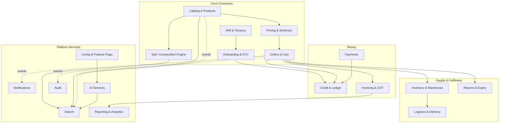
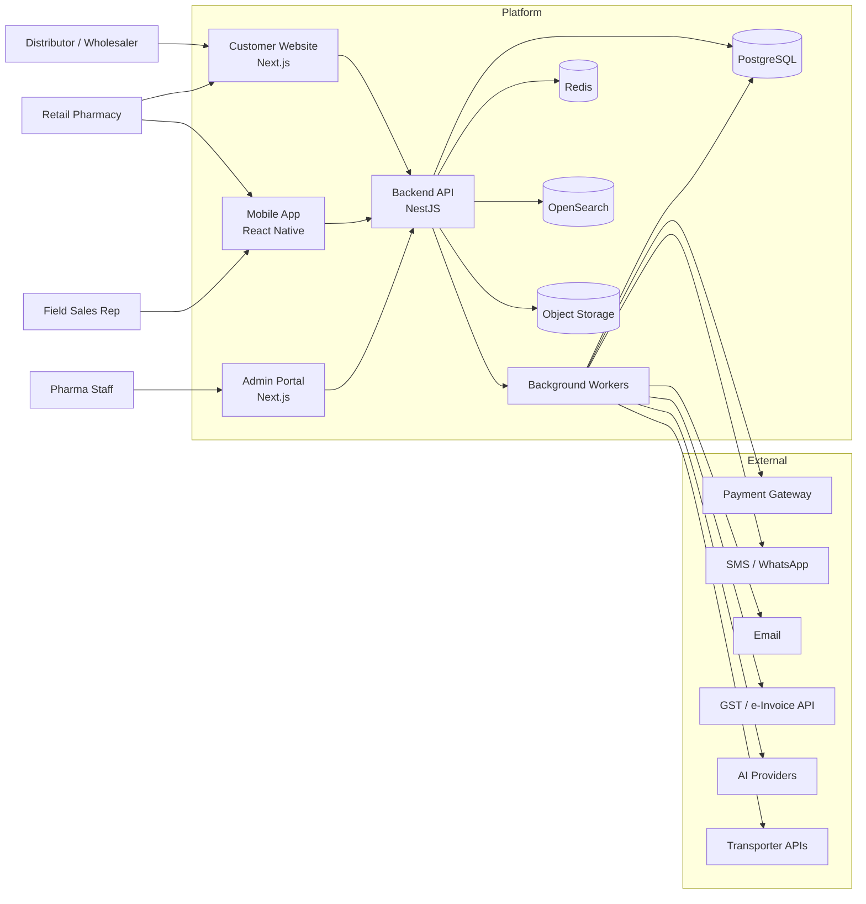
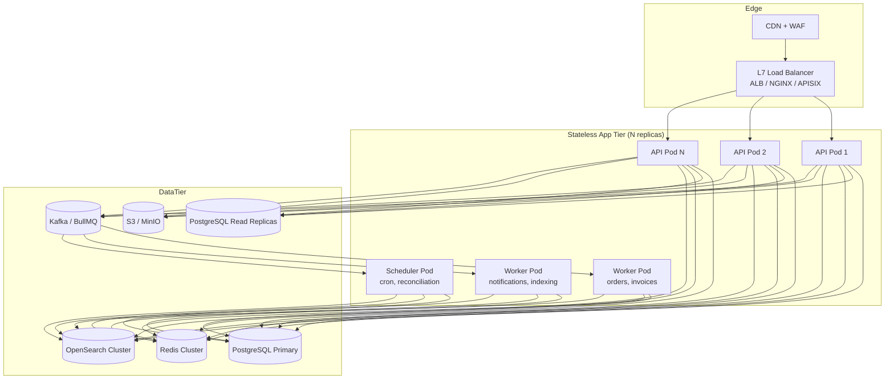
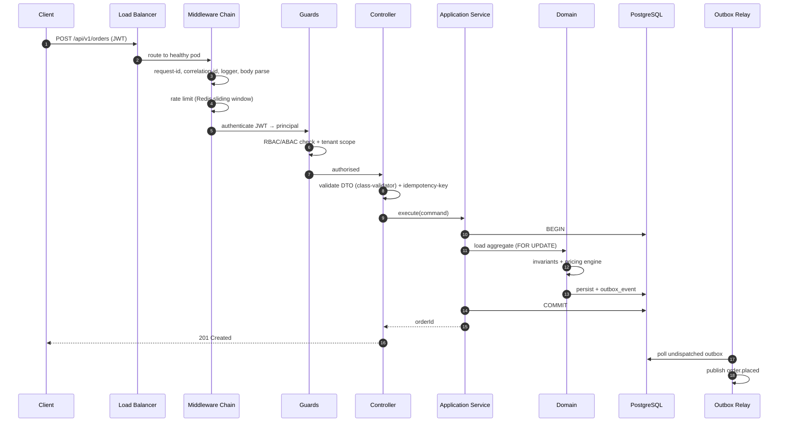

# 01 — High-Level Design

> **Status:** Approved · **Owner:** Solution Architecture · **Last updated:** 2026-09-11

---

## 1. Problem statement

A pharmaceutical manufacturer/distributor needs a digital channel through which its
downstream trade — **distributors (stockists), wholesalers, and retail pharmacies** —
can discover products, check live availability and price, place orders, and receive
delivery. Today this happens over phone, WhatsApp and paper indent forms, which
causes pricing disputes, stock-outs, order errors, and zero visibility.

The platform replaces that with an ordering system modelled on e-commerce, but with
domain rules that generic e-commerce does not have:

| Pharma-specific reality | Design consequence |
|---|---|
| Products are sold by **salt/composition**, not just brand | A dedicated Salt Engine with composition→product mapping and synonym-aware search |
| Buyers are **licensed businesses**, not consumers | KYC onboarding with drug licence, GSTIN, PAN verification and credit approval |
| Medicines are **regulated by schedule** (H, H1, X, OTC) | Schedule-aware cart rules, prescription gating, statutory registers |
| Stock is **batch/lot + expiry** driven | Inventory is tracked per batch, allocation is FEFO, near-expiry workflows |
| Pricing is **customer-tier + scheme** driven, not a single price | A pricing engine with price lists, slabs, free-goods schemes |
| Orders are usually on **credit**, not prepaid | Credit limit engine, ledger, aging, dunning |
| Margins are thin and disputes are expensive | Money-safety discipline: locked rows, idempotency, immutable ledger |

---

## 2. Actors and personas

| Actor | Channel | Primary jobs |
|---|---|---|
| **Distributor / Stockist** | Website, Mobile | Bulk order, check schemes, track outstanding, download invoices |
| **Wholesaler** | Website, Mobile | Same as above, smaller volumes |
| **Retail Pharmacy** | Website, Mobile | Reorder, scan barcode, upload prescription, quick checkout |
| **Field Sales Rep** | Mobile | Place order on behalf of a buyer, check stock, collect payment reference |
| **Pharma Admin** | Admin portal | Everything: users, catalogue, pricing, orders, config |
| **Catalogue Manager** | Admin portal | Products, salts, images, HSN, schedule classification |
| **Finance / Accounts** | Admin portal | Invoices, credit limits, payments, credit notes, reconciliation |
| **Warehouse Operator** | Admin portal (handheld later) | Pick, pack, dispatch, batch allocation |
| **Logistics Coordinator** | Admin portal | Shipments, transporters, e-way bills, delivery confirmation |
| **Support Agent** | Admin portal | Tickets, order intervention, audit trail |
| **Compliance Officer** | Admin portal | Schedule registers, licence expiry, audit exports |

Role design is **RBAC + ABAC**: roles grant capabilities, attributes (own-tenant,
own-warehouse, own-region, credit band) narrow the data scope. See
[09-security-and-compliance.md](09-security-and-compliance.md).

---

## 3. Bounded contexts

The platform is decomposed into 14 bounded contexts. Each owns its tables, its
domain logic and its public interface. No context reaches into another's tables.



### Context responsibility table

| Context | Owns | Does **not** own |
|---|---|---|
| **IAM & Tenancy** | Users, credentials, roles, permissions, sessions, devices, API keys | Business profile of a buyer (that is Onboarding) |
| **Onboarding & KYC** | Applications, licences, documents, verification state machine, credit application | Credit limit value (that is Credit) |
| **Catalog & Products** | Product master, brand, manufacturer, pack, images, HSN, schedule class, storage | Stock, price |
| **Salt Engine** | Salt master, compositions, combination normalisation, synonym dictionary, product↔salt links | Product marketing content |
| **Pricing & Schemes** | Price lists, customer tier assignment, slabs, discounts, schemes, free goods, tax rules | Credit terms, invoice generation |
| **Orders & Cart** | Cart, quote, order, order lines, order state machine, approvals, backorders | Stock levels, invoices, shipments |
| **Inventory & Warehouse** | Warehouses, bins, batches, stock ledger, reservations, ATP, FEFO allocation | Order state |
| **Logistics & Delivery** | Shipments, transporters, e-way bills, tracking, ePOD | Order pricing |
| **Returns & Expiry** | Return requests, RMA, breakage, near-expiry claims, credit note requests | Actual credit note posting |
| **Credit & Ledger** | Credit limits, exposures, customer ledger, ageing, dunning | Invoice line content |
| **Payments** | Payment intents, gateway integrations, webhooks, reconciliation | Customer ledger (it posts into it) |
| **Invoicing & GST** | Tax invoices, credit/debit notes, GST computation, e-invoice IRN, GSTR exports | Payment capture |
| **Search** | Index projections, query parsing, ranking, autocomplete | Source of truth for any entity |
| **Notifications** | Templates, channels, delivery attempts, preferences | Business decisions to notify |
| **AI Services** | Provider registry, prompt templates, usage metering, feature bindings | Any write to core domain tables |
| **Reporting** | Read models, materialised views, exports, dashboards | Transactional writes |
| **Audit** | Append-only audit log, actor trail, data-change diffs | Anything else |
| **Config & Feature Flags** | Platform settings, encrypted secrets, flags, rollout rules | Code |

---

## 4. System context (C4 Level 1)



---

## 5. Container view (C4 Level 2)



**Key properties**

- The app tier is **completely stateless** — no local session, no local file, no
  in-memory truth. Any pod can serve any request. This is what makes the load
  balancer trivially correct and autoscaling safe.
- **Writes go to the primary only.** Reads that tolerate staleness go to replicas
  via a read-routing layer (`?consistency=eventual` or read-only repository).
- Workers are the *same codebase* as the API, started with a different bootstrap
  flag — one artifact, three roles (api / worker / scheduler). This removes an
  entire class of "works in API, fails in worker" drift.

---

## 6. The consistency model — the important part

The brief explicitly asks to scale without data-consistency pain. That is achieved
by **not splitting invariants across services**. Concretely:

### 6.1 Single writer per aggregate

Every aggregate (Order, Invoice, StockBatch, CustomerLedger, Payment) has exactly
one owning context and one database. All mutations to an aggregate go through its
owning context. No other context ever writes its tables.

### 6.2 Transactions stay local

A business operation that must be atomic is executed inside **one** PostgreSQL
transaction against **one** schema. We deliberately avoid distributed transactions.

Example — order placement, all in one transaction:

```
BEGIN
  lock customer row (credit)                      -- pessimistic_write
  insert order + order_lines                      -- status = PENDING
  insert outbox_event('order.placed')             -- same tx
  reserve stock: insert stock_reservation rows    -- same tx, FEFO
  increment credit exposure                        -- same tx
COMMIT
```

Everything downstream — invoice generation, notification, search indexing,
analytics — is driven by `outbox_event` rows read *after* commit.

### 6.3 Transactional outbox (no lost events)

```
┌──────────────────────────┐
│ DB TRANSACTION           │
│  write domain rows       │
│  write outbox_event row  │  ← atomic with the domain write
└──────────────────────────┘
             │ commit
             ▼
   Outbox Relay Worker  (poll / CDC / LISTEN-NOTIFY)
             │  publishes, then marks dispatched_at
             ▼
      Kafka topic  or  BullMQ queue
             │
             ▼
   Idempotent consumer (dedupe by event_id)
```

This gives **at-least-once delivery with idempotent consumers**, which is the
practical equivalent of exactly-once for business purposes. The event is never lost
because it is committed in the same transaction as the state change.

### 6.4 Sagas for cross-context workflows

Order fulfilment spans Orders → Inventory → Invoicing → Logistics. It is modelled
as an **orchestrated saga** with explicit compensations, not a distributed
transaction:

| Step | Action | Compensation |
|---|---|---|
| 1 | Reserve stock (FEFO) | Release reservation |
| 2 | Confirm credit available | Release credit hold |
| 3 | Approve order | Cancel order, release 1+2 |
| 4 | Generate invoice | Void invoice |
| 5 | Create shipment | Cancel shipment |
| 6 | Dispatch | Recall / reverse shipment |

The saga state lives in `order_saga` with a step cursor. Every step is idempotent
and re-drivable. A stuck saga is visible on the admin dashboard, not silent.

### 6.5 Money-safety rules (non-negotiable)

Derived from hard-won production experience with financial bugs:

1. **Never read-modify-write a balance.** Always `SELECT … FOR UPDATE` inside the
   transaction, then mutate. Lost updates under concurrency are silent.
2. **Idempotency checks go *inside* the lock**, not before the transaction.
   Check-then-act outside a transaction is a TOCTOU race.
3. **Validate before the first mutation.** If a guard can throw, it must throw
   *before* anything is persisted, or the row is stranded in a half-applied state.
4. **Never credit on a failed upstream call.** If the gateway call throws, let it
   propagate so the transaction rolls back.
5. **All money is `NUMERIC(18,4)`** in Postgres and a decimal string in JSON.
   Never `float`, never JS `number` for arithmetic — use a decimal library.
6. **The ledger is append-only.** Corrections are new compensating entries, never
   updates or deletes.
7. **Every cron that mutates money takes a Postgres advisory lock** so N replicas
   do not run it N times.
8. **Every webhook verifies its signature and fails closed.** A missing provider
   config must throw — never silently fall back to a provider that accepts anything.

Full detail in [09-security-and-compliance.md](09-security-and-compliance.md) and
[11-design-patterns-and-solid.md](11-design-patterns-and-solid.md).

### 6.6 Read models are eventually consistent — and that is fine

Search index, dashboards and analytics lag by seconds. Every user-facing *decision*
surface (price, stock available to promise, credit available) is read from
PostgreSQL, never from a projection. Users never make a decision on stale data
that matters.

---

## 7. Request lifecycle (write path)



**Budget:** p95 < 300 ms for reads, < 800 ms for writes, at 500 RPS sustained.

---

## 8. Deployment topology

| Environment | Purpose | Topology |
|---|---|---|
| `local` | Development | docker-compose, single pod, all-in-one |
| `dev` | Shared integration | 1 API pod, 1 worker, small managed PG/Redis |
| `staging` | Pre-prod, production-shaped | 2 API pods, 1 worker, read replica, OpenSearch 1 node |
| `prod` | Live | 3–N API pods across 2+ AZs, 2+ workers, PG primary + 1 replica, Redis cluster, OpenSearch 3 nodes |

Scaling levers, in the order we pull them:

1. Add API pods (horizontal, automatic on CPU/RPS) — the first and usually only lever.
2. Add Postgres read replicas for read-heavy endpoints.
3. Add Redis cluster shards.
4. Partition the hottest tables (stock_ledger, audit_log) by month.
5. Extract a context into its own service + database.

Step 5 is a **last resort**, not a starting point. See
[03-architecture-decisions.md](03-architecture-decisions.md) for the extraction
criteria.

---

## 9. Cross-cutting concerns

| Concern | Approach |
|---|---|
| **Multi-tenancy** | Single-tenant today (one pharma company), but every table carries `tenant_id` and every query is scoped by it. Enables a future SaaS pivot without a rewrite. |
| **Auth** | JWT access (15 min) + rotating refresh (30 d) stored in Redis, argon2id password hashing, device registry, optional TOTP for staff. |
| **Authorisation** | Capability-based RBAC + attribute scoping. Enforced in guards, with a second enforcement at the repository/query layer so a missed guard cannot leak another tenant's rows. |
| **Validation** | `class-validator` DTOs at the boundary; domain invariants re-checked in the aggregate. Never trust the boundary alone. |
| **Error handling** | One global exception filter → RFC 9457 `application/problem+json`. Domain errors are typed; infrastructure errors are mapped; unknown errors become 500 with a correlation id and a logged stack. |
| **Observability** | Structured JSON logs (Pino) with correlation ids, OpenTelemetry traces, RED/USE metrics, `/health/live` + `/health/ready` (503 when a dependency is down). |
| **Config** | Layered: env → DB `platform_setting` → feature flags. Secrets encrypted with AES-256-GCM. See [13](13-runtime-configuration.md). |
| **Audit** | Every state-changing command emits an audit record with actor, before/after diff, ip, correlation id. Append-only. |
| **Idempotency** | `Idempotency-Key` header on all unsafe writes; stored with the response and replayed for 24 h. |
| **Localisation** | `next-intl` on web, `i18n-js` on mobile. Currency and number formatting driven by locale. English + Hindi at launch. |

---

## 10. What we deliberately did **not** do

Documenting rejections is as important as documenting choices.

| Rejected | Why |
|---|---|
| Microservices from day one | 14 services × network hops × distributed transactions × 14 CI pipelines, for a system with no proven load. The complexity is paid up front and the benefit arrives (if ever) much later. |
| A separate database per context from day one | Cross-context joins (order + product + stock) are the most common query. Splitting them early means building a data-assembly layer for no gain. |
| MongoDB for the catalogue | The catalogue is highly relational (product ↔ salt ↔ pack ↔ price ↔ stock) and needs transactions with orders. Postgres `JSONB` covers the few document-shaped fields. |
| Client-side price calculation | Price is a legal and commercial fact. It is computed server-side only; the client displays what it is told. |
| Storing money as `float` | Rounding drift accumulates into real losses and reconciliation failures. |
| Kafka on day one | Postgres outbox + BullMQ covers phase 1–3 volume with far less operational burden. Kafka is introduced when we need replay, retention or multiple independent consumers at scale. |
| Elasticsearch from day one for search | Postgres FTS + `pg_trgm` handles the initial catalogue (tens of thousands of SKUs) adequately. OpenSearch is introduced when relevance tuning and salt-synonym ranking demand it. |
