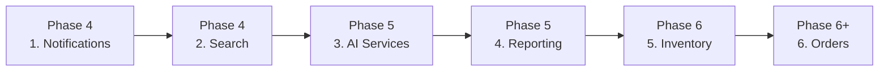

# 03 — Architecture Decisions (ADR Log)

> **Status:** Approved · **Owner:** Solution Architecture · **Last updated:** 2026-09-11

This is the decision record. Each ADR states context, the decision, the alternatives
we rejected, and — most importantly — **the conditions that would make us revisit it**.

---

## ADR-000 — Overall architecture style

### Context

The brief asks whether we should go distributed / microservices. It also asks for
easy horizontal scaling, no data-consistency headaches, and the ability to handle
"a lot of user requests". Those three goals are often in tension: microservices
solve the scaling goal but create the consistency goal.

### Decision

**Start with a modular monolith. Design the seams so that extraction is a
mechanical refactor, not a rewrite. Extract on evidence, never on ambition.**

The monolith is *not* a "big ball of mud with a nice name". It has hard internal
boundaries:

| Property | How it is enforced |
|---|---|
| One module = one bounded context | `backend/src/modules/<context>/` |
| No cross-module table access | ESLint `no-restricted-imports`; only the module's `index.ts` public API may be imported |
| No cross-module joins in code | Cross-context data is composed in an application service or read model |
| Communication via ports | `@Inject(PRICING_PORT)`, `@Inject(STOCK_PORT)` — interfaces, never concrete classes |
| Events for side effects | Domain events + transactional outbox |
| Own migrations | Each module owns its migration files |

### Why not microservices from day one

| Cost of a service | Impact at our scale |
|---|---|
| Network hop per cross-context call | 14 contexts × 3 calls/request ≈ latency and 14 more failure modes |
| No cross-service transactions | Every business operation becomes a saga. Order placement alone spans 5 contexts. |
| Distributed debugging | One trace across 14 services, 14 log streams, 14 deploy versions |
| 14 CI/CD pipelines, 14 on-call rotations | A team of 4–6 cannot own this |
| Schema evolution | Every contract change is a versioned, backward-compatible rollout |

**The honest arithmetic:** microservices pay off when you have (a) independent
scaling needs that differ by an order of magnitude between contexts, (b) multiple
teams that must deploy independently, or (c) genuinely different data-store
requirements per context. At launch we have none of the three. Adopting the pattern
early buys us the costs immediately and the benefits much later — if ever.

### Why a monolith is not a scaling limitation

The common confusion is that "monolith" means "cannot scale". It does not. A
stateless NestJS monolith behind a load balancer scales horizontally to hundreds of
pods. What it *does* mean is that contexts scale **together**, not independently.
For a pharma ordering platform where the ratio between catalogue reads and order
writes is maybe 50:1, scaling them together is exactly right.

### Extraction criteria — when we DO split a context out

A context is extracted into its own service + database only when **at least one**
of these is true and measurable:

1. **Divergent scaling** — it needs ≥5× the pod count of the rest, sustained.
   *Likely first candidates:* Search, Notifications, AI Services.
2. **Different data store** — it genuinely needs a non-Postgres store.
   *Likely first candidate:* Search (OpenSearch).
3. **Independent team ownership** — a separate team owns it end to end.
4. **Different release cadence** — it must ship daily while the core ships weekly.
5. **Blast-radius isolation** — a failure in it must not take down ordering.
   *Likely first candidates:* AI Services, Reporting.
6. **Compliance boundary** — it handles data that must be isolated.

### Recommended extraction order (when the time comes)



We start with the contexts that are **already asynchronous, already have no
cross-context write dependencies, and already fail independently**. Notifications
is the perfect first extraction: it consumes events, owns its own data, and if it
is down nobody can place an order less.

We extract **Orders last** — it is the transactional heart, and splitting it is the
single most expensive move in the whole system.

### The strangler-fig mechanism

Extraction is possible without a rewrite because of decisions made now:

- Contexts already communicate through **ports**, so the in-process adapter is
  swapped for an HTTP/gRPC adapter at one injection token.
- Side effects already flow through **events**, which become Kafka topics.
- Each module already owns its **tables**, so the schema moves as a unit.
- The `packages/api-client` pattern means the transport change is invisible to clients.

**Revisit when:** any extraction criterion above is met and measured. Review
quarterly against real metrics, not opinion.

---

## ADR-001 — One database, many schemas

### Context

With a modular monolith we still must decide how data is organised.

### Decision

**One PostgreSQL cluster. One database. One schema (`public`) for phase 1–3, with
strict module ownership of tables. Move to schema-per-module when the first context
is extracted.**

Each table is owned by exactly one module. Foreign keys **within** a module are
enforced by the database. References **across** modules are stored as plain UUIDs
with no FK constraint — the cross-context reference is resolved through the owning
module's port, which is what allows that module to move to another database later
without a migration nightmare.

### Alternatives rejected

| Option | Why not now |
|---|---|
| Schema per module from day one | Adds `search_path` complexity and cross-schema FK friction for zero benefit while we are in one process. Easy to adopt later. |
| Database per module from day one | Distributed transactions across 14 databases. The exact consistency problem the brief wants to avoid. |
| Separate read replica for reporting from day one | Add when reporting load actually competes with OLTP. Until then it is cost with no benefit. |

**Revisit when:** the first context is extracted, or reporting queries start
affecting p95 latency on the primary.

---

## ADR-002 — Consistency strategy

### Context

The brief: "do not have challenge of data consistency" while handling a lot of
requests.

### Decision

Five mechanisms, applied in this order:

1. **Keep invariants inside one aggregate** — an invariant that spans two services
   is an invariant that will eventually be violated.
2. **One transaction per request** — no distributed transactions, ever.
3. **Transactional outbox** for all cross-context side effects.
4. **Orchestrated sagas with explicit compensations** for multi-step workflows.
5. **Idempotency keys on every unsafe write**, deduped by `event_id` on every consumer.

### The rule that makes it work

> **Never split a business invariant across a transaction boundary.**

Concretely: "credit exposure must not exceed the credit limit" is checked and
mutated in one transaction in the Credit context. It is never checked in Credit and
enforced in Orders.

### What we accept

- Read models, search and dashboards are **eventually consistent** (seconds).
- A saga can be **in flight** — an order can be `AWAITING_STOCK` for a moment.
  This is modelled explicitly as a state, not hidden as a bug.
- We accept **at-least-once** delivery and require consumers to be idempotent,
  rather than paying for exactly-once semantics that no broker truly provides.

**Revisit when:** never. This is the load-bearing decision.

---

## ADR-003 — Stateless app tier + external session state

### Context

Load balancing and autoscaling require that any pod can serve any request.

### Decision

**Zero state in the application process.** No in-memory sessions, no local file
writes, no sticky sessions, no in-process caches that hold authoritative data.

| State | Lives in |
|---|---|
| Session / refresh tokens | Redis |
| Uploads, documents, invoices | S3 |
| Cache | Redis |
| Rate-limit counters | Redis |
| Queues | Redis / Kafka |
| Truth | PostgreSQL |

**Consequence:** the load balancer needs no sticky sessions, autoscaling can add or
kill pods at any moment, and deployments are zero-downtime by default (rolling
update, `enableShutdownHooks()` for graceful drain).

**Trade-off:** every cache hit is a network round trip (~0.3 ms intra-AZ). Accepted;
in-process caching of authoritative data is the bug we are avoiding.

**Revisit when:** never for authoritative state. A short-TTL (≤1 s) in-process cache
of truly immutable data (e.g. country list) is acceptable if it is ever needed.

---

## ADR-004 — Price and stock are always read from the primary

### Context

Price and stock are the two values that must never be wrong, and they are the two
most-read values in the system — exactly the ones a cache or read replica would
"help" with.

### Decision

**Price computation and stock availability checks always hit PostgreSQL, with row
locks where they gate a write. They are never served from a cache, a replica, or a
search index.**

- The catalogue page *displays* a cached indicative price for speed.
- The cart and the order **recompute** price and re-check ATP from the primary,
  inside the transaction, at the moment of commitment.
- If the recomputed price differs from what was displayed, the order is either
  re-quoted to the user or rejected — it is never silently accepted at the stale price.

**Why:** "the customer saw an old price and we honoured it" is a revenue leak.
"we showed stock we did not have" is a broken promise. Both are worse than 20 ms of
extra latency.

**Revisit when:** never. Optimise the query, not the guarantee.

---

## ADR-005 — Search engine behind a port

### Context

The brief asks for salt-combination search. Postgres FTS can do a lot; OpenSearch
does more.

### Decision

Define `SearchPort` now. Ship a **Postgres adapter** in phase 1. Add an
**OpenSearch adapter** in phase 4, selected by `SEARCH_USE_OPENSEARCH`.

**The index is a projection.** It is rebuildable from Postgres at any time via
`pnpm search:reindex`. Search never becomes a source of truth.

**Why this ordering:** the salt-combination search that the brief specifically
wants is fundamentally a **normalisation + join** problem, not a full-text problem.
Postgres solves it correctly and exactly. OpenSearch adds typo tolerance, synonym
expansion and ranking quality on top — valuable, but a refinement rather than a
prerequisite.

**Revisit when:** catalogue exceeds ~200k SKUs, or p95 search latency exceeds
150 ms, or relevance tuning becomes a product requirement.

---

## ADR-006 — Runtime-configurable AI providers

### Context

The brief requires that an AI API key and provider can be changed **at runtime**
without redeploying or restarting the application.

### Decision

An **AI Provider Registry** with a Strategy + Factory + Adapter design:

```
platform_setting (encrypted, in Postgres)
        │  read through a 30 s cache
        ▼
AiProviderRegistry ──resolve(providerKey)──▶ AiProvider (interface)
        │                                          │
        │  admin changes provider/key              ├── OpenAiProvider
        ▼                                          ├── AnthropicProvider
   cache invalidation event                        ├── AzureOpenAiProvider
                                                   ├── BedrockProvider
                                                   ├── OllamaProvider
                                                   └── CustomHttpProvider
```

- Providers are registered as **strategies**; the registry resolves by key.
- Keys are stored **AES-256-GCM encrypted** in `platform_setting`, never in env
  after bootstrap, never returned by the API (write-only field).
- A change publishes `config.ai.updated`; every pod drops its cached provider
  within ≤30 s. **No restart, no redeploy.**
- Every AI feature declares which capability it needs (`chat`, `embedding`,
  `vision`, `ocr`) so a provider can be swapped per capability.
- Every call is metered into `ai_usage` with tokens, cost and latency, and gated by
  a monthly budget. Exceeding the budget disables AI features gracefully — it never
  breaks a core flow.

**Revisit when:** a provider needs request signing we cannot express generically, or
we adopt a gateway (LiteLLM / Portkey) that subsumes the registry.

---

## ADR-007 — Multi-tenancy: modelled now, enabled later

### Context

Today: one pharma company. Future: possibly the platform is offered to other pharma
companies.

### Decision

**Every tenant-scoped table carries `tenant_id NOT NULL`, indexed as the leading
column of every composite index. Every query is scoped by a `TenantContext`
resolved from the JWT.** At launch there is exactly one tenant row.

**Why now rather than later:** retrofitting `tenant_id` onto a populated production
schema is one of the most painful migrations in software. The cost of adding it
today is one column and one guard; the cost of adding it in year two is a rewrite of
every query plus a data backfill under load.

**Enforcement:** a Prisma middleware injects the tenant filter automatically, plus a
repository-level assertion. Two independent layers, because a single missed `WHERE`
is a cross-tenant data leak.

**Revisit when:** a second pharma company actually signs. At that point evaluate
whether to move to schema-per-tenant or database-per-tenant for the large ones.

---

## ADR-008 — RBAC + ABAC authorisation

### Context

Roles alone are insufficient. A "Sales Rep" should see only their own region's
customers; a "Finance" user should see all invoices but not edit the catalogue.

### Decision

**Capability-based RBAC for *what*, attribute scoping for *which rows*.**

- Roles map to a set of capabilities (`order:create`, `invoice:void`, `catalog:edit`).
- Principals carry attributes (`tenantId`, `warehouseIds[]`, `regionIds[]`,
  `creditBand`).
- Guards check the capability. A query-scoping layer applies the attributes.

**Why not pure ABAC:** writing policy for every endpoint is unmaintainable at this
size. **Why not pure RBAC:** it cannot express "own region only" without role
explosion.

**Revisit when:** we need user-definable policies, at which point a policy engine
(Casbin / OPA) becomes worthwhile.

---

## ADR-009 — Idempotency for all unsafe writes

### Context

Mobile clients retry on flaky networks. Webhooks are delivered more than once.
Users double-tap buttons.

### Decision

Every `POST`/`PATCH`/`DELETE` accepts an `Idempotency-Key` header. The key, the
request fingerprint and the stored response are kept for 24 h.

- Same key + same body → replay the stored response (200/201, with
  `Idempotency-Replayed: true`).
- Same key + different body → `409 Conflict`.
- First execution still in flight → `409 Conflict` with `Retry-After`.

**Why it matters here specifically:** the retry that creates a duplicate order, or
the webhook delivered twice that credits a payment twice, are the two most common
real-world money bugs. Idempotency is not a nicety; it is the primary defence.

**Revisit when:** never.

---

## ADR-010 — Numeric money, decimal-safe arithmetic

### Context

Thin pharma margins mean small rounding errors are material at volume.

### Decision

- **Storage:** `NUMERIC(18,4)` in Postgres. Four decimal places because unit prices
  for loose/loose-pack medicines routinely need them.
- **Transport:** decimal **strings** in JSON (`"1234.5600"`), never JSON numbers.
  A JSON number is an IEEE-754 double in most parsers and will silently lose precision.
- **Application:** `decimal.js` for all arithmetic. A custom ESLint rule bans
  `+`, `-`, `*`, `/` on money-typed values.
- **Rounding:** explicit `RoundingMode.HALF_UP` at defined boundaries only
  (line total, tax, invoice total). Rounding happens **once**, at the documented
  boundary, never in intermediate steps.
- **Ledger:** append-only. Corrections are new compensating rows.

**Revisit when:** never.

---

## ADR-011 — One codebase, three process roles

### Context

The API, the background workers and the scheduled jobs share almost all their code
(domain, repositories, config, observability) but have different runtime concerns
(workers should not accept HTTP; schedulers must not run N times).

### Decision

**A single build artifact, started with `APP_ROLE=api|worker|scheduler`.**
The role determines which modules bootstrap and whether the HTTP listener starts.

**Why:** eliminating an entire class of drift where a bug is fixed in the API but
the worker still runs the old logic. One version, one deploy, one dependency tree.

**Concurrency safety:** every scheduled job takes a **Postgres advisory lock**, so
N scheduler replicas result in exactly one execution. Advisory locks are
session-scoped, so acquire and release must use the same dedicated `QueryRunner` —
not a pooled connection.

**Revisit when:** a worker needs a fundamentally different runtime (e.g. a Python
ML worker). At that point it becomes a separate service consuming the same events.

---

## ADR-012 — API versioning by URL path

### Context

Three clients, one of which (mobile) cannot be force-updated because users may not
upgrade.

### Decision

**URL path versioning: `/api/v1/...`.** Additive changes only within a version.
A breaking change means `/api/v2` running **in parallel** with `/v1` for a defined
deprecation window (minimum 6 months, given app-store review latency).

**Why path over header:** trivially observable in logs and metrics, trivially
testable with curl, and cacheable at the CDN. Header-based versioning is invisible
in access logs, which makes deprecation tracking painful.

**Mobile-specific rule:** the app sends `X-App-Version`; if a version below the
minimum supported is detected, the API returns a structured "upgrade required"
response the app renders as a blocking screen. This is the only reliable way to
retire an old mobile client.

**Revisit when:** never.

---

## ADR-013 — Load balancer strategy

### Context

The brief asks for a load balancer and easy scaling.

### Decision

**L7 load balancing (ALB or NGINX Ingress / APISIX) with least-outstanding-requests
balancing, health-check based routing, and TLS termination.**

| Concern | Approach |
|---|---|
| Health checking | `/health/live` (process alive, no dependency checks) and `/health/ready` (**503 if Postgres or Redis is unreachable**) |
| Session affinity | **None.** The tier is stateless; affinity would defeat autoscaling. |
| TLS | Terminated at the LB; re-encrypted to the backend in-transit |
| Rate limiting | Two layers — coarse at the LB/WAF (per-IP, DDoS) and fine in the app (per-principal, per-route) |
| Graceful shutdown | `SIGTERM` → stop accepting new connections → drain in-flight (≤30 s) → exit. Requires `app.enableShutdownHooks()`. |
| Timeouts | LB idle 60 s, backend request 30 s, DB statement 10 s. Layered so a slow dependency cannot exhaust connections. |

**The health-check detail that matters:** if `/health/ready` returns 200 while
Postgres is down, the load balancer keeps routing traffic to a pod that can only
return 500s. Readiness must return **503** on any failed dependency check.

**Revisit when:** we need global traffic management, at which point add a global
accelerator / multi-region DNS routing in front.

---

## ADR-014 — Rate limiting: layered, fail-open for availability

### Decision

| Layer | Scope | Limit | Action on breach |
|---|---|---|---|
| WAF / LB | per IP | 2000 req/min | 429 / challenge |
| App — anonymous | per IP | 60 req/min | 429 |
| App — authenticated | per principal | 300 req/min | 429 |
| App — auth endpoints | per IP + username | 10 req/min | 429 + lockout escalation |
| App — search | per principal | 120 req/min | 429 |
| App — heavy exports | per principal | 5 req/hour | 429 |

**Algorithm:** sliding window in Redis (sorted set), which avoids the burst
weakness of fixed windows. Returns standard `RateLimit-Limit`,
`RateLimit-Remaining`, `RateLimit-Reset` and `Retry-After` headers.

**Fail-open:** if Redis is unreachable, the limiter logs and **allows** the request.
Availability beats abuse protection during a cache outage — the WAF layer is still
enforcing a coarse per-IP limit, so we are not unprotected.

**Revisit when:** we need per-tenant quotas or fair-share scheduling.

---

## ADR-015 — Audit logging as an append-only, partitioned table

### Decision

Every state-changing command writes an `audit_log` row: actor, action, entity type,
entity id, before/after diff (JSONB), IP, user agent, correlation id, timestamp.

**Append-only:** no `UPDATE`, no `DELETE` — enforced by `BEFORE UPDATE OR DELETE`
and `BEFORE TRUNCATE` triggers that raise, plus a `REVOKE ... FROM PUBLIC` as
defence in depth. Monthly partitions via `pg_partman`; retention 7 years for
financial records, aligned with statutory requirements.

> **Corrected during Phase 0.** The original wording said append-only was enforced
> by revoking `UPDATE`/`DELETE` from the application role. That does not work: in
> PostgreSQL the table *owner* holds an implicit, non-revocable grant, and
> `REVOKE ... FROM current_user` is a silent no-op. Verified empirically — the
> application role could still `DELETE` from `audit_log`. Triggers are the
> enforcement mechanism; the `REVOKE` only constrains other roles. An escape
> hatch exists for migrations and retention jobs:
> `SET LOCAL medichain.allow_audit_mutation = 'on'`.

**Why a table and not just log files:** auditors need to query it ("who changed this
price on this date"), and it must be transactionally consistent with the change it
describes.

**Revisit when:** volume demands shipping to a columnar store for analysis. The
Postgres table remains the authoritative record.

---

## ADR-016 — npm workspaces instead of pnpm

### Context

Every design document in this repository specifies **pnpm workspaces +
Turborepo** ([02-tech-stack.md](02-tech-stack.md), [12-folder-structures.md](12-folder-structures.md),
[14-deployment-devops-observability.md](14-deployment-devops-observability.md)).
The Phase 0 implementation was built and verified with **npm workspaces**, and
`package-lock.json` — not `pnpm-lock.yaml` — is the committed lockfile. The CI
workflow was originally written against pnpm and therefore failed before running
a single check.

### Decision

Use **npm workspaces + Turborepo**. `pnpm-workspace.yaml` is retained so the
workspace glob is discoverable by pnpm-based tooling, but npm is the source of
truth. All commands in the README use `npm`.

### Why

- **pnpm is genuinely better for monorepos** — stricter dependency isolation and
  disk efficiency. That is not in dispute, and this ADR does not claim otherwise.
- The decision is about **cost of change at this moment**, not merit. Switching
  now means installing pnpm, deleting `package-lock.json`, regenerating a
  lockfile, re-installing the full tree, and re-verifying build, tests and the
  Docker image — for zero functional gain in Phase 0, on a foundation whose whole
  purpose is to be boring and verified.
- npm workspaces + Turborepo covers every requirement Phase 0 has: shared
  packages, task orchestration, a committed lockfile, and reproducible CI.
- Turborepo is package-manager agnostic, so the task graph survives the switch.

### Consequences

- `npm ci` is the CI install step. It requires `package-lock.json` to be in sync
  with every workspace `package.json`.
- The design documents still say `pnpm`. They are design intent, not runbooks;
  this ADR is the reconciliation. New documentation must use `npm`.
- Dependency advisories are gated by `scripts/check-audit.mjs`, not by a bare
  `npm audit --audit-level=high`. **Do not reach for `overrides` to fix a
  transitive advisory without verifying it actually took effect.** An attempt to
  force `multer` to `^2.3.0` via npm `overrides` was made and abandoned: npm
  10.9.7 parsed the field but silently ignored it for this exact-pinned
  transitive dependency, through both the flat and the path-specific form, and
  across a registry-only re-resolve with the lockfile deleted. A non-functional
  override is worse than none, because it reads as a fix. Exceptions live in the
  allow-list instead, each with a reason and a `reviewBy` date.

### Revisit when

The monorepo grows enough that install time or phantom-dependency bugs become a
real cost, or a contributor workflow requires pnpm. The migration is mechanical:
generate `pnpm-lock.yaml`, switch the CI install step and the Dockerfile in one
commit, and verify `pnpm install --frozen-lockfile` locally first.

---

## Decision summary

| ADR | Decision | Revisit trigger |
|---|---|---|
| 000 | Modular monolith, extract on evidence | Any of 6 extraction criteria, measured |
| 001 | One DB, module-owned tables | First extraction, or reporting contention |
| 002 | Local transactions + outbox + sagas | Never |
| 003 | Stateless app tier | Never for authoritative state |
| 004 | Price/stock always from primary | Never |
| 005 | Search behind a port, Postgres first | >200k SKUs, p95 >150 ms |
| 006 | Runtime AI provider registry | Provider needs exotic signing |
| 007 | Multi-tenant columns from day one | Second tenant signs |
| 008 | RBAC + ABAC | Need user-defined policies |
| 009 | Idempotency keys everywhere | Never |
| 010 | NUMERIC + decimal.js money | Never |
| 011 | One codebase, three roles | Non-Node worker needed |
| 012 | URL path versioning | Never |
| 013 | L7 LB, no sticky sessions, strict readiness | Multi-region |
| 014 | Layered rate limiting, fail-open | Per-tenant quotas |
| 015 | Append-only partitioned audit log | Columnar analysis |
| 016 | npm workspaces, not pnpm | Install cost or phantom deps bite |
