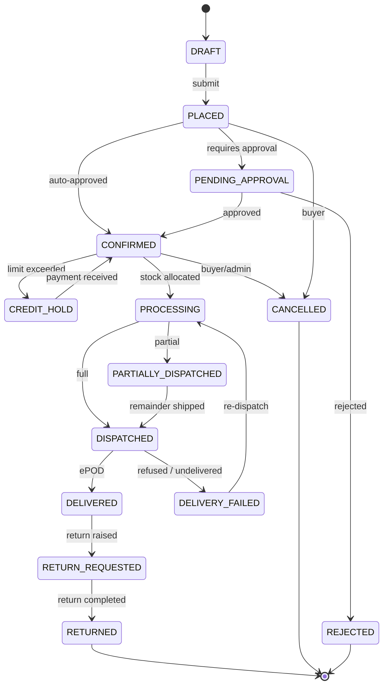

# 04 — Feature Catalogue

> **Status:** Approved · **Owner:** Product + Architecture · **Last updated:** 2026-09-11

Every feature the platform needs, grouped by module. Priority uses MoSCoW
(**M**ust / **S**hould / **C**ould / **W**on't-now). The `Phase` column maps to
[05-phases-roadmap.md](05-phases-roadmap.md).

**Total: 20 modules · 231 features.**

---

## Module index

| # | Module | Features | Phase(s) |
|---|---|---|---|
| 1 | Identity & Access Management | 22 | 0–1 |
| 2 | Tenancy & Organisation | 8 | 0 |
| 3 | Onboarding & KYC | 16 | 1 |
| 4 | Catalogue & Product Master | 24 | 1 |
| 5 | Salt / Composition Engine | 14 | 1–2 |
| 6 | Pricing & Schemes | 18 | 2 |
| 7 | Cart & Checkout | 12 | 1 |
| 8 | Orders | 22 | 1–3 |
| 9 | Prescriptions & Schedule Compliance | 11 | 2 |
| 10 | Inventory & Warehouse | 21 | 2 |
| 11 | Credit & Ledger | 14 | 2 |
| 12 | Payments | 13 | 2 |
| 13 | Invoicing & GST | 16 | 2–3 |
| 14 | Logistics & Delivery | 15 | 3 |
| 15 | Returns & Expiry | 13 | 3 |
| 16 | Search & Discovery | 14 | 1–4 |
| 17 | Notifications | 12 | 1–2 |
| 18 | Reporting & Analytics | 16 | 3–5 |
| 19 | AI Services | 12 | 5 |
| 20 | Platform: Config, Audit, Support | 18 | 0–3 |

---

## 1. Identity & Access Management

| # | Feature | Priority | Phase |
|---|---|---|---|
| 1.1 | Email + password registration with strong password policy | M | 0 |
| 1.2 | Mobile-number + OTP registration (primary flow for mobile app) | M | 1 |
| 1.3 | Email/mobile verification with expiring tokens | M | 0 |
| 1.4 | Login with JWT access token (15 min) + rotating refresh token (30 d) | M | 0 |
| 1.5 | Refresh-token rotation with reuse detection (reuse ⇒ revoke whole family) | M | 0 |
| 1.6 | Password reset via email/SMS with single-use token | M | 0 |
| 1.7 | argon2id password hashing (memory 19 MiB, t=2, p=1) | M | 0 |
| 1.8 | Account lockout after N failed attempts, with exponential backoff | M | 0 |
| 1.9 | TOTP two-factor authentication (mandatory for admin roles) | S | 1 |
| 1.10 | Device registry — list and revoke active sessions per device | S | 2 |
| 1.11 | Role management (CRUD roles, assign capabilities) | M | 0 |
| 1.12 | Capability catalogue (`order:create`, `invoice:void`, …) | M | 0 |
| 1.13 | Attribute-based scoping (tenant, warehouse, region, credit band) | M | 1 |
| 1.14 | Multi-role users (one login, switchable active role) | S | 2 |
| 1.15 | User invitation flow (admin invites buyer → email/SMS onboarding link) | M | 1 |
| 1.16 | Impersonation for support, fully audited, time-boxed, read-only by default | S | 3 |
| 1.17 | API keys for B2B integration (buyer's ERP → our API) | C | 4 |
| 1.18 | OAuth2 / OIDC social login (Google, for retail pharmacy owners) | C | 4 |
| 1.19 | Session listing and remote logout | S | 2 |
| 1.20 | Login history with IP and device, visible to the user | S | 2 |
| 1.21 | SCIM user provisioning (enterprise buyers) | W | — |
| 1.22 | Passkey / WebAuthn login | C | 5 |

**Security note:** OTPs use `crypto.randomInt()`, never `Math.random()`, and are
deleted on successful verification (otherwise they are replayable within the TTL).
See [09](09-security-and-compliance.md).

---

## 2. Tenancy & Organisation

| # | Feature | Priority | Phase |
|---|---|---|---|
| 2.1 | Tenant (pharma company) entity with branding, address, GSTIN, licences | M | 0 |
| 2.2 | `tenant_id` on every scoped table, auto-injected in every query | M | 0 |
| 2.3 | Tenant settings: currency, timezone, fiscal year, invoice numbering | M | 0 |
| 2.4 | Buyer organisation entity (distributor / wholesaler / pharmacy) | M | 1 |
| 2.5 | Multiple ship-to / bill-to addresses per organisation | M | 1 |
| 2.6 | Organisation hierarchy (chain → branches) | S | 3 |
| 2.7 | Organisation-level credit account shared across branches | S | 3 |
| 2.8 | Tenant data export and deletion (data-portability) | C | 5 |

---

## 3. Onboarding & KYC

Joining the platform is a **gated, verified** process — an unverified buyer must
never see trade prices or place an order.

| # | Feature | Priority | Phase |
|---|---|---|---|
| 3.1 | Public "Apply to join" form (no account required to apply) | M | 1 |
| 3.2 | Business type selection (distributor / wholesaler / pharmacy / hospital) | M | 1 |
| 3.3 | Drug licence capture — number, type (20/21, 20B/21B), issuing state, validity, document upload | M | 1 |
| 3.4 | GSTIN capture with format validation and (optional) API verification | M | 1 |
| 3.5 | PAN capture with format validation | M | 1 |
| 3.6 | Document upload with virus scan, size/type validation, and OCR-assisted field extraction | M | 1 |
| 3.7 | Multi-step application wizard with save-and-resume | M | 1 |
| 3.8 | Application state machine (DRAFT → SUBMITTED → UNDER_REVIEW → INFO_REQUIRED → APPROVED / REJECTED) | M | 1 |
| 3.9 | Reviewer queue with assignment, SLA timer and notes | M | 1 |
| 3.10 | Request-more-information loop (reopens the application with a specific ask) | M | 1 |
| 3.11 | Approval creates the organisation, the user and the buyer profile atomically | M | 1 |
| 3.12 | Credit application as part of onboarding (requested limit + terms) | M | 2 |
| 3.13 | Credit approval workflow with a different approver than the requester (segregation of duties) | M | 2 |
| 3.14 | Licence-expiry monitoring with automatic reminders at 90/60/30/7 days and auto-suspension | M | 2 |
| 3.15 | Buyer profile: trade tier, sales rep assignment, price list, payment terms | M | 2 |
| 3.16 | Re-verification / re-KYC on expiry or material change | S | 3 |

**Critical rule:** the approval transaction creates organisation + user + profile +
credit account together. A partial approval that leaves a user without an
organisation is a support ticket and a security hole.

---

## 4. Catalogue & Product Master

The catalogue is pharma-specific, so the model is richer than generic e-commerce.

| # | Feature | Priority | Phase |
|---|---|---|---|
| 4.1 | Product master with internal SKU + manufacturer's code | M | 1 |
| 4.2 | Brand name and generic (salt) name, stored separately | M | 1 |
| 4.3 | Manufacturer / marketer entity (with licence details) | M | 1 |
| 4.4 | Dosage form (tablet, capsule, syrup, injection, cream, drops, inhaler…) | M | 1 |
| 4.5 | Strength and unit (500 mg, 5 mg/5 ml, 10 %w/w) | M | 1 |
| 4.6 | Pack configuration (strip of 10, bottle of 100 ml, box of 10×10) | M | 1 |
| 4.7 | Pack hierarchy — primary pack ↔ case/carton ↔ pallet with conversion factors | M | 2 |
| 4.8 | Composition/salt list with per-salt strength (drives the Salt Engine) | M | 1 |
| 4.9 | Drug schedule classification (OTC, H, H1, X, Narcotic) with cart rules | M | 2 |
| 4.10 | Storage conditions (ambient, cool, cold chain 2–8 °C, frozen) | M | 2 |
| 4.11 | HSN code and GST rate per product (with effective-dated rate changes) | M | 2 |
| 4.12 | Barcode / GTIN / EAN per pack level | S | 2 |
| 4.13 | Product images, multiple per product, with alt text | M | 1 |
| 4.14 | Product description, indications, dosage, warnings, contraindications | S | 2 |
| 4.15 | Category / therapeutic-class taxonomy (multi-level) | M | 1 |
| 4.16 | Therapeutic segment, sub-segment, molecule tags | S | 2 |
| 4.17 | Prescription-required flag (derived from schedule) | M | 2 |
| 4.18 | Product lifecycle states (DRAFT → ACTIVE → DISCONTINUED → BLOCKED) | M | 1 |
| 4.19 | Substitution / equivalent product grouping (same composition, different brand) | S | 2 |
| 4.20 | Bulk import from Excel/CSV with validation report and dry-run | M | 1 |
| 4.21 | Bulk export of the catalogue | S | 2 |
| 4.22 | Product versioning with a change history per field | S | 3 |
| 4.23 | Related / frequently-bought-together products | C | 4 |
| 4.24 | Regulatory hold / recall flag with automatic blocking of affected batches | S | 3 |

**Why pack hierarchy matters commercially:** pharma is bought and sold in different
units — a pharmacy orders 10 strips, the warehouse ships 1 box of 10×10. Getting the
conversion wrong is a 10× pricing error, so the conversion factor is a first-class,
validated field rather than an implicit assumption.

---

## 5. Salt / Composition Engine

This module exists because the brief specifically asks: *"capture salt of medicine
so if any user search salt combination application should suggest medicine name."*

| # | Feature | Priority | Phase |
|---|---|---|---|
| 5.1 | Salt master (molecule) with canonical name, synonyms and brand names | M | 1 |
| 5.2 | Salt aliases — Paracetamol ≡ Acetaminophen ≡ PCM ≡ Acetaminophenum | M | 1 |
| 5.3 | Salt strength/unit normalisation (500mg ≡ 0.5g ≡ 500 mg) | M | 1 |
| 5.4 | Salt categories (analgesic, antibiotic, antihistamine, PPI…) | S | 2 |
| 5.5 | Composition entity linking product → ordered list of (salt, strength) | M | 1 |
| 5.6 | **Canonical composition key** — a deterministic normalised string for exact matching | M | 1 |
| 5.7 | Salt-combination search: user enters "Paracetamol + Cetirizine" → all matching products | M | 1 |
| 5.8 | Combination search tolerant of order, separators, casing, synonyms and typos | M | 2 |
| 5.9 | Partial-combination match — "contains these salts" (superset match) | S | 2 |
| 5.10 | Exact-combination match — "contains exactly these salts, nothing else" | S | 2 |
| 5.11 | Generic-substitute suggestion — same composition, cheaper alternative | S | 2 |
| 5.12 | Drug–drug interaction warnings on multi-salt combinations (rule table + external dataset) | C | 5 |
| 5.13 | Salt usage analytics (most-searched salts, unmet demand) | S | 4 |
| 5.14 | Admin UI to curate salt mappings and resolve duplicates | M | 2 |

**The core design idea:** rather than matching salt combinations with free-text
search (fragile, order-dependent, synonym-blind), every product stores a
**canonical composition key** — the sorted, normalised, strength-annotated salt list,
hashed into a stable string. Salt-combination search normalises the query the same
way and matches on that key, with fuzzy fallback. Full detail in
[08-search-and-salt-engine.md](08-search-and-salt-engine.md).

---

## 6. Pricing & Schemes

| # | Feature | Priority | Phase |
|---|---|---|---|
| 6.1 | Multiple price lists (MRP, PTR, PTS, institutional, tender) | M | 2 |
| 6.2 | Price list assignment per buyer organisation / tier | M | 2 |
| 6.3 | Customer-specific negotiated prices (override list) | M | 2 |
| 6.4 | Volume slab pricing (buy 10+ at X, 50+ at Y) | S | 2 |
| 6.5 | Quantity-discount and percentage-discount rules | M | 2 |
| 6.6 | Scheme types: percentage off, flat off, free goods (buy N get M), combo | M | 2 |
| 6.7 | Scheme validity windows (start/end date, time-of-day optional) | M | 2 |
| 6.8 | Scheme applicability scoping (product / category / brand / customer tier / region) | M | 2 |
| 6.9 | Scheme stacking rules (allow, deny, best-of) | S | 2 |
| 6.10 | Trade scheme budget and consumption cap (scheme stops when budget exhausted) | S | 3 |
| 6.11 | Price effective dating (future-dated price changes) | M | 2 |
| 6.12 | Tax-inclusive vs tax-exclusive pricing per price list | M | 2 |
| 6.13 | Margin/landed-cost visibility for internal users only | S | 3 |
| 6.14 | Price approval workflow for changes above a threshold | S | 3 |
| 6.15 | Price history and audit trail per product per customer | S | 3 |
| 6.16 | Quote / proforma generation with a validity window | S | 2 |
| 6.17 | Price preview tool — "what would customer X pay for product Y today?" | S | 3 |
| 6.18 | Freight / handling charges in the price build-up | C | 4 |

**Design constraint:** the pricing engine is a **pure function**:
`(product, quantity, customer, date, schemes) → priced line`. Pure functions are
trivially unit-testable, which matters because pricing bugs are both subtle and
commercially expensive. Every pricing decision returns an **explanation trail** —
which rule fired, in what order, with what effect — surfaced in the admin UI and on
the order line. "Why is this price what it is?" must always be answerable.

---

## 7. Cart & Checkout

| # | Feature | Priority | Phase |
|---|---|---|---|
| 7.1 | Persistent server-side cart (survives device switch and app reinstall) | M | 1 |
| 7.2 | Add / update / remove line items | M | 1 |
| 7.3 | Quick order pad — paste SKUs + quantities, or upload a CSV indent | M | 1 |
| 7.4 | Barcode scan to add (mobile) | M | 2 |
| 7.5 | Reorder from a previous order (one tap) | M | 2 |
| 7.6 | Reorder from a saved template / standing indent | S | 3 |
| 7.7 | Live price and availability recalculation on every cart change | M | 1 |
| 7.8 | Scheme display on the line ("Buy 10 get 1 free applied") | M | 2 |
| 7.9 | Minimum order value / minimum order quantity enforcement | S | 2 |
| 7.10 | Credit-limit indicator ("this order will exceed your limit by ₹X") | M | 2 |
| 7.11 | Address and delivery-slot selection | M | 2 |
| 7.12 | Prescription attachment prompt for schedule H/H1/X items | M | 2 |

**Cart honesty rule:** the cart shows the price the user *will* pay, computed from
the primary database at the moment of display, and the same computation runs again
inside the order transaction. If they disagree, the user is re-quoted rather than
silently charged the stale price.

---

## 8. Orders

| # | Feature | Priority | Phase |
|---|---|---|---|
| 8.1 | Order placement with idempotency key | M | 1 |
| 8.2 | Order state machine with explicit, auditable transitions | M | 1 |
| 8.3 | Order number generation (tenant-configurable, gapless for tax purposes) | M | 1 |
| 8.4 | Order list with filters (status, date, buyer, amount, warehouse) | M | 1 |
| 8.5 | Order detail with full timeline of every state change and actor | M | 1 |
| 8.6 | Order cancellation by buyer (before dispatch) and by admin (any time) | M | 1 |
| 8.7 | Partial cancellation (line-level) | S | 2 |
| 8.8 | Admin order approval workflow with approval thresholds | M | 2 |
| 8.9 | Order modification by admin before dispatch (with a full audit diff) | S | 2 |
| 8.10 | Backorder handling — out-of-stock lines move to a backorder, order ships partial | M | 3 |
| 8.11 | Split order across warehouses based on availability and proximity | S | 3 |
| 8.12 | Partial fulfilment with proportional freight allocation | S | 3 |
| 8.13 | Order-to-invoice conversion (single order may produce multiple invoices for partial dispatch) | M | 2 |
| 8.14 | Order PDF / proforma download | M | 2 |
| 8.15 | Credit hold — order parked when the limit is exceeded, released on payment | M | 2 |
| 8.16 | Sales-rep-assisted order placement on behalf of a buyer | M | 2 |
| 8.17 | Order duplication ("order the same as last month") | S | 3 |
| 8.18 | Order comments / internal notes, visible only to staff | S | 3 |
| 8.19 | Bulk order status update from admin | S | 3 |
| 8.20 | Order export (CSV/Excel) | S | 3 |
| 8.21 | Order search by number, buyer, product, date range | M | 2 |
| 8.22 | Webhook / event notification to the buyer's ERP on order state change | C | 4 |

### Order state machine

**Every transition is guarded** by a domain rule and recorded in `order_status_history`
with actor, timestamp and reason. Illegal transitions raise a domain error rather
than being silently ignored — an order that quietly jumps states is an order nobody
can audit.

---

## 9. Prescriptions & Schedule Compliance

| # | Feature | Priority | Phase |
|---|---|---|---|
| 9.1 | Prescription upload (camera, gallery, PDF) attached to an order or a customer | M | 2 |
| 9.2 | Prescription store with validity period and reference number | M | 2 |
| 9.3 | Pharmacist verification workflow (approve / reject with reason) | M | 2 |
| 9.4 | Order blocking when a schedule H/H1/X item has no verified prescription | M | 2 |
| 9.5 | Schedule X additional controls (separate register, dual authorisation) | S | 3 |
| 9.6 | Prescription reuse control — one prescription, configurable max dispensings | S | 3 |
| 9.7 | Prescription OCR to pre-fill doctor, patient and drug fields (AI) | C | 5 |
| 9.8 | Statutory register generation — Schedule H/H1/X consumption registers | M | 3 |
| 9.9 | Narcotic/psychotropic movement register | C | 4 |
| 9.10 | Controlled-substance order quantity caps | S | 3 |
| 9.11 | Prescription audit trail (who verified, when, what was dispensed) | M | 3 |

**Why this is a whole module:** selling a schedule H1 drug without a valid
prescription is a criminal offence in India, not a policy violation. The control
must be enforced server-side in the order transaction — a client-side warning is
worthless.

---

## 10. Inventory & Warehouse

| # | Feature | Priority | Phase |
|---|---|---|---|
| 10.1 | Multi-warehouse / multi-location stock | M | 2 |
| 10.2 | Bin / rack location mapping within a warehouse | S | 3 |
| 10.3 | **Batch/lot-level stock** — every quantity belongs to a batch | M | 2 |
| 10.4 | Batch attributes: batch no., manufacture date, expiry date, MRP, cost | M | 2 |
| 10.5 | Immutable stock ledger — every movement is an append-only entry | M | 2 |
| 10.6 | Stock on hand, reserved, and **available-to-promise (ATP)** as separate figures | M | 2 |
| 10.7 | **FEFO allocation** (first-expiry-first-out) on order confirmation | M | 2 |
| 10.8 | Stock reservation with TTL and automatic release on expiry | M | 2 |
| 10.9 | Goods receipt (GRN) against a purchase order | M | 2 |
| 10.10 | Purchase order management to manufacturers/suppliers | S | 3 |
| 10.11 | Stock adjustment with reason codes and approval | M | 2 |
| 10.12 | Stock transfer between warehouses (with in-transit state) | S | 3 |
| 10.13 | Stock take / physical verification with variance report | S | 3 |
| 10.14 | Near-expiry alerts (configurable horizons: 180/90/60/30 days) | M | 2 |
| 10.15 | Expired stock quarantine and automatic blocking from sale | M | 2 |
| 10.16 | Damaged/breakage stock recording | M | 3 |
| 10.17 | Cold-chain batch flagging and handling rules | S | 3 |
| 10.18 | Reorder-level and safety-stock configuration per product per warehouse | S | 3 |
| 10.19 | Inventory valuation (weighted average / FIFO) | S | 3 |
| 10.20 | Barcode-based picking and put-away | C | 4 |
| 10.21 | Cycle-count scheduling | C | 4 |

**The invariant that must never break:**
`stock_on_hand − reserved = available_to_promise`, and
`Σ(stock_ledger entries) = stock_on_hand` for every (product, warehouse, batch).
A nightly reconciliation job asserts both and raises an alert on mismatch — the
advisory-locked cron pattern from ADR-011.

**Why FEFO and not FIFO:** pharma stock loses value at expiry, not with age. Shipping
the oldest-received batch would systematically waste the most valuable stock.

---

## 11. Credit & Ledger

| # | Feature | Priority | Phase |
|---|---|---|---|
| 11.1 | Credit limit per organisation, with a temporary-limit override | M | 2 |
| 11.2 | Credit exposure tracking (invoiced + unbilled + on-hold orders) | M | 2 |
| 11.3 | Credit availability check at order placement, inside the transaction | M | 2 |
| 11.4 | Credit hold / release workflow | M | 2 |
| 11.5 | Payment terms (Net 30, Net 45, advance, part-advance) per buyer | M | 2 |
| 11.6 | **Append-only customer ledger** — every debit/credit is an immutable row | M | 2 |
| 11.7 | Outstanding balance derived from the ledger, never stored as a mutable column | M | 2 |
| 11.8 | Ageing analysis (0–30, 31–60, 61–90, 90+ days) | M | 3 |
| 11.9 | Statement of account generation and download | M | 3 |
| 11.10 | Dunning / payment reminder workflow with escalating templates | S | 3 |
| 11.11 | Credit note and debit note posting | M | 3 |
| 11.12 | Advance / on-account payment allocation to invoices | M | 3 |
| 11.13 | Cheque / PDC (post-dated cheque) tracking | S | 4 |
| 11.14 | Credit review cycle with limit revision history | S | 4 |

**Money-safety detail that matters most here:** the balance is **derived** from the
append-only ledger, never stored as a mutable column that gets incremented. A
derived balance cannot drift. A cached balance is a convenience only, and is
rebuilt from the ledger — never trusted as the source of truth.

Where a denormalised `credit_exposure` counter *is* used for fast checks, it is
updated inside a transaction with `SELECT … FOR UPDATE` on the organisation row,
and reconciled against the ledger nightly.

---

## 12. Payments

| # | Feature | Priority | Phase |
|---|---|---|---|
| 12.1 | Payment gateway abstraction (Strategy + Adapter per provider) | M | 2 |
| 12.2 | Razorpay integration (primary for India) | M | 2 |
| 12.3 | Stripe integration (international / card) | C | 4 |
| 12.4 | UPI / QR collection | M | 3 |
| 12.5 | Net-banking / NEFT / RTGS with UTR capture | M | 3 |
| 12.6 | Offline payment recording by finance (cash, cheque, bank transfer) | M | 2 |
| 12.7 | Payment webhook handling with **signature verification, fail-closed** | M | 2 |
| 12.8 | Webhook idempotency (dedupe by gateway event id) | M | 2 |
| 12.9 | Payment reconciliation (gateway settlement file vs. our ledger) | M | 3 |
| 12.10 | Refund processing with the original-payment reference | M | 3 |
| 12.11 | Payment link generation and sharing | S | 3 |
| 12.12 | Part payment and split payment across invoices | S | 3 |
| 12.13 | Payment receipt PDF with allocation detail | M | 3 |
| 12.14 | Failed-payment retry and dunning integration | S | 4 |

**Fail-closed rule:** if the gateway configuration is missing, the payment service
**throws**. It never falls back to a provider whose signature verification is a
no-op. A silent fallback here is a forged-payment vulnerability.

---

## 13. Invoicing & GST

| # | Feature | Priority | Phase |
|---|---|---|---|
| 13.1 | Tax invoice generation from an order/dispatch | M | 2 |
| 13.2 | Gapless, tenant-configurable invoice numbering series | M | 2 |
| 13.3 | Line-level GST computation (CGST/SGST/IGST by place of supply) | M | 2 |
| 13.4 | HSN-wise tax summary on the invoice | M | 2 |
| 13.5 | Discount/scheme allocation at line level for correct taxable value | M | 2 |
| 13.6 | Freight and other charges with their own tax treatment | S | 3 |
| 13.7 | Round-off handling with the adjustment shown explicitly | M | 2 |
| 13.8 | Credit note / debit note against an invoice | M | 3 |
| 13.9 | Invoice PDF with the tenant's branding and statutory fields | M | 2 |
| 13.10 | E-invoice (IRN) generation via the GST/IRP API | S | 4 |
| 13.11 | E-way bill generation for consignments above the threshold | M | 3 |
| 13.12 | GSTR-1 / GSTR-3B data export | M | 3 |
| 13.13 | HSN summary report | M | 3 |
| 13.14 | Invoice cancellation with a mandatory reason and full audit | M | 3 |
| 13.15 | Multiple invoices per order (partial dispatch) | S | 3 |
| 13.16 | Invoice-to-order and invoice-to-shipment traceability | M | 3 |

**Rule:** an issued tax invoice is a legal document. It is never edited. A mistake
is corrected by a credit note, and the original remains visible forever. The
application database role has no `UPDATE` grant on the invoice table.

---

## 14. Logistics & Delivery

| # | Feature | Priority | Phase |
|---|---|---|---|
| 14.1 | Shipment creation from a confirmed order | M | 3 |
| 14.2 | Transporter master with contact and serviceability | M | 3 |
| 14.3 | Freight calculation (weight/volume/value-based, per transporter) | S | 3 |
| 14.4 | Dispatch note / packing list generation | M | 3 |
| 14.5 | Tracking number capture and customer-visible tracking | M | 3 |
| 14.6 | Delivery status updates (in transit, out for delivery, delivered) | M | 3 |
| 14.7 | ePOD — electronic proof of delivery with signature/photo | S | 3 |
| 14.8 | Delivery failure capture with reason codes | M | 3 |
| 14.9 | Re-dispatch workflow | S | 3 |
| 14.10 | Delivery-zone and pincode serviceability mapping | S | 3 |
| 14.11 | Route planning / beat plan for own fleet | C | 4 |
| 14.12 | Driver app / delivery-partner view | C | 4 |
| 14.13 | Cold-chain shipment temperature log capture | C | 4 |
| 14.14 | Transporter API integration for automated tracking | C | 5 |
| 14.15 | Delivery SLA tracking and breach alerts | S | 4 |

---

## 15. Returns & Expiry

| # | Feature | Priority | Phase |
|---|---|---|---|
| 15.1 | Sales return request raised by the buyer with reason and photos | M | 3 |
| 15.2 | Return approval workflow (auto-approve within policy, else review) | M | 3 |
| 15.3 | Return reason codes (damaged, wrong item, near-expiry, quality, excess) | M | 3 |
| 15.4 | Return pickup / reverse logistics | S | 3 |
| 15.5 | Goods-received-back inspection and acceptance/rejection | M | 3 |
| 15.6 | Credit note generation on accepted return | M | 3 |
| 15.7 | Batch traceability from return back to the original invoice line | M | 3 |
| 15.8 | Expiry claim settlement (near-expiry stock returned for credit) | S | 4 |
| 15.9 | Breakage/damage claim workflow | S | 4 |
| 15.10 | Return-to-manufacturer (RTV) workflow | C | 4 |
| 15.11 | Return analytics (rate by product, buyer, reason) | S | 4 |
| 15.12 | Return policy configuration (window, eligible reasons, restocking fee) | S | 3 |
| 15.13 | Replacement vs credit-note option | C | 4 |

---

## 16. Search & Discovery

| # | Feature | Priority | Phase |
|---|---|---|---|
| 16.1 | Full-text product search (brand, generic, SKU, manufacturer) | M | 1 |
| 16.2 | Type-ahead autocomplete with suggestions | M | 1 |
| 16.3 | **Salt-combination search** (see module 5) | M | 1 |
| 16.4 | Typo tolerance and fuzzy matching | S | 2 |
| 16.5 | Synonym and alias expansion | M | 2 |
| 16.6 | Faceted filtering (category, manufacturer, form, strength, schedule, price band, availability) | M | 2 |
| 16.7 | Sorting (relevance, price, name, availability, newest) | M | 2 |
| 16.8 | Search scoped to the buyer's own price list and availability | M | 2 |
| 16.9 | Personalised ranking (previously ordered, frequently ordered) | S | 4 |
| 16.10 | "Did you mean…" suggestions | S | 3 |
| 16.11 | Zero-result handling with substitute suggestions | S | 3 |
| 16.12 | Search analytics (top queries, zero-result queries, click-through) | S | 4 |
| 16.13 | Semantic / vector search (AI) | C | 5 |
| 16.14 | Saved searches and search alerts ("notify me when in stock") | C | 4 |

---

## 17. Notifications

| # | Feature | Priority | Phase |
|---|---|---|---|
| 17.1 | Templated notifications with variable interpolation | M | 1 |
| 17.2 | Multi-channel delivery: email, SMS, push, in-app, WhatsApp | M | 2 |
| 17.3 | Per-user channel preferences and opt-outs | M | 2 |
| 17.4 | Event-driven triggering (order placed, confirmed, dispatched, delivered…) | M | 1 |
| 17.5 | Notification queue with retry and exponential backoff | M | 1 |
| 17.6 | Delivery status tracking per notification | S | 2 |
| 17.7 | In-app notification centre with read/unread | M | 2 |
| 17.8 | Digest / batch notifications (daily summary instead of per-event) | C | 4 |
| 17.9 | Admin broadcast to a segment (all buyers in a region, etc.) | S | 3 |
| 17.10 | Template management UI with preview | M | 2 |
| 17.11 | Multi-language templates | S | 3 |
| 17.12 | Quiet hours / do-not-disturb | C | 4 |

**Failure isolation:** a notification failure must never fail the business
transaction that triggered it. Notifications are always sent from an event
consumer, never inline in the order transaction. If the SMS provider is down, orders
still flow.

---

## 18. Reporting & Analytics

| # | Feature | Priority | Phase |
|---|---|---|---|
| 18.1 | Sales dashboard (value, volume, trend, top products, top buyers) | M | 3 |
| 18.2 | Order dashboard (counts by status, ageing, fulfilment rate) | M | 3 |
| 18.3 | Inventory dashboard (stock value, near-expiry, dead stock, stock-out) | M | 3 |
| 18.4 | Outstanding / receivables dashboard with ageing buckets | M | 3 |
| 18.5 | Product performance report (sales, margin, returns) | M | 3 |
| 18.6 | Customer performance report (orders, value, payment behaviour) | M | 3 |
| 18.7 | Sales-rep performance report | S | 3 |
| 18.8 | GST reports (GSTR-1, GSTR-3B, HSN summary) | M | 3 |
| 18.9 | Stock ledger report with full drill-down | M | 3 |
| 18.10 | Batch-wise expiry report | M | 3 |
| 18.11 | Order-to-delivery cycle-time report | S | 4 |
| 18.12 | Return and credit-note analysis | S | 4 |
| 18.13 | Custom report builder with saved views | C | 5 |
| 18.14 | Scheduled report delivery by email | S | 4 |
| 18.15 | Export to Excel/CSV/PDF | M | 3 |
| 18.16 | Data warehouse / BI feed (nightly CDC to a columnar store) | C | 5 |

**Architecture note:** reports read from **read replicas and materialised views**,
never from the primary. A heavy report must not be able to slow down order
placement. Long-running exports run as background jobs with a download link, not as
a blocking HTTP request.

---

## 19. AI Services

All AI features are **optional, additive and provider-agnostic**. If AI is disabled
or a provider is unreachable, every core flow still works — AI enhances, it never gates.

| # | Feature | Priority | Phase |
|---|---|---|---|
| 19.1 | Provider registry with runtime switching (see [13](13-runtime-configuration.md)) | S | 5 |
| 19.2 | Encrypted key storage with write-only admin UI | S | 5 |
| 19.3 | Per-feature provider/model binding | S | 5 |
| 19.4 | Usage metering (tokens, cost, latency) and monthly budget enforcement | S | 5 |
| 19.5 | Prescription OCR — extract doctor, patient, drug, dosage | C | 5 |
| 19.6 | Semantic product search (embeddings + vector similarity) | C | 5 |
| 19.7 | Demand forecasting per product per region | C | 5 |
| 19.8 | Smart reorder suggestions for buyers ("you usually order this now") | C | 5 |
| 19.9 | Product description / marketing copy generation | C | 5 |
| 19.10 | Duplicate product and duplicate salt detection at import | C | 5 |
| 19.11 | Natural-language order assistant ("reorder last month's antibiotics") | C | 6 |
| 19.12 | Anomaly detection on orders and payments (fraud signal) | C | 6 |

**Graceful degradation is a hard requirement.** Every AI call is wrapped in a
circuit breaker with a deterministic fallback. Budget exceeded, provider down, or
feature disabled ⇒ the non-AI path runs. There is no code path where an AI outage
stops a customer from ordering medicine.

---

## 20. Platform: Configuration, Audit & Support

| # | Feature | Priority | Phase |
|---|---|---|---|
| 20.1 | Runtime platform settings (DB-backed, encrypted for secrets) | M | 0 |
| 20.2 | Feature flags with per-tenant / per-role targeting | M | 0 |
| 20.3 | AI provider configuration at runtime | S | 5 |
| 20.4 | Notification provider configuration at runtime | S | 2 |
| 20.5 | Payment gateway configuration at runtime | M | 2 |
| 20.6 | Audit log of every state change with before/after diff | M | 0 |
| 20.7 | Audit log viewer with filters and export | M | 2 |
| 20.8 | Admin user management (invite, deactivate, reset, force logout) | M | 0 |
| 20.9 | Support ticket creation and assignment | S | 3 |
| 20.10 | Impersonation with mandatory reason and full audit trail | S | 3 |
| 20.11 | System health dashboard (dependencies, queue depth, error rates) | S | 2 |
| 20.12 | Background job monitor with retry and dead-letter inspection | S | 2 |
| 20.13 | Bulk operations framework (import, update, export) with dry-run | M | 2 |
| 20.14 | Data retention and archival policies | S | 4 |
| 20.15 | Maintenance mode with a customer-facing message | S | 3 |
| 20.16 | Announcement banner management | C | 4 |
| 20.17 | Terms, privacy policy and consent capture with versioning | M | 1 |
| 20.18 | Multi-language content management for CMS pages | S | 4 |

---

## Feature-to-phase summary

| Phase | Focus | Modules touched |
|---|---|---|
| **0** | Foundation | IAM (core), Tenancy, Platform config, Audit, CI/CD |
| **1** | Core commerce MVP | IAM, Onboarding, Catalogue, Salt Engine (core), Cart, Orders (core), Search (basic), Notifications (email/SMS) |
| **2** | Commercial engine | Pricing, Schemes, Inventory, Credit, Payments, Invoicing, Prescriptions, Admin portal GA |
| **3** | Fulfilment & finance | Logistics, Returns, Reports, GST/e-way bill, Dunning |
| **4** | Scale & mobile GA | Service extraction (notifications, search), OpenSearch, Kafka, mobile store release, API keys |
| **5** | Intelligence | AI services, forecasting, semantic search, custom reports |
| **6** | Compliance & multi-tenant | E-invoice at scale, multi-tenant enablement, advanced compliance |

Detailed phase scope, deliverables and exit criteria:
[05-phases-roadmap.md](05-phases-roadmap.md).
