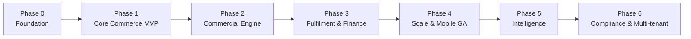

# 05 — Phased Roadmap

> **Status:** Approved · **Owner:** Product + Architecture · **Last updated:** 2026-09-15

Seven phases. Each phase is **independently deployable and commercially useful** —
no phase exists purely to set up the next one. A phase is done when its exit
criteria are met and the previous phase is still green in production.

---

## Phase map

| Phase | Theme | Headline outcome |
|---|---|---|
| 0 | Foundation | A deployable skeleton with auth, config, CI/CD, observability |
| 1 | Core Commerce MVP | A buyer can join, browse, search by salt, and place an order |
| 2 | Commercial Engine | Correct prices, correct stock, correct credit — real money works |
| 3 | Fulfilment & Finance | Orders ship, invoices are legally valid, money is reconciled |
| 4 | Scale & Mobile GA | Both stores live; first service extracted; 10× traffic headroom |
| 5 | Intelligence | AI features with runtime-swappable providers |
| 6 | Compliance & Multi-tenant | Full statutory reporting; platform sellable to a second tenant |

---

## Phase 0 — Foundation

**Goal:** every later phase builds on a base that is already production-shaped.
Nothing here is throwaway.

### Scope

| Area | Deliverable |
|---|---|
| Monorepo | npm workspaces + Turborepo, shared eslint/tsconfig/tailwind presets |
| Backend skeleton | NestJS bootstrap, module structure, config module with Zod env validation |
| Database | Postgres + Prisma, migration tooling, seed framework, all extensions enabled |
| IAM core | Register, login, refresh rotation, argon2id, password reset, RBAC primitives |
| Tenancy | `tenant_id` everywhere, tenant context middleware, auto-scoping |
| Platform config | `platform_setting` table with AES-256-GCM encryption for secrets |
| Feature flags | DB-backed flags with a 30 s cache and change events |
| Audit | Append-only `audit_log`, interceptor that records every mutation |
| Error handling | Global exception filter, RFC 9457 problem+json, correlation ids |
| Rate limiting | Redis sliding-window guard, per-route configuration |
| Idempotency | `Idempotency-Key` middleware + storage + replay |
| Health | `/health/live`, `/health/ready` (503 on dependency failure), graceful shutdown |
| Observability | Pino structured logs, OpenTelemetry traces, Prometheus metrics, Sentry |
| Infra | Dockerfiles (multi-stage), docker-compose for local, Terraform for dev/staging |
| CI/CD | GitHub Actions: lint → typecheck → test → build → migrate → deploy |
| Docs | OpenAPI generation wired into CI |
| Website skeleton | Next.js app, design tokens, layout, auth flow, API client generation |
| Admin skeleton | Same, plus an RBAC-aware navigation shell |
| Mobile skeleton | Expo app, navigation, auth flow, secure token storage |

### Exit criteria

- [x] `npm run dev` brings up backend + website + admin locally with one command.
      *Verified: `turbo run dev` starts all three — the website answers on :3000, the
      API on :3001, the admin portal on :3002. The command is `npm`, not `pnpm`; see
      [ADR-016](03-architecture-decisions.md).*
- [x] A user can register, verify, log in, refresh, and log out from all three clients.
      *Website and admin verified end-to-end against a live API: each app's BFF sets
      an HttpOnly refresh cookie, returns an in-memory access token, rotates the
      cookie on refresh, revokes the session on sign-out, and refuses a cross-origin
      sign-in. The full journey — register → verify (single-use code, wrong code
      rejected) → log in → reset password → old password refused and every session
      revoked — was exercised against the API. The mobile app implements the same
      flow against the same endpoints and is verified by typecheck and `expo config`,
      but has **not** been run on a device or simulator: this environment has none.*
- [x] `/health/ready` returns **503** when Postgres is stopped.
      *Verified: 200 → stop Postgres → 503 → restart Postgres → 200, with the API
      process never restarting (`uptimeSeconds` confirms it). `/health/live` stayed
      200 throughout, so a database outage does not crash-loop the fleet.*
- [x] A mutation writes an audit row with an actor and a correlation id.
      *Verified: `auth.login.succeeded` and `auth.refresh.reuse_detected` both
      carry `actor_id`, `tenant_id`, `correlation_id` and `request_id`. The table
      is append-only via triggers — `UPDATE`, `DELETE` and `TRUNCATE` all raise.*
- [x] CI is green on `main` — the workflow now matches what the repository can
      actually run.
      *Was not true before this pass: the workflow assumed pnpm
      (`pnpm install --frozen-lockfile`, `pnpm test:unit`), but the repo has
      `package-lock.json` and npm workspaces, no `pnpm-lock.yaml` exists, and
      pnpm is not installed — so every job failed before running a check. It also
      referenced a Dockerfile and four npm scripts that did not exist. All fixed:
      see [ADR-016](03-architecture-decisions.md), `scripts/check-module-boundaries.mjs`
      and `scripts/check-coverage.mjs`. The `static` job now lint- and typechecks
      **every** workspace — backend, website, admin, mobile and the shared packages —
      and the `build` job regenerates the OpenAPI document *and* the API client and
      fails on contract drift. **Not yet observed on a remote run** —
      the first push is what proves it.*
- [ ] Deploys to `dev` automatically.
      *The deploy-to-`dev` job exists, runs on push to `main` after every other job
      passes, and reports exactly what is missing rather than failing. It is gated on
      `DEV_DATABASE_URL` / `KUBE_CONFIG`, which are not provisioned.
      **This is the one Phase 0 exit criterion still open**, and it is blocked on
      credentials that live outside the repository, not on code. It has also not been
      observed on a remote run.*
- [x] A load test sustains 100 RPS on a login + profile read with p95 < 200 ms.
      *Verified with autocannon against a seeded local backend: 1,500 requests over
      15 s at 100 RPS on `GET /auth/me` — zero errors, p50 9 ms, **p97.5 23 ms**,
      p99 26 ms. The assertion is on p97.5, a strictly tighter bound than p95,
      because autocannon does not expose p95; passing it implies p95 passes.
      `k6` — the tool [15-testing-strategy.md](15-testing-strategy.md) prescribes — is
      committed for CI and staging in `loadtest/k6/auth-baseline.js`, and the
      `load-test` workflow runs the 10-minute figure the criterion names.*
- [x] **No secret is committed.** A secret-scanning step runs in CI.
      *`.env` is gitignored and no generated secret appears in any tracked file.
      The `gitleaks` job runs on every push and PR with `fetch-depth: 0`, so the
      whole history is scanned, not just the diff.*
- [x] Security-critical code is unit-tested and gated.
      *243 tests across 10 suites. `scripts/check-coverage.mjs` holds **eight**
      security-critical modules to ≥90% statements/lines — the list now includes the
      one-time-code service, contact verification and password reset, all three at
      100%. The global ratchet was raised from 16/9/13/16 to **38/26/27/37** against
      a measured **39.1% statements / 27.7% branches / 28.6% functions / 38.5%
      lines**. The repo-wide figure is still low because most of `src` belongs to
      phases that do not exist yet; the ratchet is there to stop the number going
      down, not to certify quality.*
- [x] No dependency with an **unreviewed** high-severity advisory ships.
      *Getting here required bumping Nest 11.0.1 → 11.2.3 (path-to-regexp ReDoS),
      `uuid` → 11.1.1, and `@nestjs/cli` → 11.0.24; that took the tree from 20
      vulnerabilities (6 high) to 7 (3 high). The remaining three are `multer`
      DoS advisories reached only through `@nestjs/platform-express`, which pins
      the vulnerable `2.2.0` exactly — npm's own suggested fix is a downgrade to
      Nest 7. They are accepted, with reasons and a review date, in
      `scripts/check-audit.mjs`. No upload routes exist yet, so the parser is
      never invoked.*

### Risks

| Risk | Mitigation |
|---|---|
| Over-engineering the foundation | Timebox. Ship the minimum that is production-shaped. |
| Premature abstraction | Only abstract what has two real implementations today. |

### Build status

Built and verified (backend). Everything below typechecks (`tsc --noEmit`), builds
(`nest build`), and was exercised against a live PostgreSQL 17 instance.

| Area | State |
|---|---|
| Monorepo, shared presets | Done (`packages/config`, `turbo.json`, npm workspaces) |
| Backend skeleton, Zod env validation | Done — fails at boot with an actionable message |
| Postgres + Prisma, migration, seed | Done — migration applies cleanly; seed is idempotent |
| IAM core | Done — register, login, refresh rotation with reuse detection, logout, sessions |
| Tenancy | Done — guard layer + Prisma extension; unclassified models throw |
| Platform config | Done — `platform_setting`, AES-256-GCM, AAD-bound |
| Feature flags | Done — DB-backed, seeded |
| Audit | Done — append-only enforced by triggers |
| Error handling | Done — RFC 9457, correlation ids |
| Rate limiting | Done — Redis sliding window, fails open |
| Idempotency | Done — `IdempotencyInterceptor` + Redis-backed store behind a port; `POST /auth/register` requires an `Idempotency-Key` and replays on retry |
| Health | Done — liveness vs readiness, 503 on required-dependency failure |
| Observability | Done — structured Pino logs; Prometheus `/metrics`; OpenTelemetry traces started from a preload; Sentry error reporting wired through the exception filter via an `ErrorReporter` port |
| Infra | `docker-compose`, `backend.Dockerfile` (multi-stage, non-root, tini, healthcheck) and `.dockerignore` written; CI builds and scans the image. Terraform and k8s are placeholders |
| CI/CD | Workflow rewritten for npm; runs lint and typecheck across every workspace, module boundaries, unit tests, coverage gate, dependency audit, secret scan, build, container scan, OpenAPI generation and a contract-drift check, and has a deploy-to-`dev` job gated on `DEV_DATABASE_URL` / `KUBE_CONFIG`. Not yet run against a remote |
| Docs / OpenAPI | Done — `src/scripts/generate-openapi.ts` writes `backend/openapi.json` from the same document definition the server serves; CI generates and uploads it |
| Testing | 243 unit tests, 10 suites. `test:integration` / `test:concurrency` / `test:isolation` configs exist but the suites are unwritten — see the parked block in `ci.yml` |
| Load testing | `loadtest/run-local.mjs` (autocannon, proven locally) and `loadtest/k6/auth-baseline.js` (k6, for CI and staging), with the `load-test` workflow |
| Architecture gates | `check:module-boundaries` enforces the barrel rule across `src/modules/**`; `check:coverage` holds security-critical modules to ≥90% |
| Website | Built — Next 16 App Router, shared design tokens, route groups, and a BFF auth flow (HttpOnly refresh cookie, in-memory access token) wired to the API |
| Admin portal | Built — Next 16, RBAC-aware navigation shell filtered by the capabilities the API reports for the signed-in user |
| Mobile | Built — Expo SDK 57, React Navigation 7, Keychain-backed refresh token, silent refresh on 401. Typechecked and `expo config` validated; not run on a device here |
| Shared packages | `@medichain/config` presets (tsconfig/eslint/tailwind), `@medichain/api-client` generated from OpenAPI, `@medichain/ui` primitives |

Not yet started: the `test-isolation` / `test-concurrency` suites (their Jest configs
exist, the tests that assert the tenant extension applies inside a transaction do
not). The three client applications and the load testing are now built and verified
as recorded above; the only Phase 0 item still open is the deploy-to-`dev` job, which
is blocked on credentials rather than on code.

---

## Phase 1 — Core Commerce MVP

**Goal:** a real distributor can join the platform, get approved, find medicine by
brand **or by salt combination**, and place an order that a human fulfils manually.

This is the phase that proves the product. Everything else is refinement.

### Scope

Status is as at the build status table below; "backend landed" means the endpoints
exist and are capability-gated, not that a screen consumes them yet.

| Module | Deliverable | Status |
|---|---|---|
| Onboarding & KYC | Application wizard, document upload, reviewer queue, approval → org + user creation | **Partial** — submit → PENDING, reviewer queue, approve/reject landed. Wizard, document upload and org/user creation on approval open |
| Catalogue | Product master, composition, pack, images, categories, bulk Excel import | **Partial** — create/browse/detail/update landed. Images, categories and bulk import open |
| Salt Engine | Salt master + aliases, composition links, **canonical composition key**, exact and combination search | **Landed** — canonical key (pure, unit-tested) + AND combination search with the `exact` flag |
| Search | Postgres FTS + `pg_trgm` adapter behind `SearchPort`, autocomplete, filters | **Partial** — app-level matching capped at 500 rows. `pg_trgm`, FTS, autocomplete, filters open |
| Cart | Server-side cart, live price/availability, quick order pad, CSV indent upload | **Partial** — backend cart landed. Screen, quick order pad, CSV indent upload open |
| Orders | Placement with idempotency, state machine, list/detail, cancellation, order PDF | **Partial** — backend landed incl. cancel-with-release. Screen and order PDF open |
| Notifications | Email + SMS templates, event-driven sending, retry with backoff | **Partial** — templates + best-effort post-commit send behind a port. No transport, no retry |
| Admin | Buyer approval queue, catalogue CRUD, order list and manual status update | **Partial** — backend landed (capability-gated endpoints). Admin UI screens open |
| Website | Catalogue browse, salt search, cart, checkout, order history | **Partial** — all five pages built in the authenticated route group (browse + salt search routing-verified on the built app). Cart, checkout and order history not yet exercised against real data |
| Mobile | Catalogue browse, salt search, cart, order placement (internal TestFlight / APK) | **Not started** — auth shell only |

### Exit criteria

- [ ] A new distributor completes onboarding and is approved end-to-end.
- [ ] Searching `Paracetamol + Cetirizine` returns all matching products, and a
      typo (`Paracetmol`) still finds Paracetamol.
- [ ] An order placed twice with the same `Idempotency-Key` creates **one** order.
- [ ] Concurrent order placement on the last unit of stock never oversells
      (verified by a concurrent integration test).
- [ ] An order triggers an email **and** an SMS within 30 s of placement.
- [ ] Order placement p95 < 800 ms at 200 RPS sustained.
- [ ] 100% of order state transitions appear in `order_status_history` with an actor.

### Build status (updated 2026-09-16 — no exit criterion met yet)

| Slice | Landed | Evidence |
|---|---|---|
| DB models | `product`, `warehouse_stock`, `cart`, `cart_item`, `customer_order`, `order_item` | `prisma validate` clean; **migration not run**; commerce seed (`demo buyer org + 8 products + WH-MUM-01 stock`, deterministic ids, engine-computed composition keys) wired into `seed.ts` and typechecked — awaiting a database |
| Onboarding & KYC (backend) | Submit → PENDING, reviewer queue, approve → ACTIVE, reject → BLOCKED; audited | typecheck, boundaries, lint, unit tests green |
| Catalogue (backend) | Product create/browse/detail/update; paginated, allow-listed sort; audited writes | typecheck, boundaries, lint, unit tests green |
| Salt engine + search (backend) | Canonical composition key; `GET /search/products` with AND combination matching + `exact` flag; no `pg_trgm` yet | typecheck, boundaries, lint, unit tests green |
| Cart (backend) | Server-side cart per org; live price, availability checks; add/update/remove | typecheck, boundaries, lint, unit tests green |
| Orders (backend) | Idempotent placement with row-locked reservation; canonical state machine; cancel releases stock; audited | typecheck, boundaries, lint, unit tests green |
| Notifications (backend) | `sendOrderPlaced` port + best-effort post-commit send; pure templates, unit-tested; log adapter only | typecheck, boundaries, lint, unit tests green |
| Admin (backend) | Covered by existing endpoints: buyer queue (onboarding), catalogue CRUD, order list + manual status (orders) | covered above |
| Contract (OpenAPI) | 32 paths / 15 schemas, up from 16 / 7. Operation ids qualified by resource; `Idempotency-Key` declared on all five routes that require it | `npm run openapi:generate`; the contract-drift job diffs the committed artifacts |
| Typed API client | `catalog`, `search`, `cart`, `orders`, `onboarding` endpoint modules over the generated client; response shapes in `@medichain/shared-types` | typecheck + build green across all 9 workspaces |
| Website storefront — search | `/products` browse with pagination and a name filter; `/salt-search` by composition with the exact-match marker. Both moved into the authenticated route group: the endpoints require a capability and price per organisation, so there is no anonymous catalogue to render | typecheck, lint, website build; routing smoke test on the built app (`307` to sign-in without a refresh cookie, `200` with one) |

Unit-test evidence is the suite as it stood when the row landed; it now stands at
**250 tests across 12 suites**.

Also fixed while landing cart/orders: `tenantId` added to line-item tables (scoping
extension requirement); commerce models classified in
`tenant-scoping.extension.ts`; earlier slices retrofitted to
`findFirst`/`updateMany` (Prisma rejects extension-rewritten unique `where`).

**Not started:** mobile storefront, the migration run. Exercising cart / checkout /
order history against real data, durable retry (outbox relay), typo tolerance
(`pg_trgm`), and `order_status_history` remain explicitly unclaimed.

**Next up — the Phase 1 migration.** It is now the only thing blocking end-to-end
verification of everything above: the commerce tables exist in `schema.prisma` and in
no database. The seed side is ready (`prisma/seeds/commerce.seed.ts`: demo buyer
org, 8 products including a Paracetamol+Cetirizine combo, `WH-MUM-01` stock), so the
moment the migration is applied, `prisma db seed` populates stock and the storefront,
cart and order paths can be exercised against real data. Every row in this table is
verified statically (typecheck, boundaries, lint, unit tests), and the two storefront
screens only as far as their routing. That gap closes as soon as the migration is
applied and the seed runs.

### Risks

| Risk | Mitigation |
|---|---|
| Salt data quality | Build the curation UI in this phase, not later. Bad salt data poisons search. |
| Onboarding friction | Instrument drop-off at each wizard step from day one. |
| Catalogue import quality | Dry-run mode + a validation report before any commit. |

---

## Phase 2 — Commercial Engine

**Goal:** the numbers become correct and trustworthy. This is where real money
starts moving, so this phase is the most safety-critical.

### Scope

| Module | Deliverable |
|---|---|
| Pricing | Price lists, tier assignment, customer overrides, effective dating, tax-inclusive/exclusive |
| Schemes | Percentage/flat/free-goods/combo, scoping, validity windows, stacking rules, explanation trail |
| Inventory | Multi-warehouse, **batch-level stock**, immutable stock ledger, ATP, FEFO allocation, reservations, near-expiry alerts |
| Credit | Limits, exposure tracking, in-transaction availability check, credit hold/release, append-only ledger |
| Payments | Gateway abstraction, Razorpay, offline payment recording, **fail-closed webhooks**, idempotent handling |
| Invoicing | Tax invoice, gapless numbering, CGST/SGST/IGST, HSN summary, PDF, round-off |
| Prescriptions | Upload, pharmacist verification, schedule-based order blocking |
| Notifications | Push notifications, in-app centre, channel preferences, template UI |
| Admin | Pricing UI, scheme UI, stock management, credit management, invoice viewer |
| Mobile | Push notifications, barcode scan, reorder, prescription upload |

### Exit criteria

- [ ] Price shown in the cart equals the price on the invoice, always — verified by
      a property-based test over a randomised scheme matrix.
- [ ] Concurrent orders against the same credit limit never exceed the limit
      (verified by a concurrent test with row locking).
- [ ] `Σ(stock_ledger) = stock_on_hand` for every product/warehouse/batch after a
      full test cycle, including concurrent orders, cancellations and returns.
- [ ] A duplicate payment webhook credits the ledger exactly once.
- [ ] A webhook with an invalid signature is rejected **and** does not 500
      (it returns a logged failure so the provider does not retry forever).
- [ ] A schedule H1 product cannot be ordered without a verified prescription,
      enforced server-side.
- [ ] Invoice totals reconcile to the paisa against an independently computed
      expected value for 1,000 generated orders.
- [ ] Every balance mutation is inside a transaction with a row lock — verified by
      a lint rule plus code review sign-off.

### Risks

| Risk | Mitigation |
|---|---|
| Money bugs under concurrency | The full money-safety checklist is a **merge gate**, not a guideline. |
| Scheme rule explosion | Rules are data, not code. The engine is a pure function with exhaustive tests. |
| Stock drift | Nightly reconciliation cron with an advisory lock; alert on any mismatch. |
| Pricing disputes | Every price carries an explanation trail shown in the UI. |

---

## Phase 3 — Fulfilment & Finance

**Goal:** goods leave the warehouse, invoices are legally valid, and money is
reconciled.

### Scope

| Module | Deliverable |
|---|---|
| Logistics | Shipments, transporters, freight, dispatch note, tracking, ePOD, failure reasons |
| Returns | Return requests, approval, inspection, credit note, batch traceability |
| Invoicing+ | E-way bill, credit/debit notes, invoice cancellation, GSTR-1/3B exports |
| Orders+ | Backorders, split across warehouses, partial dispatch, partial invoicing |
| Credit+ | Ageing, statements, dunning, advance allocation, reconciliation |
| Reporting | Sales, order, inventory, outstanding, product and customer dashboards, exports |
| Prescriptions+ | Statutory Schedule H/H1/X registers |
| Admin | Dispatch workflow, returns queue, report centre, dunning queue, support tickets |
| Mobile | Order tracking, invoice download, outstanding view, return request |

### Exit criteria

- [ ] A full order lifecycle runs order → dispatch → e-way bill → delivery → ePOD
      → invoice, with a complete audit trail.
- [ ] A partial dispatch produces two invoices whose totals equal the order total.
- [ ] An accepted return produces a credit note that correctly reverses the tax.
- [ ] GSTR-1 export matches the invoice register to the paisa.
- [ ] Reports run against a read replica; p95 for the sales dashboard < 2 s.
- [ ] No report query appears in the primary's slow-query log.
- [ ] Payment reconciliation runs nightly and reports zero unexplained differences
      on a clean dataset.

---

## Phase 4 — Scale & Mobile GA

**Goal:** production scale, both app stores live, first services extracted on
evidence.

### Scope

| Area | Deliverable |
|---|---|
| Search | OpenSearch adapter, synonym expansion, fuzzy matching, personalised ranking, reindex tooling |
| Events | Kafka introduction for domain events; outbox relay gains a Kafka publisher |
| Extraction | Notifications → own service; Search → own service (following ADR-000 criteria) |
| Mobile | App Store + Play Store release, OTA update pipeline, crash reporting, store assets |
| Scale | Read replicas, Redis cluster, table partitioning for `stock_ledger` and `audit_log` |
| Performance | Query optimisation, N+1 elimination, connection pool tuning, caching layers |
| Reliability | Load testing at 10× peak, chaos drills, runbooks, on-call rotation |
| Integrations | API keys for buyer ERP integration, webhooks out |
| Ops | Full Grafana dashboards, alerting rules, SLO tracking, error budget policy |

### Exit criteria

- [ ] Sustained 2,000 RPS on read endpoints with p95 < 200 ms and < 1% error rate.
- [ ] Both mobile apps are live and passing store review.
- [ ] A single API pod can be killed mid-traffic with zero user-visible errors.
- [ ] Postgres failover to a replica completes in < 60 s with automatic recovery.
- [ ] Notifications run as an independent service; killing it does not affect ordering.
- [ ] A load test at 3× expected peak passes with headroom to spare.
- [ ] Runbooks exist for: DB failover, Redis loss, queue backlog, bad deploy rollback.

---

## Phase 5 — Intelligence

**Goal:** AI features that are genuinely useful, with providers swappable at runtime
and zero risk to core flows.

### Scope

| Area | Deliverable |
|---|---|
| AI platform | Provider registry, encrypted keys, per-feature binding, usage metering, budget caps |
| Extraction | AI Services as an independent service (blast-radius isolation) |
| Features | Prescription OCR, semantic search, demand forecasting, reorder suggestions, description enrichment, duplicate detection |
| Reporting+ | Custom report builder, scheduled delivery, BI/warehouse feed |
| Personalisation | Personalised ranking, personalised reorder cadence |

### Exit criteria

- [ ] An admin switches the AI provider and rotates the key **with no redeploy and
      no restart**; the change is live within 30 s.
- [ ] AI budget exhaustion degrades gracefully — every core flow still works.
- [ ] Killing the AI service has zero impact on order placement, pricing or stock.
- [ ] Prescription OCR reaches a measurable accuracy bar on a labelled test set,
      and every OCR field is human-reviewable before it affects a decision.
- [ ] Every AI call is metered with tokens, cost and latency, queryable by feature.

---

## Phase 6 — Compliance & Multi-tenant

**Goal:** full statutory compliance at scale, and the platform becomes sellable to
a second pharma company.

### Scope

| Area | Deliverable |
|---|---|
| Compliance | E-invoice (IRN) at scale, narcotic registers, controlled-substance caps, 7-year retention |
| Multi-tenant | Enable a second tenant, tenant-scoped everything verified, per-tenant config and branding |
| Data | Export, deletion, retention automation, archival to cold storage |
| Advanced | Passkeys, drug-interaction warnings, anomaly detection, advanced analytics |
| Hardening | Penetration test, compliance audit, DR drill, business continuity plan |

### Exit criteria

- [ ] A second tenant is onboarded with **zero** cross-tenant data leakage, verified
      by an automated isolation test suite.
- [ ] E-invoice IRN generation succeeds for 100% of eligible invoices in a soak test.
- [ ] A cross-tenant access attempt is blocked at both the guard **and** the query layer.
- [ ] An external penetration test reports no critical or high findings.
- [ ] A full DR drill restores service from backups within the RTO target.

---

## Cross-phase concerns

### Definition of Done (applies to every phase)

- [ ] Feature implemented against the documented API contract.
- [ ] Unit tests for domain logic; integration tests for the persistence path.
- [ ] OpenAPI spec updated and the client regenerated.
- [ ] Audit logging in place for every state change.
- [ ] Authorisation enforced at both the guard and the query layer.
- [ ] Idempotency on every unsafe write.
- [ ] Structured logs with correlation ids at every decision point.
- [ ] Metrics for the new endpoint(s).
- [ ] No secrets in code or config files.
- [ ] Documentation updated in `docs/`.

### Quality gates (must pass before any phase closes)

| Gate | Threshold |
|---|---|
| Unit test coverage (domain + application layers) | ≥ 85% |
| Integration test coverage (repositories, transactions) | ≥ 70% |
| Critical-path E2E tests | 100% passing |
| p95 latency, read endpoints | < 200 ms |
| p95 latency, write endpoints | < 800 ms |
| Error rate (5xx) | < 0.1% |
| Known critical/high security findings | 0 |
| Money-path concurrency tests | All passing |

### Suggested team shape

| Phase | Team |
|---|---|
| 0–1 | 1 architect/lead, 2 backend, 2 frontend, 1 mobile, 1 QA, 1 DevOps (part-time) |
| 2–3 | + 1 backend (money paths), + 1 QA, + 1 business analyst (pharma domain) |
| 4 | + 1 DevOps, + 1 mobile, + 1 performance engineer |
| 5–6 | + 1 ML/AI engineer, + 1 security engineer |

A **pharma domain expert** (someone who has actually run distribution operations)
should join by phase 2 at the latest. Most of the requirements in modules 6, 10, 11,
13 and 15 are impossible to get right from first principles alone.

### What we explicitly defer

| Deferred | Until | Why |
|---|---|---|
| Microservice extraction | Phase 4 | No measured scaling pressure before then |
| Kafka | Phase 4 | Outbox + BullMQ is sufficient and far simpler |
| OpenSearch | Phase 4 | Postgres FTS is adequate below ~200k SKUs |
| Full AI suite | Phase 5 | Needs a stable catalogue and real usage data to be useful |
| Multi-tenant enablement | Phase 6 | One customer today; columns are already in place |
| Warehouse handheld app | Phase 4+ | Web admin works for the first warehouse |
| Route optimisation | Phase 4+ | Needs real delivery volume to tune against |
