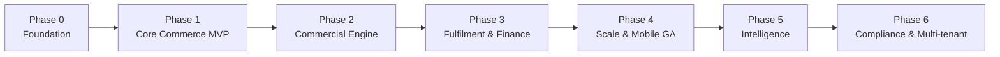

# 05 — Phased Roadmap

> **Status:** Approved · **Owner:** Product + Architecture · **Last updated:** 2026-09-11

Seven phases. Each phase is **independently deployable and commercially useful** —
no phase exists purely to set up the next one. A phase is done when its exit
criteria are met and the previous phase is still green in production.

---

## Phase map

| Phase | Theme | Headline outcome |
|---|---|---|
| 0 | Foundation | A deployable skeleton with auth, config, CI/CD, observability |
| 1 | Core Commerce MVP | A buyer can join, browse, search by salt, and place an order |
| 2 | Commercial Engine | Correct prices, correct stock, correct credit — real money works |
| 3 | Fulfilment & Finance | Orders ship, invoices are legally valid, money is reconciled |
| 4 | Scale & Mobile GA | Both stores live; first service extracted; 10× traffic headroom |
| 5 | Intelligence | AI features with runtime-swappable providers |
| 6 | Compliance & Multi-tenant | Full statutory reporting; platform sellable to a second tenant |

---

## Phase 0 — Foundation

**Goal:** every later phase builds on a base that is already production-shaped.
Nothing here is throwaway.

### Scope

| Area | Deliverable |
|---|---|
| Monorepo | pnpm workspaces + Turborepo, shared eslint/tsconfig/tailwind presets |
| Backend skeleton | NestJS bootstrap, module structure, config module with Zod env validation |
| Database | Postgres + Prisma, migration tooling, seed framework, all extensions enabled |
| IAM core | Register, login, refresh rotation, argon2id, password reset, RBAC primitives |
| Tenancy | `tenant_id` everywhere, tenant context middleware, auto-scoping |
| Platform config | `platform_setting` table with AES-256-GCM encryption for secrets |
| Feature flags | DB-backed flags with a 30 s cache and change events |
| Audit | Append-only `audit_log`, interceptor that records every mutation |
| Error handling | Global exception filter, RFC 9457 problem+json, correlation ids |
| Rate limiting | Redis sliding-window guard, per-route configuration |
| Idempotency | `Idempotency-Key` middleware + storage + replay |
| Health | `/health/live`, `/health/ready` (503 on dependency failure), graceful shutdown |
| Observability | Pino structured logs, OpenTelemetry traces, Prometheus metrics, Sentry |
| Infra | Dockerfiles (multi-stage), docker-compose for local, Terraform for dev/staging |
| CI/CD | GitHub Actions: lint → typecheck → test → build → migrate → deploy |
| Docs | OpenAPI generation wired into CI |
| Website skeleton | Next.js app, design tokens, layout, auth flow, API client generation |
| Admin skeleton | Same, plus an RBAC-aware navigation shell |
| Mobile skeleton | Expo app, navigation, auth flow, secure token storage |

### Exit criteria

- [ ] `pnpm dev` brings up backend + website + admin locally with one command.
      *Backend only — the website and admin apps are still folder skeletons.*
- [ ] A user can register, verify, log in, refresh, and log out from all three clients.
      *Verified against the API directly (register, login, refresh rotation, reuse
      detection, logout). The three clients do not exist yet.*
- [x] `/health/ready` returns **503** when Postgres is stopped.
      *Verified: 200 → stop Postgres → 503 → restart Postgres → 200, with the API
      process never restarting (`uptimeSeconds` confirms it). `/health/live` stayed
      200 throughout, so a database outage does not crash-loop the fleet.*
- [x] A mutation writes an audit row with an actor and a correlation id.
      *Verified: `auth.login.succeeded` and `auth.refresh.reuse_detected` both
      carry `actor_id`, `tenant_id`, `correlation_id` and `request_id`. The table
      is append-only via triggers — `UPDATE`, `DELETE` and `TRUNCATE` all raise.*
- [ ] CI is green on `main` and deploys to `dev` automatically.
      *Workflow exists; no remote run has been observed yet.*
- [ ] A load test sustains 100 RPS on a login + profile read with p95 < 200 ms.
- [ ] **No secret is committed.** A secret-scanning step runs in CI.
      *`.env` is gitignored and no generated secret appears in any tracked file.
      The CI scanning step still needs to be wired up.*

### Risks

| Risk | Mitigation |
|---|---|
| Over-engineering the foundation | Timebox. Ship the minimum that is production-shaped. |
| Premature abstraction | Only abstract what has two real implementations today. |

### Build status

Built and verified (backend). Everything below typechecks (`tsc --noEmit`), builds
(`nest build`), and was exercised against a live PostgreSQL 17 instance.

| Area | State |
|---|---|
| Monorepo, shared presets | Done (`packages/config`, `turbo.json`, npm workspaces) |
| Backend skeleton, Zod env validation | Done — fails at boot with an actionable message |
| Postgres + Prisma, migration, seed | Done — migration applies cleanly; seed is idempotent |
| IAM core | Done — register, login, refresh rotation with reuse detection, logout, sessions |
| Tenancy | Done — guard layer + Prisma extension; unclassified models throw |
| Platform config | Done — `platform_setting`, AES-256-GCM, AAD-bound |
| Feature flags | Done — DB-backed, seeded |
| Audit | Done — append-only enforced by triggers |
| Error handling | Done — RFC 9457, correlation ids |
| Rate limiting | Done — Redis sliding window, fails open |
| Health | Done — liveness vs readiness, 503 on required-dependency failure |
| Observability | Structured logs only; OpenTelemetry, Prometheus and Sentry not wired |
| Infra | `docker-compose` and Dockerfiles written; Terraform and k8s are placeholders |
| CI/CD | Workflow written; not yet run against a remote |
| Idempotency middleware | Decorator and storage port exist; not yet wired into a route |
| Website / admin / mobile | Folder skeletons only — no application code |

Not yet started: the website, admin and mobile applications; load testing; and the
`test-isolation` / `test-concurrency` suites (their Jest configs exist, the tests
that assert the tenant extension applies inside a transaction do not).

---

## Phase 1 — Core Commerce MVP

**Goal:** a real distributor can join the platform, get approved, find medicine by
brand **or by salt combination**, and place an order that a human fulfils manually.

This is the phase that proves the product. Everything else is refinement.

### Scope

| Module | Deliverable |
|---|---|
| Onboarding & KYC | Application wizard, document upload, reviewer queue, approval → org + user creation |
| Catalogue | Product master, composition, pack, images, categories, bulk Excel import |
| Salt Engine | Salt master + aliases, composition links, **canonical composition key**, exact and combination search |
| Search | Postgres FTS + `pg_trgm` adapter behind `SearchPort`, autocomplete, filters |
| Cart | Server-side cart, live price/availability, quick order pad, CSV indent upload |
| Orders | Placement with idempotency, state machine, list/detail, cancellation, order PDF |
| Notifications | Email + SMS templates, event-driven sending, retry with backoff |
| Admin | Buyer approval queue, catalogue CRUD, order list and manual status update |
| Website | Catalogue browse, salt search, cart, checkout, order history |
| Mobile | Catalogue browse, salt search, cart, order placement (internal TestFlight / APK) |

### Exit criteria

- [ ] A new distributor completes onboarding and is approved end-to-end.
- [ ] Searching `Paracetamol + Cetirizine` returns all matching products, and a
      typo (`Paracetmol`) still finds Paracetamol.
- [ ] An order placed twice with the same `Idempotency-Key` creates **one** order.
- [ ] Concurrent order placement on the last unit of stock never oversells
      (verified by a concurrent integration test).
- [ ] An order triggers an email **and** an SMS within 30 s of placement.
- [ ] Order placement p95 < 800 ms at 200 RPS sustained.
- [ ] 100% of order state transitions appear in `order_status_history` with an actor.

### Risks

| Risk | Mitigation |
|---|---|
| Salt data quality | Build the curation UI in this phase, not later. Bad salt data poisons search. |
| Onboarding friction | Instrument drop-off at each wizard step from day one. |
| Catalogue import quality | Dry-run mode + a validation report before any commit. |

---

## Phase 2 — Commercial Engine

**Goal:** the numbers become correct and trustworthy. This is where real money
starts moving, so this phase is the most safety-critical.

### Scope

| Module | Deliverable |
|---|---|
| Pricing | Price lists, tier assignment, customer overrides, effective dating, tax-inclusive/exclusive |
| Schemes | Percentage/flat/free-goods/combo, scoping, validity windows, stacking rules, explanation trail |
| Inventory | Multi-warehouse, **batch-level stock**, immutable stock ledger, ATP, FEFO allocation, reservations, near-expiry alerts |
| Credit | Limits, exposure tracking, in-transaction availability check, credit hold/release, append-only ledger |
| Payments | Gateway abstraction, Razorpay, offline payment recording, **fail-closed webhooks**, idempotent handling |
| Invoicing | Tax invoice, gapless numbering, CGST/SGST/IGST, HSN summary, PDF, round-off |
| Prescriptions | Upload, pharmacist verification, schedule-based order blocking |
| Notifications | Push notifications, in-app centre, channel preferences, template UI |
| Admin | Pricing UI, scheme UI, stock management, credit management, invoice viewer |
| Mobile | Push notifications, barcode scan, reorder, prescription upload |

### Exit criteria

- [ ] Price shown in the cart equals the price on the invoice, always — verified by
      a property-based test over a randomised scheme matrix.
- [ ] Concurrent orders against the same credit limit never exceed the limit
      (verified by a concurrent test with row locking).
- [ ] `Σ(stock_ledger) = stock_on_hand` for every product/warehouse/batch after a
      full test cycle, including concurrent orders, cancellations and returns.
- [ ] A duplicate payment webhook credits the ledger exactly once.
- [ ] A webhook with an invalid signature is rejected **and** does not 500
      (it returns a logged failure so the provider does not retry forever).
- [ ] A schedule H1 product cannot be ordered without a verified prescription,
      enforced server-side.
- [ ] Invoice totals reconcile to the paisa against an independently computed
      expected value for 1,000 generated orders.
- [ ] Every balance mutation is inside a transaction with a row lock — verified by
      a lint rule plus code review sign-off.

### Risks

| Risk | Mitigation |
|---|---|
| Money bugs under concurrency | The full money-safety checklist is a **merge gate**, not a guideline. |
| Scheme rule explosion | Rules are data, not code. The engine is a pure function with exhaustive tests. |
| Stock drift | Nightly reconciliation cron with an advisory lock; alert on any mismatch. |
| Pricing disputes | Every price carries an explanation trail shown in the UI. |

---

## Phase 3 — Fulfilment & Finance

**Goal:** goods leave the warehouse, invoices are legally valid, and money is
reconciled.

### Scope

| Module | Deliverable |
|---|---|
| Logistics | Shipments, transporters, freight, dispatch note, tracking, ePOD, failure reasons |
| Returns | Return requests, approval, inspection, credit note, batch traceability |
| Invoicing+ | E-way bill, credit/debit notes, invoice cancellation, GSTR-1/3B exports |
| Orders+ | Backorders, split across warehouses, partial dispatch, partial invoicing |
| Credit+ | Ageing, statements, dunning, advance allocation, reconciliation |
| Reporting | Sales, order, inventory, outstanding, product and customer dashboards, exports |
| Prescriptions+ | Statutory Schedule H/H1/X registers |
| Admin | Dispatch workflow, returns queue, report centre, dunning queue, support tickets |
| Mobile | Order tracking, invoice download, outstanding view, return request |

### Exit criteria

- [ ] A full order lifecycle runs order → dispatch → e-way bill → delivery → ePOD
      → invoice, with a complete audit trail.
- [ ] A partial dispatch produces two invoices whose totals equal the order total.
- [ ] An accepted return produces a credit note that correctly reverses the tax.
- [ ] GSTR-1 export matches the invoice register to the paisa.
- [ ] Reports run against a read replica; p95 for the sales dashboard < 2 s.
- [ ] No report query appears in the primary's slow-query log.
- [ ] Payment reconciliation runs nightly and reports zero unexplained differences
      on a clean dataset.

---

## Phase 4 — Scale & Mobile GA

**Goal:** production scale, both app stores live, first services extracted on
evidence.

### Scope

| Area | Deliverable |
|---|---|
| Search | OpenSearch adapter, synonym expansion, fuzzy matching, personalised ranking, reindex tooling |
| Events | Kafka introduction for domain events; outbox relay gains a Kafka publisher |
| Extraction | Notifications → own service; Search → own service (following ADR-000 criteria) |
| Mobile | App Store + Play Store release, OTA update pipeline, crash reporting, store assets |
| Scale | Read replicas, Redis cluster, table partitioning for `stock_ledger` and `audit_log` |
| Performance | Query optimisation, N+1 elimination, connection pool tuning, caching layers |
| Reliability | Load testing at 10× peak, chaos drills, runbooks, on-call rotation |
| Integrations | API keys for buyer ERP integration, webhooks out |
| Ops | Full Grafana dashboards, alerting rules, SLO tracking, error budget policy |

### Exit criteria

- [ ] Sustained 2,000 RPS on read endpoints with p95 < 200 ms and < 1% error rate.
- [ ] Both mobile apps are live and passing store review.
- [ ] A single API pod can be killed mid-traffic with zero user-visible errors.
- [ ] Postgres failover to a replica completes in < 60 s with automatic recovery.
- [ ] Notifications run as an independent service; killing it does not affect ordering.
- [ ] A load test at 3× expected peak passes with headroom to spare.
- [ ] Runbooks exist for: DB failover, Redis loss, queue backlog, bad deploy rollback.

---

## Phase 5 — Intelligence

**Goal:** AI features that are genuinely useful, with providers swappable at runtime
and zero risk to core flows.

### Scope

| Area | Deliverable |
|---|---|
| AI platform | Provider registry, encrypted keys, per-feature binding, usage metering, budget caps |
| Extraction | AI Services as an independent service (blast-radius isolation) |
| Features | Prescription OCR, semantic search, demand forecasting, reorder suggestions, description enrichment, duplicate detection |
| Reporting+ | Custom report builder, scheduled delivery, BI/warehouse feed |
| Personalisation | Personalised ranking, personalised reorder cadence |

### Exit criteria

- [ ] An admin switches the AI provider and rotates the key **with no redeploy and
      no restart**; the change is live within 30 s.
- [ ] AI budget exhaustion degrades gracefully — every core flow still works.
- [ ] Killing the AI service has zero impact on order placement, pricing or stock.
- [ ] Prescription OCR reaches a measurable accuracy bar on a labelled test set,
      and every OCR field is human-reviewable before it affects a decision.
- [ ] Every AI call is metered with tokens, cost and latency, queryable by feature.

---

## Phase 6 — Compliance & Multi-tenant

**Goal:** full statutory compliance at scale, and the platform becomes sellable to
a second pharma company.

### Scope

| Area | Deliverable |
|---|---|
| Compliance | E-invoice (IRN) at scale, narcotic registers, controlled-substance caps, 7-year retention |
| Multi-tenant | Enable a second tenant, tenant-scoped everything verified, per-tenant config and branding |
| Data | Export, deletion, retention automation, archival to cold storage |
| Advanced | Passkeys, drug-interaction warnings, anomaly detection, advanced analytics |
| Hardening | Penetration test, compliance audit, DR drill, business continuity plan |

### Exit criteria

- [ ] A second tenant is onboarded with **zero** cross-tenant data leakage, verified
      by an automated isolation test suite.
- [ ] E-invoice IRN generation succeeds for 100% of eligible invoices in a soak test.
- [ ] A cross-tenant access attempt is blocked at both the guard **and** the query layer.
- [ ] An external penetration test reports no critical or high findings.
- [ ] A full DR drill restores service from backups within the RTO target.

---

## Cross-phase concerns

### Definition of Done (applies to every phase)

- [ ] Feature implemented against the documented API contract.
- [ ] Unit tests for domain logic; integration tests for the persistence path.
- [ ] OpenAPI spec updated and the client regenerated.
- [ ] Audit logging in place for every state change.
- [ ] Authorisation enforced at both the guard and the query layer.
- [ ] Idempotency on every unsafe write.
- [ ] Structured logs with correlation ids at every decision point.
- [ ] Metrics for the new endpoint(s).
- [ ] No secrets in code or config files.
- [ ] Documentation updated in `docs/`.

### Quality gates (must pass before any phase closes)

| Gate | Threshold |
|---|---|
| Unit test coverage (domain + application layers) | ≥ 85% |
| Integration test coverage (repositories, transactions) | ≥ 70% |
| Critical-path E2E tests | 100% passing |
| p95 latency, read endpoints | < 200 ms |
| p95 latency, write endpoints | < 800 ms |
| Error rate (5xx) | < 0.1% |
| Known critical/high security findings | 0 |
| Money-path concurrency tests | All passing |

### Suggested team shape

| Phase | Team |
|---|---|
| 0–1 | 1 architect/lead, 2 backend, 2 frontend, 1 mobile, 1 QA, 1 DevOps (part-time) |
| 2–3 | + 1 backend (money paths), + 1 QA, + 1 business analyst (pharma domain) |
| 4 | + 1 DevOps, + 1 mobile, + 1 performance engineer |
| 5–6 | + 1 ML/AI engineer, + 1 security engineer |

A **pharma domain expert** (someone who has actually run distribution operations)
should join by phase 2 at the latest. Most of the requirements in modules 6, 10, 11,
13 and 15 are impossible to get right from first principles alone.

### What we explicitly defer

| Deferred | Until | Why |
|---|---|---|
| Microservice extraction | Phase 4 | No measured scaling pressure before then |
| Kafka | Phase 4 | Outbox + BullMQ is sufficient and far simpler |
| OpenSearch | Phase 4 | Postgres FTS is adequate below ~200k SKUs |
| Full AI suite | Phase 5 | Needs a stable catalogue and real usage data to be useful |
| Multi-tenant enablement | Phase 6 | One customer today; columns are already in place |
| Warehouse handheld app | Phase 4+ | Web admin works for the first warehouse |
| Route optimisation | Phase 4+ | Needs real delivery volume to tune against |
