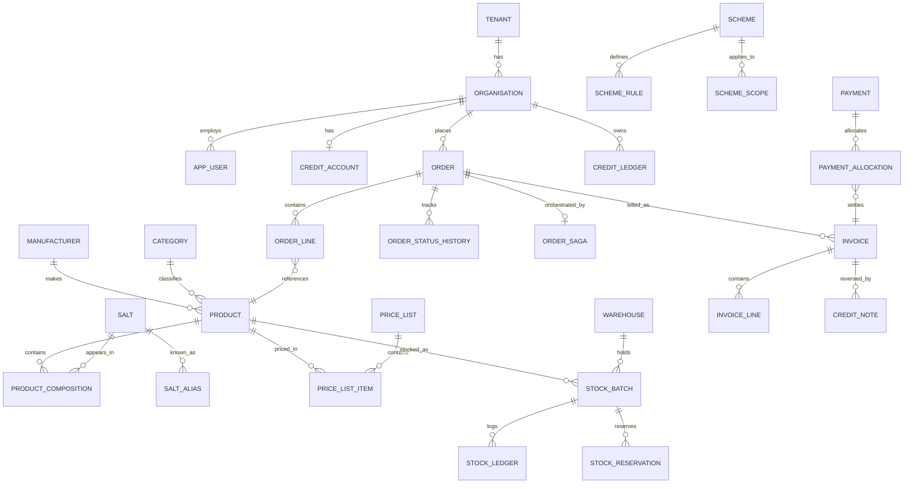

# 06 — Database Design

> **Status:** Approved · **Owner:** Solution Architecture · **Last updated:** 2026-09-11

PostgreSQL 17. This document defines the schema, the indexing strategy, the
constraints that protect correctness, and the concurrency patterns used on the
money paths.

---

## 1. Conventions

| Convention | Rule |
|---|---|
| Primary keys | `uuid` v7 (time-ordered — better index locality than v4), `DEFAULT uuid_generate_v7()` |
| Tenant scope | Every business table has `tenant_id uuid NOT NULL`, first column of every composite index |
| Timestamps | `created_at`, `updated_at` as `timestamptz NOT NULL DEFAULT now()` |
| Soft delete | `deleted_at timestamptz NULL`; a partial index excludes deleted rows |
| Money | `NUMERIC(18,4)`. Never `float`, never `real`, never `double precision` |
| Quantity | `NUMERIC(18,4)` — fractional units are real (ml, grams) |
| Enums | Postgres native enums for closed sets; lookup tables for open/editable sets |
| Naming | `snake_case`, singular table names, `<entity>_id` foreign keys |
| Cross-module refs | Plain `uuid` **without** an FK constraint — allows later extraction |
| Intra-module refs | Real `FOREIGN KEY` with an explicit `ON DELETE` |
| JSON | `jsonb` only for genuinely schemaless data; never for anything queried as a filter |

**Why UUID v7:** sequential integers leak business volume and make distributed ID
generation painful; random UUID v4 fragments B-tree indexes. UUID v7 gives
time-ordering with global uniqueness — the best of both.

---

## 2. Tenancy & Organisation

```sql
CREATE TABLE tenant (
  id                  uuid PRIMARY KEY DEFAULT uuid_generate_v7(),
  code                text NOT NULL UNIQUE,
  legal_name          text NOT NULL,
  display_name        text NOT NULL,
  gstin               text,
  pan                 text,
  drug_licence_no     text,
  drug_licence_expiry date,
  currency            char(3) NOT NULL DEFAULT 'INR',
  timezone            text NOT NULL DEFAULT 'Asia/Kolkata',
  fiscal_year_start   smallint NOT NULL DEFAULT 4,      -- April
  invoice_prefix      text NOT NULL DEFAULT 'INV',
  status              text NOT NULL DEFAULT 'ACTIVE',
  settings            jsonb NOT NULL DEFAULT '{}'::jsonb,
  created_at          timestamptz NOT NULL DEFAULT now(),
  updated_at          timestamptz NOT NULL DEFAULT now()
);

-- A buyer organisation: distributor / wholesaler / pharmacy / hospital
CREATE TABLE organisation (
  id                uuid PRIMARY KEY DEFAULT uuid_generate_v7(),
  tenant_id         uuid NOT NULL REFERENCES tenant(id),
  parent_org_id     uuid REFERENCES organisation(id),   -- chain -> branch
  code              text NOT NULL,
  legal_name        text NOT NULL,
  trade_name        text,
  org_type          text NOT NULL,          -- DISTRIBUTOR|WHOLESALER|PHARMACY|HOSPITAL
  gstin             text,
  pan               text,
  drug_licence_no   text,
  drug_licence_type text,                   -- '20B/21B', '20/21'
  drug_licence_expiry date,
  billing_address   jsonb NOT NULL,
  contact_email     citext,
  contact_phone     text,
  price_list_id     uuid,
  credit_account_id uuid,
  sales_rep_id      uuid,
  tier              text NOT NULL DEFAULT 'STANDARD',
  status            text NOT NULL DEFAULT 'PENDING',  -- PENDING|ACTIVE|SUSPENDED|BLOCKED
  created_at        timestamptz NOT NULL DEFAULT now(),
  updated_at        timestamptz NOT NULL DEFAULT now(),
  deleted_at        timestamptz,
  UNIQUE (tenant_id, code)
);

CREATE INDEX idx_org_tenant_status ON organisation (tenant_id, status) WHERE deleted_at IS NULL;
CREATE INDEX idx_org_gstin         ON organisation (tenant_id, gstin) WHERE gstin IS NOT NULL;
CREATE INDEX idx_org_licence_exp   ON organisation (tenant_id, drug_licence_expiry)
  WHERE status = 'ACTIVE';

CREATE TABLE organisation_address (
  id              uuid PRIMARY KEY DEFAULT uuid_generate_v7(),
  tenant_id       uuid NOT NULL REFERENCES tenant(id),
  organisation_id uuid NOT NULL REFERENCES organisation(id) ON DELETE CASCADE,
  label           text NOT NULL,
  address_type    text NOT NULL DEFAULT 'SHIP_TO',   -- SHIP_TO|BILL_TO|BOTH
  line1           text NOT NULL,
  line2           text,
  city            text NOT NULL,
  state_code      text NOT NULL,                     -- GST state code
  pincode         text NOT NULL,
  country         char(2) NOT NULL DEFAULT 'IN',
  is_default      boolean NOT NULL DEFAULT false,
  created_at      timestamptz NOT NULL DEFAULT now()
);

CREATE INDEX idx_addr_org ON organisation_address (tenant_id, organisation_id);
-- At most one default per type per org
CREATE UNIQUE INDEX uq_addr_default ON organisation_address (organisation_id, address_type)
  WHERE is_default;
```

**Note on `drug_licence_expiry`:** indexed because a nightly job scans it to
auto-suspend organisations whose licence has lapsed. Selling to a lapsed licensee is
a compliance breach, so this must be a *job*, not a manual review.

---

## 3. Identity & Access

```sql
CREATE TABLE app_user (
  id                uuid PRIMARY KEY DEFAULT uuid_generate_v7(),
  tenant_id         uuid REFERENCES tenant(id),        -- NULL for platform super-admin
  organisation_id   uuid REFERENCES organisation(id),
  email             citext UNIQUE,
  phone             text UNIQUE,
  password_hash     text,                              -- NULL for OTP-only users
  full_name         text NOT NULL,
  status            text NOT NULL DEFAULT 'PENDING_VERIFICATION',
  email_verified_at timestamptz,
  phone_verified_at timestamptz,
  mfa_secret_enc    bytea,                             -- TOTP secret, AES-256-GCM
  mfa_enabled       boolean NOT NULL DEFAULT false,
  failed_attempts   smallint NOT NULL DEFAULT 0,
  locked_until      timestamptz,
  last_login_at     timestamptz,
  attributes        jsonb NOT NULL DEFAULT '{}'::jsonb, -- ABAC: regions, warehouseIds...
  created_at        timestamptz NOT NULL DEFAULT now(),
  updated_at        timestamptz NOT NULL DEFAULT now(),
  deleted_at        timestamptz,
  CHECK (email IS NOT NULL OR phone IS NOT NULL)
);

CREATE INDEX idx_user_tenant   ON app_user (tenant_id) WHERE deleted_at IS NULL;
CREATE INDEX idx_user_org      ON app_user (organisation_id) WHERE deleted_at IS NULL;
CREATE INDEX idx_user_status   ON app_user (tenant_id, status) WHERE deleted_at IS NULL;

CREATE TABLE role (
  id          uuid PRIMARY KEY DEFAULT uuid_generate_v7(),
  tenant_id   uuid REFERENCES tenant(id),   -- NULL = system role, shared
  code        text NOT NULL,
  name        text NOT NULL,
  is_system   boolean NOT NULL DEFAULT false,
  created_at  timestamptz NOT NULL DEFAULT now(),
  UNIQUE (tenant_id, code)
);

CREATE TABLE capability (
  code        text PRIMARY KEY,             -- 'order:create', 'invoice:void'
  module      text NOT NULL,
  description text NOT NULL
);

CREATE TABLE role_capability (
  role_id        uuid NOT NULL REFERENCES role(id) ON DELETE CASCADE,
  capability_code text NOT NULL REFERENCES capability(code),
  PRIMARY KEY (role_id, capability_code)
);

CREATE TABLE user_role (
  user_id     uuid NOT NULL REFERENCES app_user(id) ON DELETE CASCADE,
  role_id     uuid NOT NULL REFERENCES role(id),
  granted_at  timestamptz NOT NULL DEFAULT now(),
  granted_by  uuid REFERENCES app_user(id),
  PRIMARY KEY (user_id, role_id)
);

-- Refresh-token families for rotation + reuse detection
CREATE TABLE auth_session (
  id                  uuid PRIMARY KEY DEFAULT uuid_generate_v7(),
  tenant_id           uuid,
  user_id             uuid NOT NULL REFERENCES app_user(id) ON DELETE CASCADE,
  family_id           uuid NOT NULL,               -- one family per login
  refresh_token_hash  text NOT NULL,               -- argon2/sha256 of the token
  device_id           uuid,
  device_label        text,
  ip_address          inet,
  user_agent          text,
  expires_at          timestamptz NOT NULL,
  revoked_at          timestamptz,
  revoked_reason      text,
  replaced_by_id      uuid REFERENCES auth_session(id),
  created_at          timestamptz NOT NULL DEFAULT now()
);

CREATE INDEX idx_session_user   ON auth_session (user_id, expires_at DESC);
CREATE INDEX idx_session_family ON auth_session (family_id);
CREATE UNIQUE INDEX uq_session_token ON auth_session (refresh_token_hash);

-- OTP: hashed, single-use, deleted on verification
CREATE TABLE otp_challenge (
  id           uuid PRIMARY KEY DEFAULT uuid_generate_v7(),
  identifier   text NOT NULL,          -- phone or email
  purpose      text NOT NULL,          -- LOGIN|REGISTER|RESET|VERIFY
  code_hash    text NOT NULL,
  attempts     smallint NOT NULL DEFAULT 0,
  max_attempts smallint NOT NULL DEFAULT 5,
  expires_at   timestamptz NOT NULL,
  consumed_at  timestamptz,
  created_at   timestamptz NOT NULL DEFAULT now()
);

CREATE INDEX idx_otp_lookup ON otp_challenge (identifier, purpose, expires_at DESC);
```

**Security notes baked into the schema**

- OTP codes are stored **hashed**, never in plaintext — a database leak must not
  hand over live login codes.
- `auth_session.family_id` implements **refresh-token reuse detection**: if a token
  that was already rotated is presented again, the entire family is revoked. This is
  the standard defence against a stolen refresh token being replayed.
- `failed_attempts` + `locked_until` implement exponential lockout.
- `mfa_secret_enc` is `bytea` because it holds AES-256-GCM ciphertext, not text.

---

## 4. Onboarding & KYC

```sql
CREATE TABLE onboarding_application (
  id                uuid PRIMARY KEY DEFAULT uuid_generate_v7(),
  tenant_id         uuid NOT NULL REFERENCES tenant(id),
  reference_no      text NOT NULL UNIQUE,
  applicant_user_id uuid REFERENCES app_user(id),
  org_type          text NOT NULL,
  legal_name        text NOT NULL,
  gstin             text,
  pan               text,
  drug_licence_no   text,
  drug_licence_type text,
  drug_licence_expiry date,
  payload           jsonb NOT NULL DEFAULT '{}'::jsonb,  -- the full wizard state
  status            text NOT NULL DEFAULT 'DRAFT',
  -- DRAFT|SUBMITTED|UNDER_REVIEW|INFO_REQUIRED|APPROVED|REJECTED
  submitted_at      timestamptz,
  reviewed_by       uuid REFERENCES app_user(id),
  reviewed_at       timestamptz,
  rejection_reason  text,
  sla_due_at        timestamptz,
  created_org_id    uuid REFERENCES organisation(id),
  created_at        timestamptz NOT NULL DEFAULT now(),
  updated_at        timestamptz NOT NULL DEFAULT now()
);

CREATE INDEX idx_onb_status ON onboarding_application (tenant_id, status, submitted_at);
CREATE INDEX idx_onb_sla    ON onboarding_application (tenant_id, sla_due_at)
  WHERE status IN ('SUBMITTED','UNDER_REVIEW');

CREATE TABLE application_document (
  id              uuid PRIMARY KEY DEFAULT uuid_generate_v7(),
  tenant_id       uuid NOT NULL REFERENCES tenant(id),
  application_id  uuid NOT NULL REFERENCES onboarding_application(id) ON DELETE CASCADE,
  doc_type        text NOT NULL,          -- DRUG_LICENCE|GST_CERT|PAN|CHEQUE|OTHER
  storage_key     text NOT NULL,          -- S3 object key
  file_name       text NOT NULL,
  mime_type       text NOT NULL,
  size_bytes      bigint NOT NULL,
  checksum_sha256 text NOT NULL,
  virus_scan      text NOT NULL DEFAULT 'PENDING',  -- PENDING|CLEAN|INFECTED|FAILED
  ocr_result      jsonb,
  verified        boolean NOT NULL DEFAULT false,
  created_at      timestamptz NOT NULL DEFAULT now()
);

CREATE INDEX idx_doc_app ON application_document (tenant_id, application_id);

CREATE TABLE application_review_note (
  id             uuid PRIMARY KEY DEFAULT uuid_generate_v7(),
  tenant_id      uuid NOT NULL REFERENCES tenant(id),
  application_id uuid NOT NULL REFERENCES onboarding_application(id) ON DELETE CASCADE,
  author_id      uuid NOT NULL REFERENCES app_user(id),
  note           text NOT NULL,
  is_internal    boolean NOT NULL DEFAULT true,
  created_at     timestamptz NOT NULL DEFAULT now()
);
```

---

## 5. Catalogue & Salt Engine

The heart of the product. Read alongside
[08-search-and-salt-engine.md](08-search-and-salt-engine.md).

```sql
CREATE TABLE manufacturer (
  id         uuid PRIMARY KEY DEFAULT uuid_generate_v7(),
  tenant_id  uuid NOT NULL REFERENCES tenant(id),
  name       text NOT NULL,
  code       text,
  licence_no text,
  country    char(2) DEFAULT 'IN',
  created_at timestamptz NOT NULL DEFAULT now(),
  UNIQUE (tenant_id, name)
);

-- The salt (molecule) master. The canonical, deduplicated list.
CREATE TABLE salt (
  id              uuid PRIMARY KEY DEFAULT uuid_generate_v7(),
  tenant_id       uuid NOT NULL REFERENCES tenant(id),
  canonical_name  text NOT NULL,          -- 'Paracetamol'
  normalized_name text NOT NULL,          -- 'paracetamol' (lower, unaccented, trimmed)
  category        text,                   -- 'Analgesic'
  atc_code        text,                   -- WHO ATC classification
  is_active       boolean NOT NULL DEFAULT true,
  created_at      timestamptz NOT NULL DEFAULT now(),
  updated_at      timestamptz NOT NULL DEFAULT now(),
  UNIQUE (tenant_id, normalized_name)
);

CREATE INDEX idx_salt_trgm ON salt USING gin (normalized_name gin_trgm_ops);

-- Synonyms / brand names / alternate spellings. This is what makes salt search work.
CREATE TABLE salt_alias (
  id         uuid PRIMARY KEY DEFAULT uuid_generate_v7(),
  tenant_id  uuid NOT NULL REFERENCES tenant(id),
  salt_id    uuid NOT NULL REFERENCES salt(id) ON DELETE CASCADE,
  alias      text NOT NULL,
  normalized text NOT NULL,
  alias_type text NOT NULL DEFAULT 'SYNONYM',  -- SYNONYM|BRAND|MISSPELLING|INN|TRADE
  created_at timestamptz NOT NULL DEFAULT now(),
  UNIQUE (tenant_id, normalized)
);

CREATE INDEX idx_salt_alias_trgm ON salt_alias USING gin (normalized gin_trgm_ops);
CREATE INDEX idx_salt_alias_salt ON salt_alias (tenant_id, salt_id);

CREATE TABLE category (
  id         uuid PRIMARY KEY DEFAULT uuid_generate_v7(),
  tenant_id  uuid NOT NULL REFERENCES tenant(id),
  parent_id  uuid REFERENCES category(id),
  name       text NOT NULL,
  slug       text NOT NULL,
  path       text NOT NULL,            -- materialised path '/antibiotics/penicillins'
  level      smallint NOT NULL DEFAULT 0,
  created_at timestamptz NOT NULL DEFAULT now(),
  UNIQUE (tenant_id, slug)
);

CREATE INDEX idx_category_path ON category (tenant_id, path);

CREATE TABLE product (
  id                  uuid PRIMARY KEY DEFAULT uuid_generate_v7(),
  tenant_id           uuid NOT NULL REFERENCES tenant(id),
  sku                 text NOT NULL,
  brand_name          text NOT NULL,
  generic_name        text NOT NULL,
  normalized_brand    text NOT NULL,
  normalized_generic  text NOT NULL,
  manufacturer_id     uuid NOT NULL REFERENCES manufacturer(id),
  manufacturer_code   text,
  category_id         uuid REFERENCES category(id),
  dosage_form         text NOT NULL,        -- TABLET|CAPSULE|SYRUP|INJECTION|...
  strength_value      numeric(18,4),
  strength_unit       text,                 -- mg|ml|%|IU
  pack_description    text NOT NULL,        -- 'Strip of 10 tablets'
  units_per_pack      integer NOT NULL DEFAULT 1,
  -- pack hierarchy for correct ordering units
  base_unit           text NOT NULL DEFAULT 'UNIT',
  pack_unit           text NOT NULL DEFAULT 'PACK',
  units_per_pack_unit integer NOT NULL DEFAULT 1,
  case_unit           text,
  packs_per_case      integer,
  schedule_class      text NOT NULL DEFAULT 'OTC',   -- OTC|H|H1|X|NARCOTIC
  prescription_required boolean NOT NULL GENERATED ALWAYS AS
                        (schedule_class IN ('H','H1','X','NARCOTIC')) STORED,
  storage_condition   text NOT NULL DEFAULT 'AMBIENT', -- AMBIENT|COOL|COLD_CHAIN|FROZEN
  hsn_code            text,
  gst_rate            numeric(5,2) NOT NULL DEFAULT 12.00,
  -- Salt Engine: deterministic key over the normalised composition
  composition_key     text,                 -- 'cetirizine-10mg|paracetamol-500mg'
  composition_hash    char(64),             -- sha256(composition_key) for exact match
  is_combination      boolean NOT NULL DEFAULT false,
  is_substitutable    boolean NOT NULL DEFAULT true,
  regulatory_hold     boolean NOT NULL DEFAULT false,
  status              text NOT NULL DEFAULT 'DRAFT',  -- DRAFT|ACTIVE|DISCONTINUED|BLOCKED
  attributes          jsonb NOT NULL DEFAULT '{}'::jsonb,
  search_vector       tsvector GENERATED ALWAYS AS (
                        setweight(to_tsvector('english', coalesce(brand_name,'')), 'A') ||
                        setweight(to_tsvector('english', coalesce(generic_name,'')), 'B') ||
                        setweight(to_tsvector('english', coalesce(sku,'')), 'A')
                      ) STORED,
  created_at          timestamptz NOT NULL DEFAULT now(),
  updated_at          timestamptz NOT NULL DEFAULT now(),
  deleted_at          timestamptz,
  UNIQUE (tenant_id, sku)
);

CREATE INDEX idx_product_tenant_status ON product (tenant_id, status) WHERE deleted_at IS NULL;
CREATE INDEX idx_product_category      ON product (tenant_id, category_id) WHERE deleted_at IS NULL;
CREATE INDEX idx_product_mfr           ON product (tenant_id, manufacturer_id);
CREATE INDEX idx_product_schedule      ON product (tenant_id, schedule_class);
CREATE INDEX idx_product_search        ON product USING gin (search_vector);
CREATE INDEX idx_product_brand_trgm    ON product USING gin (normalized_brand gin_trgm_ops);
CREATE INDEX idx_product_generic_trgm  ON product USING gin (normalized_generic gin_trgm_ops);
CREATE INDEX idx_product_comp_key      ON product (tenant_id, composition_key)
  WHERE composition_key IS NOT NULL;
CREATE INDEX idx_product_comp_hash     ON product (tenant_id, composition_hash)
  WHERE composition_hash IS NOT NULL;

-- Composition: an ordered, strength-annotated list of salts per product
CREATE TABLE product_composition (
  id             uuid PRIMARY KEY DEFAULT uuid_generate_v7(),
  tenant_id      uuid NOT NULL REFERENCES tenant(id),
  product_id     uuid NOT NULL REFERENCES product(id) ON DELETE CASCADE,
  salt_id        uuid NOT NULL REFERENCES salt(id),
  strength_value numeric(18,4) NOT NULL,
  strength_unit  text NOT NULL,
  sequence       smallint NOT NULL DEFAULT 0,
  created_at     timestamptz NOT NULL DEFAULT now(),
  UNIQUE (product_id, salt_id)
);

CREATE INDEX idx_comp_product ON product_composition (tenant_id, product_id);
CREATE INDEX idx_comp_salt    ON product_composition (tenant_id, salt_id);

CREATE TABLE product_image (
  id          uuid PRIMARY KEY DEFAULT uuid_generate_v7(),
  tenant_id   uuid NOT NULL REFERENCES tenant(id),
  product_id  uuid NOT NULL REFERENCES product(id) ON DELETE CASCADE,
  storage_key text NOT NULL,
  alt_text    text,
  is_primary  boolean NOT NULL DEFAULT false,
  sort_order  smallint NOT NULL DEFAULT 0,
  created_at  timestamptz NOT NULL DEFAULT now()
);

CREATE UNIQUE INDEX uq_product_primary_image ON product_image (product_id) WHERE is_primary;

CREATE TABLE product_barcode (
  id         uuid PRIMARY KEY DEFAULT uuid_generate_v7(),
  tenant_id  uuid NOT NULL REFERENCES tenant(id),
  product_id uuid NOT NULL REFERENCES product(id) ON DELETE CASCADE,
  barcode    text NOT NULL,
  pack_level text NOT NULL DEFAULT 'PACK',   -- UNIT|PACK|CASE
  created_at timestamptz NOT NULL DEFAULT now(),
  UNIQUE (tenant_id, barcode, pack_level)
);
```

### The `composition_key` design

`composition_key` is the sorted, normalised, strength-annotated salt list:

```
'cetirizine-10mg|paracetamol-500mg'
```

Built by: resolve every salt to its canonical name → lowercase → strip
non-alphanumerics → normalise the strength to a base unit → sort
lexicographically → join with `|`.

Why this works:

- **Order-independent** — `Paracetamol + Cetirizine` and `Cetirizine + Paracetamol`
  produce the same key.
- **Synonym-independent** — `PCM`, `Acetaminophen` and `Paracetamol` all resolve to
  the same salt row before the key is built.
- **Strength-aware** — `500mg` and `0.5g` normalise identically; `500mg` and `650mg`
  correctly differ.
- **Indexable** — a plain B-tree equality lookup, not a text search.
- **Deterministic** — the same input always yields the same key, so it can be
  recomputed and backfilled safely.

`composition_hash` is the SHA-256 of that key, used where a fixed-length key is
preferable for indexing. Both are maintained by a database trigger on
`product_composition` so they can never drift from the composition rows.

---

## 6. Pricing & Schemes

```sql
CREATE TABLE price_list (
  id             uuid PRIMARY KEY DEFAULT uuid_generate_v7(),
  tenant_id      uuid NOT NULL REFERENCES tenant(id),
  code           text NOT NULL,
  name           text NOT NULL,
  currency       char(3) NOT NULL DEFAULT 'INR',
  tax_inclusive  boolean NOT NULL DEFAULT false,
  is_default     boolean NOT NULL DEFAULT false,
  valid_from     date NOT NULL DEFAULT CURRENT_DATE,
  valid_to       date,
  status         text NOT NULL DEFAULT 'ACTIVE',
  created_at     timestamptz NOT NULL DEFAULT now(),
  UNIQUE (tenant_id, code)
);

CREATE TABLE price_list_item (
  id            uuid PRIMARY KEY DEFAULT uuid_generate_v7(),
  tenant_id     uuid NOT NULL REFERENCES tenant(id),
  price_list_id uuid NOT NULL REFERENCES price_list(id) ON DELETE CASCADE,
  product_id    uuid NOT NULL REFERENCES product(id),
  mrp           numeric(18,4) NOT NULL,
  ptr           numeric(18,4),          -- price to retailer
  pts           numeric(18,4),          -- price to stockist
  selling_price numeric(18,4) NOT NULL,
  cost_price    numeric(18,4),
  min_qty       numeric(18,4) NOT NULL DEFAULT 1,
  valid_from    date NOT NULL DEFAULT CURRENT_DATE,
  valid_to      date,
  created_at    timestamptz NOT NULL DEFAULT now(),
  updated_at    timestamptz NOT NULL DEFAULT now()
);

-- A product can have multiple time-bounded price rows in one list
CREATE INDEX idx_pli_lookup ON price_list_item
  (tenant_id, price_list_id, product_id, valid_from DESC);
CREATE INDEX idx_pli_product ON price_list_item (tenant_id, product_id);

CREATE TABLE customer_price_override (
  id             uuid PRIMARY KEY DEFAULT uuid_generate_v7(),
  tenant_id      uuid NOT NULL REFERENCES tenant(id),
  organisation_id uuid NOT NULL REFERENCES organisation(id) ON DELETE CASCADE,
  product_id     uuid NOT NULL REFERENCES product(id),
  override_price numeric(18,4) NOT NULL,
  reason         text,
  valid_from     date NOT NULL DEFAULT CURRENT_DATE,
  valid_to       date,
  approved_by    uuid REFERENCES app_user(id),
  created_at     timestamptz NOT NULL DEFAULT now()
);

CREATE INDEX idx_cpo_lookup ON customer_price_override
  (tenant_id, organisation_id, product_id, valid_from DESC);

CREATE TABLE scheme (
  id             uuid PRIMARY KEY DEFAULT uuid_generate_v7(),
  tenant_id      uuid NOT NULL REFERENCES tenant(id),
  code           text NOT NULL,
  name           text NOT NULL,
  scheme_type    text NOT NULL,   -- PERCENT_OFF|FLAT_OFF|FREE_GOODS|COMBO|SLAB
  priority       smallint NOT NULL DEFAULT 100,   -- lower wins; deterministic ordering
  stackable      boolean NOT NULL DEFAULT false,
  budget_amount  numeric(18,4),
  consumed_amount numeric(18,4) NOT NULL DEFAULT 0,
  valid_from     timestamptz NOT NULL,
  valid_to       timestamptz,
  status         text NOT NULL DEFAULT 'ACTIVE',
  created_at     timestamptz NOT NULL DEFAULT now(),
  UNIQUE (tenant_id, code)
);

CREATE INDEX idx_scheme_window ON scheme (tenant_id, status, valid_from, valid_to);

CREATE TABLE scheme_rule (
  id            uuid PRIMARY KEY DEFAULT uuid_generate_v7(),
  tenant_id     uuid NOT NULL REFERENCES tenant(id),
  scheme_id     uuid NOT NULL REFERENCES scheme(id) ON DELETE CASCADE,
  min_quantity  numeric(18,4),
  max_quantity  numeric(18,4),
  discount_pct  numeric(5,2),
  discount_flat numeric(18,4),
  free_qty      numeric(18,4),
  buy_qty       numeric(18,4),
  created_at    timestamptz NOT NULL DEFAULT now()
);

CREATE TABLE scheme_scope (
  id          uuid PRIMARY KEY DEFAULT uuid_generate_v7(),
  tenant_id   uuid NOT NULL REFERENCES tenant(id),
  scheme_id   uuid NOT NULL REFERENCES scheme(id) ON DELETE CASCADE,
  scope_type  text NOT NULL,   -- PRODUCT|CATEGORY|BRAND|MANUFACTURER|CUSTOMER_TIER|ORGANISATION|REGION
  scope_value text NOT NULL,   -- the id or code the scope points at
  created_at  timestamptz NOT NULL DEFAULT now()
);

CREATE INDEX idx_scheme_scope ON scheme_scope (tenant_id, scope_type, scope_value);

-- Immutable record of every price a customer was ever offered/quoted
CREATE TABLE price_history (
  id             uuid PRIMARY KEY DEFAULT uuid_generate_v7(),
  tenant_id      uuid NOT NULL REFERENCES tenant(id),
  organisation_id uuid,
  product_id     uuid NOT NULL,
  quantity       numeric(18,4) NOT NULL,
  base_price     numeric(18,4) NOT NULL,
  final_price    numeric(18,4) NOT NULL,
  applied_rules  jsonb NOT NULL,       -- the explanation trail
  computed_at    timestamptz NOT NULL DEFAULT now()
);

CREATE INDEX idx_price_hist ON price_history (tenant_id, organisation_id, product_id, computed_at DESC);
```

**The pricing engine is a pure function** over
`(product, quantity, organisation, priceList, schemes, at)`. `price_history.applied_rules`
stores the explanation trail so "why is this the price?" is always answerable — which
is the difference between a pricing dispute resolved in 10 seconds and one resolved
in 3 days.

---

## 7. Inventory & Warehouse

```sql
CREATE TABLE warehouse (
  id         uuid PRIMARY KEY DEFAULT uuid_generate_v7(),
  tenant_id  uuid NOT NULL REFERENCES tenant(id),
  code       text NOT NULL,
  name       text NOT NULL,
  address    jsonb NOT NULL,
  state_code text NOT NULL,
  is_active  boolean NOT NULL DEFAULT true,
  created_at timestamptz NOT NULL DEFAULT now(),
  UNIQUE (tenant_id, code)
);

-- One row per product + batch + warehouse. THE stock record.
CREATE TABLE stock_batch (
  id                uuid PRIMARY KEY DEFAULT uuid_generate_v7(),
  tenant_id         uuid NOT NULL REFERENCES tenant(id),
  warehouse_id      uuid NOT NULL REFERENCES warehouse(id),
  product_id        uuid NOT NULL REFERENCES product(id),
  batch_no          text NOT NULL,
  manufacture_date  date,
  expiry_date       date NOT NULL,
  mrp               numeric(18,4) NOT NULL,
  cost_price        numeric(18,4) NOT NULL,
  qty_on_hand       numeric(18,4) NOT NULL DEFAULT 0,
  qty_reserved      numeric(18,4) NOT NULL DEFAULT 0,
  qty_available     numeric(18,4) GENERATED ALWAYS AS (qty_on_hand - qty_reserved) STORED,
  qty_blocked       numeric(18,4) NOT NULL DEFAULT 0,   -- expired/quarantined
  storage_condition text NOT NULL DEFAULT 'AMBIENT',
  is_quarantined    boolean NOT NULL DEFAULT false,
  created_at        timestamptz NOT NULL DEFAULT now(),
  updated_at        timestamptz NOT NULL DEFAULT now(),
  UNIQUE (tenant_id, warehouse_id, product_id, batch_no),
  CHECK (qty_on_hand >= 0),
  CHECK (qty_reserved >= 0),
  CHECK (qty_reserved <= qty_on_hand)
);

-- FEFO: the index that makes allocation fast and correct
CREATE INDEX idx_batch_fefo ON stock_batch
  (tenant_id, warehouse_id, product_id, expiry_date ASC)
  WHERE qty_available > 0 AND is_quarantined = false;

CREATE INDEX idx_batch_expiry ON stock_batch (tenant_id, expiry_date)
  WHERE qty_on_hand > 0;

-- Append-only. Never updated, never deleted.
CREATE TABLE stock_ledger (
  id             uuid PRIMARY KEY DEFAULT uuid_generate_v7(),
  tenant_id      uuid NOT NULL REFERENCES tenant(id),
  warehouse_id   uuid NOT NULL,
  product_id     uuid NOT NULL,
  batch_id       uuid NOT NULL,
  movement_type  text NOT NULL,
  -- RECEIPT|SALE|SALE_RETURN|PURCHASE_RETURN|ADJUSTMENT|TRANSFER_IN|TRANSFER_OUT|DAMAGE|EXPIRY_WRITE_OFF
  quantity       numeric(18,4) NOT NULL,     -- signed: + increases, - decreases
  balance_after  numeric(18,4) NOT NULL,
  reference_type text,                       -- ORDER|GRN|RETURN|ADJUSTMENT
  reference_id   uuid,
  reason_code    text,
  actor_id       uuid REFERENCES app_user(id),
  notes          text,
  occurred_at    timestamptz NOT NULL DEFAULT now()
);

CREATE INDEX idx_ledger_product ON stock_ledger (tenant_id, product_id, occurred_at DESC);
CREATE INDEX idx_ledger_batch   ON stock_ledger (tenant_id, batch_id, occurred_at DESC);
CREATE INDEX idx_ledger_ref     ON stock_ledger (tenant_id, reference_type, reference_id);

CREATE TABLE stock_reservation (
  id             uuid PRIMARY KEY DEFAULT uuid_generate_v7(),
  tenant_id      uuid NOT NULL REFERENCES tenant(id),
  warehouse_id   uuid NOT NULL REFERENCES warehouse(id),
  product_id     uuid NOT NULL REFERENCES product(id),
  batch_id       uuid NOT NULL REFERENCES stock_batch(id),
  quantity       numeric(18,4) NOT NULL,
  reference_type text NOT NULL,          -- ORDER|TRANSFER
  reference_id   uuid NOT NULL,
  status         text NOT NULL DEFAULT 'ACTIVE',  -- ACTIVE|CONSUMED|RELEASED|EXPIRED
  expires_at     timestamptz NOT NULL,
  created_at     timestamptz NOT NULL DEFAULT now()
);

CREATE INDEX idx_res_ref    ON stock_reservation (tenant_id, reference_type, reference_id);
CREATE INDEX idx_res_expiry ON stock_reservation (expires_at) WHERE status = 'ACTIVE';

CREATE TABLE stock_adjustment (
  id             uuid PRIMARY KEY DEFAULT uuid_generate_v7(),
  tenant_id      uuid NOT NULL REFERENCES tenant(id),
  warehouse_id   uuid NOT NULL REFERENCES warehouse(id),
  batch_id       uuid NOT NULL REFERENCES stock_batch(id),
  adjustment_qty numeric(18,4) NOT NULL,
  reason_code    text NOT NULL,
  reason_text    text,
  status         text NOT NULL DEFAULT 'PENDING',  -- PENDING|APPROVED|REJECTED
  requested_by   uuid NOT NULL REFERENCES app_user(id),
  approved_by    uuid REFERENCES app_user(id),
  created_at     timestamptz NOT NULL DEFAULT now()
);
```

### Stock integrity invariants

Three invariants hold at all times and are asserted by a nightly reconciliation job:

```
(1)  qty_on_hand - qty_reserved = qty_available          [enforced by GENERATED column]
(2)  Σ(stock_ledger.quantity) for a batch = stock_batch.qty_on_hand
(3)  Σ(active stock_reservation.quantity) per batch = stock_batch.qty_reserved
```

Invariant (1) is enforced by the database itself — it is a generated column, so it
cannot drift. Invariants (2) and (3) are checked by a job because they span tables.

**Why FEFO allocation is a query, not an algorithm:** the partial index
`idx_batch_fefo` already orders batches by `expiry_date ASC` for a given
product/warehouse with available stock. Allocation is therefore
`SELECT … ORDER BY expiry_date ASC LIMIT … FOR UPDATE SKIP LOCKED` — the index does
the work, and `FOR UPDATE` makes concurrent allocations safe.

---

## 8. Orders

```sql
CREATE TABLE "order" (                       -- reserved word, always quoted
  id                uuid PRIMARY KEY DEFAULT uuid_generate_v7(),
  tenant_id         uuid NOT NULL REFERENCES tenant(id),
  order_no          text NOT NULL,
  organisation_id   uuid NOT NULL REFERENCES organisation(id),
  placed_by         uuid NOT NULL REFERENCES app_user(id),
  placed_by_rep_id  uuid REFERENCES app_user(id),   -- sales-rep-assisted order
  warehouse_id      uuid REFERENCES warehouse(id),
  status            text NOT NULL DEFAULT 'PLACED',
  -- DRAFT|PLACED|PENDING_APPROVAL|CONFIRMED|CREDIT_HOLD|PROCESSING|
  -- PARTIALLY_DISPATCHED|DISPATCHED|DELIVERED|DELIVERY_FAILED|
  -- CANCELLED|REJECTED|RETURN_REQUESTED|RETURNED
  order_type        text NOT NULL DEFAULT 'SALE',
  price_list_id     uuid,
  ship_to_address   jsonb NOT NULL,
  bill_to_address   jsonb NOT NULL,
  -- money: all NUMERIC, all server-computed
  subtotal          numeric(18,4) NOT NULL DEFAULT 0,
  discount_total    numeric(18,4) NOT NULL DEFAULT 0,
  taxable_total     numeric(18,4) NOT NULL DEFAULT 0,
  cgst_total        numeric(18,4) NOT NULL DEFAULT 0,
  sgst_total        numeric(18,4) NOT NULL DEFAULT 0,
  igst_total        numeric(18,4) NOT NULL DEFAULT 0,
  cess_total        numeric(18,4) NOT NULL DEFAULT 0,
  freight_total     numeric(18,4) NOT NULL DEFAULT 0,
  round_off         numeric(18,4) NOT NULL DEFAULT 0,
  grand_total       numeric(18,4) NOT NULL DEFAULT 0,
  payment_terms     text,
  expected_delivery date,
  buyer_note        text,
  internal_note     text,
  prescription_id   uuid,
  saga_state        jsonb NOT NULL DEFAULT '{}'::jsonb,
  idempotency_key   text,
  version           integer NOT NULL DEFAULT 0,     -- optimistic locking
  placed_at         timestamptz NOT NULL DEFAULT now(),
  confirmed_at      timestamptz,
  cancelled_at      timestamptz,
  cancellation_reason text,
  created_at        timestamptz NOT NULL DEFAULT now(),
  updated_at        timestamptz NOT NULL DEFAULT now(),
  UNIQUE (tenant_id, order_no),
  UNIQUE (tenant_id, idempotency_key),
  CHECK (grand_total >= 0)
);

CREATE INDEX idx_order_org    ON "order" (tenant_id, organisation_id, placed_at DESC);
CREATE INDEX idx_order_status ON "order" (tenant_id, status, placed_at DESC);
CREATE INDEX idx_order_placed ON "order" (tenant_id, placed_at DESC);
CREATE INDEX idx_order_rep    ON "order" (tenant_id, placed_by_rep_id) WHERE placed_by_rep_id IS NOT NULL;

CREATE TABLE order_line (
  id                uuid PRIMARY KEY DEFAULT uuid_generate_v7(),
  tenant_id         uuid NOT NULL REFERENCES tenant(id),
  order_id          uuid NOT NULL REFERENCES "order"(id) ON DELETE CASCADE,
  line_no           smallint NOT NULL,
  product_id        uuid NOT NULL REFERENCES product(id),
  product_snapshot  jsonb NOT NULL,      -- brand, generic, pack, hsn, gst at time of order
  quantity          numeric(18,4) NOT NULL,
  unit              text NOT NULL,
  base_unit_price   numeric(18,4) NOT NULL,
  unit_price        numeric(18,4) NOT NULL,
  discount_pct      numeric(5,2) NOT NULL DEFAULT 0,
  discount_amount   numeric(18,4) NOT NULL DEFAULT 0,
  free_qty          numeric(18,4) NOT NULL DEFAULT 0,
  scheme_ids        uuid[] NOT NULL DEFAULT '{}',
  price_explanation jsonb NOT NULL DEFAULT '[]'::jsonb,
  taxable_amount    numeric(18,4) NOT NULL,
  gst_rate          numeric(5,2) NOT NULL,
  cgst_amount       numeric(18,4) NOT NULL DEFAULT 0,
  sgst_amount       numeric(18,4) NOT NULL DEFAULT 0,
  igst_amount       numeric(18,4) NOT NULL DEFAULT 0,
  cess_amount       numeric(18,4) NOT NULL DEFAULT 0,
  line_total        numeric(18,4) NOT NULL,
  fulfilled_qty     numeric(18,4) NOT NULL DEFAULT 0,
  cancelled_qty     numeric(18,4) NOT NULL DEFAULT 0,
  status            text NOT NULL DEFAULT 'PENDING',
  created_at        timestamptz NOT NULL DEFAULT now(),
  UNIQUE (order_id, line_no),
  CHECK (quantity > 0)
);

CREATE INDEX idx_oline_order   ON order_line (tenant_id, order_id);
CREATE INDEX idx_oline_product ON order_line (tenant_id, product_id);

-- Every transition, with actor and reason. Append-only.
CREATE TABLE order_status_history (
  id          uuid PRIMARY KEY DEFAULT uuid_generate_v7(),
  tenant_id   uuid NOT NULL REFERENCES tenant(id),
  order_id    uuid NOT NULL REFERENCES "order"(id) ON DELETE CASCADE,
  from_status text,
  to_status   text NOT NULL,
  actor_id    uuid REFERENCES app_user(id),
  actor_type  text NOT NULL DEFAULT 'USER',   -- USER|SYSTEM|SAGA
  reason      text,
  metadata    jsonb NOT NULL DEFAULT '{}'::jsonb,
  created_at  timestamptz NOT NULL DEFAULT now()
);

CREATE INDEX idx_osh_order ON order_status_history (tenant_id, order_id, created_at);

CREATE TABLE order_saga (
  id            uuid PRIMARY KEY DEFAULT uuid_generate_v7(),
  tenant_id     uuid NOT NULL REFERENCES tenant(id),
  order_id      uuid NOT NULL REFERENCES "order"(id) ON DELETE CASCADE,
  saga_type     text NOT NULL DEFAULT 'ORDER_FULFILMENT',
  current_step  text NOT NULL,
  step_index    smallint NOT NULL DEFAULT 0,
  status        text NOT NULL DEFAULT 'RUNNING',  -- RUNNING|COMPLETED|COMPENSATING|FAILED
  completed_steps text[] NOT NULL DEFAULT '{}',
  context       jsonb NOT NULL DEFAULT '{}'::jsonb,
  last_error    text,
  retry_count   smallint NOT NULL DEFAULT 0,
  next_retry_at timestamptz,
  created_at    timestamptz NOT NULL DEFAULT now(),
  updated_at    timestamptz NOT NULL DEFAULT now()
);

CREATE INDEX idx_saga_pending ON order_saga (status, next_retry_at)
  WHERE status IN ('RUNNING','COMPENSATING','FAILED');
CREATE UNIQUE INDEX uq_saga_order ON order_saga (order_id, saga_type);
```

**`product_snapshot` matters.** An order line stores the product's brand, generic,
pack, HSN and GST rate **as they were at order time**. If the catalogue changes next
month, the historical order must still print and tax exactly as it was placed. A
join to the live `product` row would silently rewrite history — and for a tax
document, that is a legal problem.

---

## 9. Credit & Ledger

```sql
CREATE TABLE credit_account (
  id              uuid PRIMARY KEY DEFAULT uuid_generate_v7(),
  tenant_id       uuid NOT NULL REFERENCES tenant(id),
  organisation_id uuid NOT NULL UNIQUE REFERENCES organisation(id),
  credit_limit    numeric(18,4) NOT NULL DEFAULT 0,
  temp_limit      numeric(18,4),
  temp_limit_until date,
  payment_terms   text NOT NULL DEFAULT 'NET30',
  -- Cached exposure for fast checks. Reconciled against the ledger nightly.
  exposure        numeric(18,4) NOT NULL DEFAULT 0,
  on_hold         boolean NOT NULL DEFAULT false,
  hold_reason     text,
  status          text NOT NULL DEFAULT 'ACTIVE',
  version         integer NOT NULL DEFAULT 0,
  created_at      timestamptz NOT NULL DEFAULT now(),
  updated_at      timestamptz NOT NULL DEFAULT now(),
  CHECK (credit_limit >= 0)
);

-- THE source of truth for what a customer owes. Append-only.
CREATE TABLE credit_ledger (
  id               uuid PRIMARY KEY DEFAULT uuid_generate_v7(),
  tenant_id        uuid NOT NULL REFERENCES tenant(id),
  organisation_id  uuid NOT NULL REFERENCES organisation(id),
  entry_type       text NOT NULL,
  -- INVOICE|PAYMENT|CREDIT_NOTE|DEBIT_NOTE|ADJUSTMENT|OPENING_BALANCE|WRITE_OFF
  debit            numeric(18,4) NOT NULL DEFAULT 0,
  credit           numeric(18,4) NOT NULL DEFAULT 0,
  running_balance  numeric(18,4) NOT NULL,       -- balance after this entry
  reference_type   text,                          -- INVOICE|PAYMENT|CREDIT_NOTE
  reference_id     uuid,
  reference_no     text,
  due_date         date,
  narration        text,
  actor_id         uuid REFERENCES app_user(id),
  occurred_at      timestamptz NOT NULL DEFAULT now(),
  CHECK (debit >= 0 AND credit >= 0),
  CHECK (NOT (debit > 0 AND credit > 0))         -- one side only
);

CREATE INDEX idx_cl_org_date ON credit_ledger (tenant_id, organisation_id, occurred_at DESC);
CREATE INDEX idx_cl_ref      ON credit_ledger (tenant_id, reference_type, reference_id);
CREATE INDEX idx_cl_due      ON credit_ledger (tenant_id, organisation_id, due_date)
  WHERE due_date IS NOT NULL;

-- Idempotency guard: one ledger entry per source document
CREATE UNIQUE INDEX uq_cl_source ON credit_ledger (tenant_id, reference_type, reference_id, entry_type)
  WHERE reference_id IS NOT NULL;
```

### Why the ledger is append-only and the balance is derived

`credit_ledger` is the **source of truth**. The balance is
`Σ(debit) − Σ(credit)` — a derived value, never a mutable column that gets
incremented. A derived balance cannot drift.

`credit_account.exposure` is a **cache** for fast limit checks at order time. It is:

- Updated only inside a transaction that holds `SELECT … FOR UPDATE` on the
  `credit_account` row.
- Reconciled nightly against `Σ(credit_ledger)` — any mismatch is alerted, and the
  cache is rebuilt from the ledger (never the other way round).

The unique index `uq_cl_source` is the database-level guarantee against the classic
double-credit bug: even if application logic retried, the same invoice can post only
one `INVOICE` ledger entry.

### The credit check that must never be racy

```sql
-- Runs INSIDE the order transaction, AFTER the row lock.
SELECT id, credit_limit, temp_limit, temp_limit_until, exposure, on_hold
FROM credit_account
WHERE organisation_id = $1
FOR UPDATE;                          -- lock first, then decide

-- then: newExposure = exposure + orderTotal
-- if newExposure > effectiveLimit -> reject or park the order in CREDIT_HOLD
-- else UPDATE credit_account SET exposure = newExposure, version = version + 1
```

Checking the limit **before** acquiring the lock is the bug: two concurrent orders
both read the old exposure, both pass the check, and both are accepted — together
exceeding the limit. The lock must come first.

---

## 10. Payments & Invoicing

```sql
CREATE TABLE payment (
  id                uuid PRIMARY KEY DEFAULT uuid_generate_v7(),
  tenant_id         uuid NOT NULL REFERENCES tenant(id),
  organisation_id   uuid NOT NULL REFERENCES organisation(id),
  payment_no        text NOT NULL,
  direction         text NOT NULL DEFAULT 'INBOUND',   -- INBOUND|OUTBOUND
  method            text NOT NULL,   -- UPI|CARD|NETBANKING|NEFT|RTGS|CASH|CHEQUE|ADVANCE
  provider          text,            -- razorpay|stripe|manual
  provider_ref      text,            -- gateway payment id
  provider_order_id text,
  amount            numeric(18,4) NOT NULL,
  currency          char(3) NOT NULL DEFAULT 'INR',
  allocated_amount  numeric(18,4) NOT NULL DEFAULT 0,
  unallocated_amount numeric(18,4) GENERATED ALWAYS AS (amount - allocated_amount) STORED,
  status            text NOT NULL DEFAULT 'PENDING',
  -- PENDING|AUTHORIZED|CAPTURED|FAILED|REFUNDED|PARTIALLY_REFUNDED|CANCELLED
  utr               text,
  cheque_no         text,
  cheque_date       date,
  failure_reason    text,
  received_at       timestamptz,
  created_by        uuid REFERENCES app_user(id),
  created_at        timestamptz NOT NULL DEFAULT now(),
  updated_at        timestamptz NOT NULL DEFAULT now(),
  UNIQUE (tenant_id, payment_no)
);

CREATE UNIQUE INDEX uq_payment_provider_ref ON payment (tenant_id, provider, provider_ref)
  WHERE provider_ref IS NOT NULL;

CREATE INDEX idx_payment_org    ON payment (tenant_id, organisation_id, created_at DESC);
CREATE INDEX idx_payment_status ON payment (tenant_id, status, created_at DESC);

-- Webhook inbox: dedupe by the gateway's own event id
CREATE TABLE payment_webhook_event (
  id              uuid PRIMARY KEY DEFAULT uuid_generate_v7(),
  tenant_id       uuid NOT NULL,
  provider        text NOT NULL,
  provider_event_id text NOT NULL,
  event_type      text NOT NULL,
  signature_valid boolean NOT NULL,
  payload         jsonb NOT NULL,
  processed_at    timestamptz,
  processing_error text,
  created_at      timestamptz NOT NULL DEFAULT now(),
  UNIQUE (provider, provider_event_id)          -- the dedupe guarantee
);

CREATE INDEX idx_pwe_unprocessed ON payment_webhook_event (created_at)
  WHERE processed_at IS NULL;

CREATE TABLE payment_allocation (
  id          uuid PRIMARY KEY DEFAULT uuid_generate_v7(),
  tenant_id   uuid NOT NULL REFERENCES tenant(id),
  payment_id  uuid NOT NULL REFERENCES payment(id) ON DELETE CASCADE,
  invoice_id  uuid NOT NULL,                 -- cross-module ref, no FK
  amount      numeric(18,4) NOT NULL,
  created_at  timestamptz NOT NULL DEFAULT now(),
  UNIQUE (payment_id, invoice_id)
);

-- ---------------------------------------------------------------- invoicing

CREATE TABLE invoice (
  id                uuid PRIMARY KEY DEFAULT uuid_generate_v7(),
  tenant_id         uuid NOT NULL REFERENCES tenant(id),
  invoice_no        text NOT NULL,
  invoice_date      date NOT NULL DEFAULT CURRENT_DATE,
  organisation_id   uuid NOT NULL REFERENCES organisation(id),
  order_id          uuid REFERENCES "order"(id),
  shipment_id       uuid,
  place_of_supply   text NOT NULL,            -- GST state code
  supply_type       text NOT NULL,            -- INTRA_STATE|INTER_STATE
  subtotal          numeric(18,4) NOT NULL,
  discount_total    numeric(18,4) NOT NULL DEFAULT 0,
  taxable_total     numeric(18,4) NOT NULL,
  cgst_total        numeric(18,4) NOT NULL DEFAULT 0,
  sgst_total        numeric(18,4) NOT NULL DEFAULT 0,
  igst_total        numeric(18,4) NOT NULL DEFAULT 0,
  cess_total        numeric(18,4) NOT NULL DEFAULT 0,
  freight_total     numeric(18,4) NOT NULL DEFAULT 0,
  round_off         numeric(18,4) NOT NULL DEFAULT 0,
  grand_total       numeric(18,4) NOT NULL,
  amount_paid       numeric(18,4) NOT NULL DEFAULT 0,
  balance_due       numeric(18,4) GENERATED ALWAYS AS (grand_total - amount_paid) STORED,
  status            text NOT NULL DEFAULT 'ISSUED',   -- ISSUED|CANCELLED|PAID|PARTIALLY_PAID
  irn               text,                     -- e-invoice reference number
  eway_bill_no      text,
  cancelled_at      timestamptz,
  cancellation_reason text,
  pdf_storage_key   text,
  created_at        timestamptz NOT NULL DEFAULT now(),
  UNIQUE (tenant_id, invoice_no)
);

CREATE INDEX idx_invoice_org    ON invoice (tenant_id, organisation_id, invoice_date DESC);
CREATE INDEX idx_invoice_order  ON invoice (tenant_id, order_id);
CREATE INDEX idx_invoice_status ON invoice (tenant_id, status, invoice_date DESC);

CREATE TABLE invoice_line (
  id              uuid PRIMARY KEY DEFAULT uuid_generate_v7(),
  tenant_id       uuid NOT NULL REFERENCES tenant(id),
  invoice_id      uuid NOT NULL REFERENCES invoice(id) ON DELETE CASCADE,
  line_no         smallint NOT NULL,
  order_line_id   uuid,
  product_id      uuid NOT NULL,
  batch_id        uuid,
  batch_no        text,
  expiry_date     date,
  product_snapshot jsonb NOT NULL,
  hsn_code        text NOT NULL,
  quantity        numeric(18,4) NOT NULL,
  free_qty        numeric(18,4) NOT NULL DEFAULT 0,
  unit_price      numeric(18,4) NOT NULL,
  discount_amount numeric(18,4) NOT NULL DEFAULT 0,
  taxable_amount  numeric(18,4) NOT NULL,
  gst_rate        numeric(5,2) NOT NULL,
  cgst_amount     numeric(18,4) NOT NULL DEFAULT 0,
  sgst_amount     numeric(18,4) NOT NULL DEFAULT 0,
  igst_amount     numeric(18,4) NOT NULL DEFAULT 0,
  line_total      numeric(18,4) NOT NULL,
  created_at      timestamptz NOT NULL DEFAULT now(),
  UNIQUE (invoice_id, line_no)
);

CREATE TABLE credit_note (
  id             uuid PRIMARY KEY DEFAULT uuid_generate_v7(),
  tenant_id      uuid NOT NULL REFERENCES tenant(id),
  credit_note_no text NOT NULL,
  note_date      date NOT NULL DEFAULT CURRENT_DATE,
  organisation_id uuid NOT NULL REFERENCES organisation(id),
  invoice_id     uuid REFERENCES invoice(id),
  return_id      uuid,
  reason         text NOT NULL,
  subtotal       numeric(18,4) NOT NULL,
  tax_total      numeric(18,4) NOT NULL,
  grand_total    numeric(18,4) NOT NULL,
  status         text NOT NULL DEFAULT 'ISSUED',
  created_at     timestamptz NOT NULL DEFAULT now(),
  UNIQUE (tenant_id, credit_note_no)
);
```

**Legal-document rules enforced at the database level**

- `invoice` has **no `UPDATE` grant** for the application role on the money columns;
  a correction is a `credit_note`, never an edit. The application connects with a
  role that has `INSERT`/`SELECT` on `invoice` and `UPDATE` only on `status`,
  `amount_paid` and `irn`.
- `invoice_no` is unique per tenant and generated from a gapless sequence — a gap
  in a tax invoice series is a red flag in an audit, so the sequence is allocated
  inside the same transaction that inserts the invoice.
- `payment_webhook_event` has a unique constraint on
  `(provider, provider_event_id)`. This is the single line of schema that makes
  double-crediting from a redelivered webhook impossible.

---

## 11. Platform tables

```sql
CREATE TABLE platform_setting (
  id            uuid PRIMARY KEY DEFAULT uuid_generate_v7(),
  tenant_id     uuid REFERENCES tenant(id),      -- NULL = platform-wide
  namespace     text NOT NULL,                   -- 'ai'|'sms'|'payment'|'general'
  key           text NOT NULL,
  value         jsonb,
  value_encrypted bytea,                          -- AES-256-GCM for secrets
  is_secret     boolean NOT NULL DEFAULT false,
  description   text,
  updated_by    uuid REFERENCES app_user(id),
  created_at    timestamptz NOT NULL DEFAULT now(),
  updated_at    timestamptz NOT NULL DEFAULT now(),
  UNIQUE (tenant_id, namespace, key),
  CHECK ( (is_secret AND value_encrypted IS NOT NULL)
       OR (NOT is_secret AND value IS NOT NULL) )
);

CREATE INDEX idx_setting_ns ON platform_setting (tenant_id, namespace);

CREATE TABLE feature_flag (
  id             uuid PRIMARY KEY DEFAULT uuid_generate_v7(),
  tenant_id      uuid REFERENCES tenant(id),
  key            text NOT NULL,
  description    text,
  is_enabled     boolean NOT NULL DEFAULT false,
  rollout_pct    smallint NOT NULL DEFAULT 100 CHECK (rollout_pct BETWEEN 0 AND 100),
  target_roles   text[] NOT NULL DEFAULT '{}',
  target_orgs    uuid[] NOT NULL DEFAULT '{}',
  metadata       jsonb NOT NULL DEFAULT '{}'::jsonb,
  updated_by     uuid REFERENCES app_user(id),
  updated_at     timestamptz NOT NULL DEFAULT now(),
  UNIQUE (tenant_id, key)
);

-- Transactional outbox. Written in the SAME transaction as the domain change.
CREATE TABLE outbox_event (
  id             uuid PRIMARY KEY DEFAULT uuid_generate_v7(),
  tenant_id      uuid,
  aggregate_type text NOT NULL,
  aggregate_id   uuid NOT NULL,
  event_type     text NOT NULL,          -- 'order.placed', 'payment.captured'
  event_version  smallint NOT NULL DEFAULT 1,
  payload        jsonb NOT NULL,
  headers        jsonb NOT NULL DEFAULT '{}'::jsonb,
  occurred_at    timestamptz NOT NULL DEFAULT now(),
  dispatched_at  timestamptz,
  attempts       smallint NOT NULL DEFAULT 0,
  last_error     text
);

CREATE INDEX idx_outbox_pending ON outbox_event (occurred_at)
  WHERE dispatched_at IS NULL;
CREATE INDEX idx_outbox_agg     ON outbox_event (aggregate_type, aggregate_id, occurred_at DESC);

-- Consumer-side dedupe
CREATE TABLE processed_event (
  consumer     text NOT NULL,
  event_id     uuid NOT NULL,
  processed_at timestamptz NOT NULL DEFAULT now(),
  PRIMARY KEY (consumer, event_id)
);

CREATE TABLE idempotency_record (
  id              uuid PRIMARY KEY DEFAULT uuid_generate_v7(),
  tenant_id       uuid,
  scope           text NOT NULL,          -- 'POST /orders'
  idempotency_key text NOT NULL,
  request_hash    char(64) NOT NULL,
  status          text NOT NULL DEFAULT 'IN_PROGRESS',  -- IN_PROGRESS|COMPLETED|FAILED
  response_status smallint,
  response_body   jsonb,
  locked_until    timestamptz,
  created_at      timestamptz NOT NULL DEFAULT now(),
  expires_at      timestamptz NOT NULL DEFAULT now() + interval '24 hours',
  UNIQUE (scope, idempotency_key)
);

CREATE INDEX idx_idem_expiry ON idempotency_record (expires_at);

CREATE TABLE ai_usage (
  id            uuid PRIMARY KEY DEFAULT uuid_generate_v7(),
  tenant_id     uuid REFERENCES tenant(id),
  provider      text NOT NULL,
  model         text NOT NULL,
  feature       text NOT NULL,           -- 'prescription_ocr'|'semantic_search'|...
  user_id       uuid REFERENCES app_user(id),
  prompt_tokens integer NOT NULL DEFAULT 0,
  completion_tokens integer NOT NULL DEFAULT 0,
  cost_usd      numeric(12,6) NOT NULL DEFAULT 0,
  latency_ms    integer NOT NULL,
  success       boolean NOT NULL,
  error_message text,
  created_at    timestamptz NOT NULL DEFAULT now()
);

CREATE INDEX idx_ai_usage_feature ON ai_usage (tenant_id, feature, created_at DESC);
CREATE INDEX idx_ai_usage_budget  ON ai_usage (tenant_id, created_at DESC);

CREATE TABLE background_job (
  id           uuid PRIMARY KEY DEFAULT uuid_generate_v7(),
  tenant_id    uuid,
  queue        text NOT NULL,
  job_name     text NOT NULL,
  payload      jsonb NOT NULL,
  status       text NOT NULL DEFAULT 'QUEUED',  -- QUEUED|RUNNING|SUCCEEDED|FAILED|DEAD
  attempts     smallint NOT NULL DEFAULT 0,
  max_attempts smallint NOT NULL DEFAULT 5,
  last_error   text,
  scheduled_at timestamptz NOT NULL DEFAULT now(),
  started_at   timestamptz,
  finished_at  timestamptz,
  created_at   timestamptz NOT NULL DEFAULT now()
);

CREATE INDEX idx_job_pending ON background_job (status, scheduled_at) WHERE status IN ('QUEUED','FAILED');
```

### The audit log — partitioned, append-only

```sql
CREATE TABLE audit_log (
  id             uuid NOT NULL DEFAULT uuid_generate_v7(),
  tenant_id      uuid,
  actor_id       uuid,
  actor_type     text NOT NULL DEFAULT 'USER',    -- USER|SYSTEM|API_KEY
  actor_ip       inet,
  user_agent     text,
  action         text NOT NULL,                   -- 'order.status.changed'
  entity_type    text NOT NULL,
  entity_id      uuid,
  before_data    jsonb,
  after_data     jsonb,
  changed_fields text[],
  correlation_id uuid,
  created_at     timestamptz NOT NULL DEFAULT now(),
  PRIMARY KEY (id, created_at)
) PARTITION BY RANGE (created_at);

-- Monthly partitions (created ahead by pg_partman or a scheduled job)
CREATE TABLE audit_log_2026_09 PARTITION OF audit_log
  FOR VALUES FROM ('2026-09-01') TO ('2026-10-01');

CREATE INDEX idx_audit_entity  ON audit_log (tenant_id, entity_type, entity_id, created_at DESC);
CREATE INDEX idx_audit_actor   ON audit_log (tenant_id, actor_id, created_at DESC);
CREATE INDEX idx_audit_action  ON audit_log (tenant_id, action, created_at DESC);

-- Append-only enforcement: the app role has no UPDATE/DELETE on this table
REVOKE UPDATE, DELETE ON audit_log FROM medichain_app;
```

**Partitioning rationale:** the audit log grows fastest of any table and is queried
almost exclusively by recent time range. Partitioning keeps indexes small, makes
retention a `DETACH PARTITION` (instant) rather than a mass `DELETE` (slow and
bloat-inducing), and keeps query plans stable as the table grows into the hundreds
of millions of rows.

---

## 12. Indexing strategy

| Pattern | Approach |
|---|---|
| Tenant scoping | `tenant_id` is the **leading column** of every composite index. Every query filters on it, so it must be first. |
| Soft delete | Partial indexes with `WHERE deleted_at IS NULL` — smaller and never scanned for deleted rows. |
| Hot partial indexes | `WHERE qty_available > 0`, `WHERE status = 'ACTIVE'`, `WHERE dispatched_at IS NULL` — index only the rows that are actually queried. |
| Fuzzy search | `gin_trgm_ops` on normalised name columns. |
| Full text | `tsvector` generated column + GIN, with `setweight` so brand name outranks generic. |
| Time-series | BRIN index on `occurred_at` for `stock_ledger` — tiny, and ideal for append-only time-ordered data. |
| Covering | `INCLUDE` columns on the hottest lookups to enable index-only scans. |
| Foreign keys | **Every** FK column is indexed. Postgres does not do this automatically, and an unindexed FK makes deletes and joins pathologically slow. |

Additional index to add once volume justifies it:

```sql
CREATE INDEX idx_ledger_brin ON stock_ledger USING brin (occurred_at)
  WITH (pages_per_range = 32);
```

---

## 13. Partitioning plan

| Table | Strategy | Key | When |
|---|---|---|---|
| `audit_log` | Monthly range | `created_at` | Day one |
| `stock_ledger` | Monthly range | `occurred_at` | > 20M rows |
| `outbox_event` | Daily range + drop after 7 days | `occurred_at` | > 50M rows |
| `ai_usage` | Monthly range | `created_at` | > 10M rows |
| `order` | Monthly range | `placed_at` | > 50M rows |
| `notification` | Monthly range | `created_at` | > 50M rows |

Declarative partitioning in Postgres 17 makes this a schema change, not an
application change — provided queries always include the partition key in their
`WHERE` clause, which is why every time-series table has a `(tenant_id, …_at DESC)`
index.

---

## 14. Migration discipline

| Rule | Reason |
|---|---|
| Migrations are versioned SQL files, committed | Reviewable, replayable, diffable |
| Never edit a migration that has run in staging or prod | It will not re-run; environments silently diverge |
| Every migration is **backward compatible** with the previous app version | Enables zero-downtime rolling deploys |
| Adding a column: `ADD COLUMN … NULL` (no default on big tables) | `ADD COLUMN … DEFAULT` rewrites the table on older versions and locks it |
| Dropping a column: two releases — stop writing, then drop | The old app version still expects it during rollout |
| Renaming: never rename; add new, backfill, switch, drop | A rename breaks the old version mid-rollout |
| Backfills run as separate, batched, resumable jobs | A 40-minute `UPDATE` holds locks and blocks deploys |
| `synchronize: false` in every environment except a throwaway local DB | Schema drift in production is a self-inflicted outage |
| A startup guard asserts core tables exist | Fails loudly instead of serving an empty database |

**The migration glob trap:** if migrations are configured with a glob like
`*{.ts,.js}`, then `.sql` migration files **never run**. Given we use raw SQL
migrations, this must be verified explicitly — a missing migration means a missing
table, and the app will start and serve errors rather than fail fast. The startup
table guard exists specifically to catch this.

---

## 15. Backup, retention and recovery

| Aspect | Policy |
|---|---|
| Automated backups | Continuous WAL archiving + daily full snapshot |
| Point-in-time recovery | 35 days |
| Cross-region backup | Yes, for disaster recovery |
| RPO | ≤ 5 minutes |
| RTO | ≤ 60 minutes |
| Retention — financial documents | 7 years (statutory) |
| Retention — audit log | 7 years, partitioned |
| Retention — OTP / idempotency / webhook payloads | 90 days, then purged |
| Retention — AI usage | 24 months, then aggregated |
| Restore drills | Quarterly, on a scratch instance |

**A backup that has never been restored is not a backup.** The quarterly drill is a
calendar commitment, not an aspiration.

---

## 16. Entity-relationship overview


