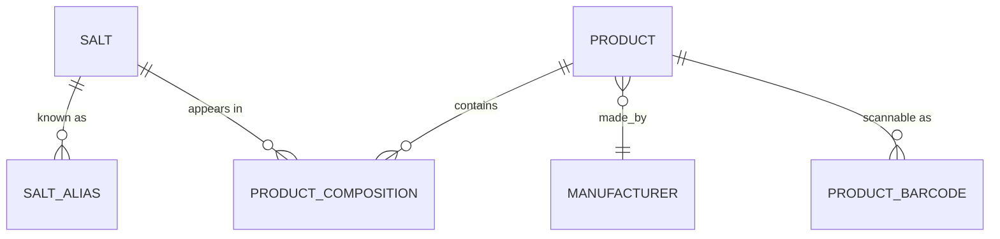
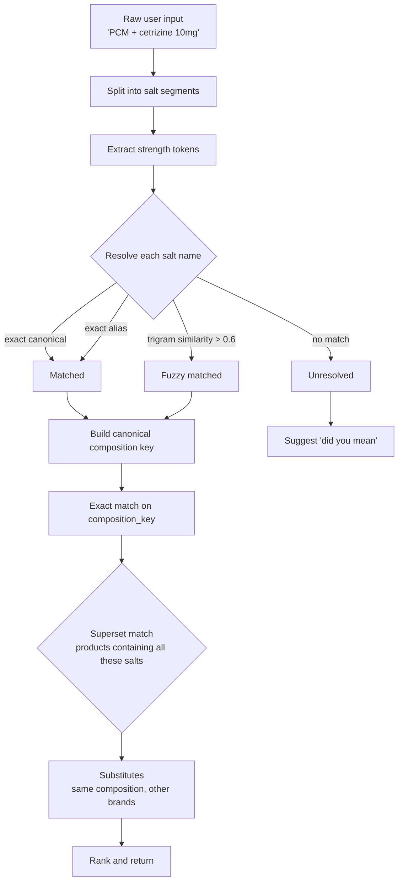

# 08 — Search & Salt Engine

> **Status:** Approved · **Owner:** Solution Architecture · **Last updated:** 2026-09-11

> **The requirement:** *"I want to capture salt of medicine so if any user searches a
> salt combination, the application should suggest medicine names."*

This document specifies how that works, exactly.

---

## 1. Why this is a real problem and not a LIKE query

A pharma buyer thinks in **molecules**, not brands. They type any of these and expect
the right medicine:

| What the user types | What they mean |
|---|---|
| `Paracetamol + Cetirizine` | The combination brand |
| `PCM cetirizine` | Same thing — `PCM` is an alias |
| `Acetaminophen + Cetrizine` | Same thing — INN name, and a typo |
| `Cetirizine 10mg, Paracetamol 500mg` | Same thing — reversed order, strengths given |
| `cetrizine paracetamol` | Same thing — lowercase, missing letter |
| `paracetamol 650` | A *different* product — strength matters |

A naive implementation — `WHERE generic_name ILIKE '%paracetamol%' AND generic_name ILIKE '%cetirizine%'`
— fails on almost every one of these:

- ❌ `PCM` does not contain the substring `paracetamol`
- ❌ `Acetaminophen` is a different string entirely
- ❌ Word order changes the result set
- ❌ `Cetrizine` (one `i`) matches nothing
- ❌ `500mg` vs `0.5g` vs `500 mg` are three different strings
- ❌ It cannot tell "contains exactly these" from "contains at least these"

The Salt Engine solves all six. It is a **normalisation and canonicalisation**
problem first, and a search problem second.

---

## 2. The core idea: canonical composition key

Every product is reduced to a **canonical composition key** — a deterministic,
sorted, normalised, strength-annotated string.

```
Product "Cetzine-P" (Strip of 10)
  composition rows:  [ (Paracetamol, 500, mg), (Cetirizine, 10, mg) ]

         │  normalise each salt to its canonical form
         │  normalise each strength to a base unit
         │  sort lexicographically
         │  join with '|'
         ▼

composition_key  = "cetirizine-10mg|paracetamol-500mg"
composition_hash = sha256(composition_key)
```

The same key is produced by **any** of the user inputs above, because the query is
normalised through the identical pipeline before matching.

### Properties this buys us

| Property | Why it holds |
|---|---|
| **Order-independent** | Salts are sorted before joining |
| **Synonym-independent** | Every salt resolves to one canonical row *before* the key is built |
| **Strength-aware** | `500 mg`, `0.5 g`, `500mg` all normalise to `500mg`; `650mg` stays distinct |
| **Case/punctuation independent** | Lowercased, non-alphanumerics stripped |
| **Exact-matchable** | A plain B-tree equality lookup on an indexed column |
| **Deterministic** | Same input always yields the same key — safe to recompute and backfill |
| **Auditable** | A human can read the key and verify it is correct |

---

## 3. Data model



```sql
-- Canonical molecule. One row per distinct salt per tenant.
CREATE TABLE salt (
  id              uuid PRIMARY KEY DEFAULT uuid_generate_v7(),
  tenant_id       uuid NOT NULL,
  canonical_name  text NOT NULL,          -- 'Paracetamol'
  normalized_name text NOT NULL,          -- 'paracetamol'
  category        text,                   -- 'Analgesic'
  atc_code        text,
  is_active       boolean NOT NULL DEFAULT true,
  UNIQUE (tenant_id, normalized_name)
);

-- Every other way anyone might refer to it.
CREATE TABLE salt_alias (
  id         uuid PRIMARY KEY DEFAULT uuid_generate_v7(),
  tenant_id  uuid NOT NULL,
  salt_id    uuid NOT NULL REFERENCES salt(id) ON DELETE CASCADE,
  alias      text NOT NULL,               -- 'Acetaminophen'
  normalized text NOT NULL,               -- 'acetaminophen'
  alias_type text NOT NULL DEFAULT 'SYNONYM',
  -- SYNONYM | BRAND | MISSPELLING | INN | TRADE
  UNIQUE (tenant_id, normalized)
);

-- The link. Ordered, strength-annotated.
CREATE TABLE product_composition (
  id             uuid PRIMARY KEY DEFAULT uuid_generate_v7(),
  tenant_id      uuid NOT NULL,
  product_id     uuid NOT NULL REFERENCES product(id) ON DELETE CASCADE,
  salt_id        uuid NOT NULL REFERENCES salt(id),
  strength_value numeric(18,4) NOT NULL,
  strength_unit  text NOT NULL,           -- stored normalised: mg | ml | % | IU | mcg
  sequence       smallint NOT NULL DEFAULT 0,
  UNIQUE (product_id, salt_id)
);
```

Seed data for the example:

```sql
INSERT INTO salt (tenant_id, canonical_name, normalized_name, category) VALUES
  ($t, 'Paracetamol', 'paracetamol', 'Analgesic'),
  ($t, 'Cetirizine',  'cetirizine',  'Antihistamine');

INSERT INTO salt_alias (tenant_id, salt_id, alias, normalized, alias_type) VALUES
  ($t, (SELECT id FROM salt WHERE normalized_name='paracetamol'), 'Acetaminophen', 'acetaminophen', 'INN'),
  ($t, (SELECT id FROM salt WHERE normalized_name='paracetamol'), 'PCM',           'pcm',           'SYNONYM'),
  ($t, (SELECT id FROM salt WHERE normalized_name='paracetamol'), 'Paracetmol',    'paracetmol',    'MISSPELLING'),
  ($t, (SELECT id FROM salt WHERE normalized_name='paracetamol'), 'Acetaminophenum','acetaminophenum','INN'),
  ($t, (SELECT id FROM salt WHERE normalized_name='cetirizine'),  'Cetrizine',     'cetrizine',     'MISSPELLING'),
  ($t, (SELECT id FROM salt WHERE normalized_name='cetirizine'),  'Cetirizin',     'cetirizin',     'MISSPELLING');
```

---

## 4. The normalisation pipeline

Two entry points use **exactly the same** normalisation code — this is what makes
the match work. If the product-side and query-side normalisers ever diverge, exact
matching silently breaks, so the shared implementation is a hard requirement.

```ts
// packages/shared-utils/src/salt/normalize.ts

const STRENGTH_UNIT_MAP: Record<string, { base: string; factor: number }> = {
  mcg:  { base: 'mg', factor: 0.001 },
  ug:   { base: 'mg', factor: 0.001 },
  'µg': { base: 'mg', factor: 0.001 },
  mg:   { base: 'mg', factor: 1 },
  g:    { base: 'mg', factor: 1000 },
  gm:   { base: 'mg', factor: 1000 },
  ml:   { base: 'ml', factor: 1 },
  l:    { base: 'ml', factor: 1000 },
  iu:   { base: 'iu', factor: 1 },
  '%':  { base: '%',  factor: 1 },
};

/** Lowercase, strip accents, drop everything that is not alphanumeric. */
export function normalizeToken(input: string): string {
  return input
    .normalize('NFKD')                    // decompose accents
    .replace(/[\u0300-\u036f]/g, '')      // drop diacritics
    .toLowerCase()
    .replace(/[^a-z0-9]/g, '');           // keep alphanumerics only
}

/** Convert a strength to the canonical base unit and format deterministically. */
export function normalizeStrength(value: number | string, unit: string): string {
  const u = unit.trim().toLowerCase();
  const entry = STRENGTH_UNIT_MAP[u];
  if (!entry) return `${trimNumber(value)}${u}`;   // unknown unit: keep as-is
  const converted = Number(value) * entry.factor;
  return `${trimNumber(converted)}${entry.base}`;
}

/** '500.0000' -> '500';  '0.5000' -> '0.5' */
function trimNumber(v: number | string): string {
  const n = Number(v);
  return n % 1 === 0 ? String(n) : String(parseFloat(n.toFixed(4)));
}

export interface CompositionPart {
  canonicalSalt: string;   // resolved canonical name
  strength?: string;       // normalised, e.g. '500mg' — omitted if unspecified
}

/**
 * THE canonical key. Sorted, normalised, strength-annotated.
 * 'cetirizine-10mg|paracetamol-500mg'
 *
 * A salt with no strength given contributes 'salt-any', which is why
 * 'cetirizine-any' != 'cetirizine-10mg' but DOES match in SUPERSET mode.
 */
export function buildCompositionKey(parts: CompositionPart[]): string {
  return parts
    .map((p) => {
      const name = normalizeToken(p.canonicalSalt);
      const strength = p.strength ? normalizeStrengthToken(p.strength) : 'any';
      return `${name}-${strength}`;
    })
    .sort()                              // order independence
    .join('|');
}

function normalizeStrengthToken(s: string): string {
  const m = s.match(/^([\d.]+)\s*([a-z%µ]+)$/i);
  return m ? normalizeStrength(m[1], m[2]) : normalizeToken(s);
}
```

**Worked examples**

| Input | Normalised key |
|---|---|
| `Paracetamol 500mg + Cetirizine 10mg` | `cetirizine-10mg\|paracetamol-500mg` |
| `Cetirizine 10 mg, Paracetamol 0.5 g` | `cetirizine-10mg\|paracetamol-500mg` ✅ same |
| `cetrizine paracetamol` | resolves alias → `cetirizine-any\|paracetamol-any` |
| `PCM + Acetaminophen` | both → `paracetamol` → `paracetamol-any` |
| `Paracetamol 650mg + Cetirizine 10mg` | `cetirizine-10mg\|paracetamol-650mg` ⚠️ different |

---

## 5. Query resolution pipeline



### 5.1 Salt name resolution

Resolution is a **tiered lookup** — cheapest and most precise first:

```ts
async function resolveSalt(
  input: string,
  tenantId: string,
): Promise<{ salt: SaltRow | null; confidence: number; method: string }> {
  const normalized = normalizeToken(input);
  if (!normalized) return { salt: null, confidence: 0, method: 'EMPTY' };

  // Tier 1: exact canonical match        (cached in Redis, ~0.2 ms)
  const exact = await saltCache.getCanonical(tenantId, normalized);
  if (exact) return { salt: exact, confidence: 1.0, method: 'CANONICAL' };

  // Tier 2: exact alias match            (cached in Redis)
  const alias = await saltCache.getAlias(tenantId, normalized);
  if (alias) return { salt: alias, confidence: 0.98, method: 'ALIAS' };

  // Tier 3: trigram similarity            (indexed, ~2 ms)
  const fuzzy = await this.db.query(`
    SELECT s.*, GREATEST(
      similarity(s.normalized_name, $2),
      COALESCE((SELECT MAX(similarity(a.normalized, $2))
                FROM salt_alias a WHERE a.salt_id = s.id), 0)
    ) AS score
    FROM salt s
    WHERE s.tenant_id = $1
      AND s.is_active
      AND (s.normalized_name % $2
           OR EXISTS (SELECT 1 FROM salt_alias a
                      WHERE a.salt_id = s.id AND a.normalized % $2))
    ORDER BY score DESC
    LIMIT 1
  `, [tenantId, normalized]);

  if (fuzzy.rows[0] && Number(fuzzy.rows[0].score) >= 0.6) {
    return { salt: fuzzy.rows[0], confidence: Number(fuzzy.rows[0].score), method: 'FUZZY' };
  }

  return { salt: null, confidence: 0, method: 'UNRESOLVED' };
}
```

**Threshold 0.6** is deliberate. Below it, `cetirizine` and `cetrizine` still match
(similarity ≈ 0.89) but `cetirizine` and `chlorpheniramine` do not (≈ 0.45). The
threshold is configurable per tenant so it can be tuned against real query logs.

The `%` operator uses the `gin_trgm_ops` index, so this is an index scan, not a
sequential scan, even at millions of alias rows.

### 5.2 Match modes

| Mode | Meaning | SQL |
|---|---|---|
| `EXACT` | Same salts, same strengths, nothing extra | `composition_key = $1` |
| `SUPERSET` | Products containing **at least** these salts | key contains all query salts |
| `SUBSET` | Products containing **at most** these salts | query salts contain all product salts |
| `ANY` | Products containing **any** of these salts | key contains at least one |

Default is `SUPERSET` — the most useful in practice. A buyer asking for
"Paracetamol + Cetirizine" usually wants every product containing both, including
ones that also contain a third molecule (many cold-and-flu combinations).

```sql
-- SUPERSET: products whose key contains every queried salt segment
-- $1 = tenant, $2 = array of normalised 'salt-strength' segments
SELECT p.id, p.brand_name, p.pack_description, p.composition_key
FROM product p
WHERE p.tenant_id = $1
  AND p.status = 'ACTIVE'
  AND p.deleted_at IS NULL
  AND p.composition_key IS NOT NULL
  AND string_to_array(p.composition_key, '|') @> $2::text[]   -- array containment
ORDER BY
  cardinality(string_to_array(p.composition_key, '|'))        -- fewer extra salts first
  , p.brand_name
LIMIT $3;
```

The `@>` array-containment operator is the key trick: it turns "contains all of
these" into an index-usable operation, and the `ORDER BY cardinality(...)` sorts
exact-ish matches (fewer extra molecules) above loose ones.

For `EXACT` mode the plan is a straight B-tree equality on `composition_key`, which
is a single index seek regardless of catalogue size.

### 5.3 Strength-less queries

When the user gives no strength (`cetirizine-any|paracetamol-any`), an exact key
match will find nothing — no product has "any" strength. Two-stage resolution:

1. Run `SUPERSET` with the strength-agnostic segments, matching on the **salt names
   only** using a separate `composition_salt_key` column (`cetirizine|paracetamol`).
2. Rank results by how closely their strengths match typical/dominant strengths for
   that combination.

This is why `product` carries **two** derived keys:

| Column | Value | Used for |
|---|---|---|
| `composition_key` | `cetirizine-10mg\|paracetamol-500mg` | EXACT matching with strengths |
| `composition_salt_key` | `cetirizine\|paracetamol` | Strength-agnostic matching |

```sql
ALTER TABLE product ADD COLUMN composition_salt_key text;
CREATE INDEX idx_product_comp_salt_key ON product (tenant_id, composition_salt_key)
  WHERE composition_salt_key IS NOT NULL;
```

---

## 6. Ranking

Exact match is only half the job. When 40 products contain Paracetamol + Cetirizine,
order matters.

| Signal | Weight | Rationale |
|---|---|---|
| Match type (EXACT > SUPERSET > SUBSET > ANY) | Highest | Precision beats popularity |
| Fewer extra salts in the composition | High | A 2-salt product is a better answer to a 2-salt query than a 4-salt one |
| Strength similarity to the query | High | `500mg` beats `650mg` for a `500mg` query |
| Availability (ATP > 0) | Medium | An unavailable product is a poor suggestion |
| Previously ordered by this buyer | Medium | Habit is a strong signal in pharma |
| Order frequency across the tenant | Medium | Popularity |
| Margin / preferred brand | Low | Commercial steering, applied subtly |
| Alphabetical | Tiebreaker | Determinism |

**Determinism is a requirement.** The ranking must always end with a stable
tiebreaker (`brand_name`, then `id`), otherwise pagination duplicates and skips rows.

### Postgres ranking implementation

```sql
WITH q AS (SELECT $2::text[] AS salts, $3::text[] AS strengths)
SELECT
    p.id, p.brand_name, p.pack_description,
    p.composition_key, p.composition_salt_key,
    -- how many extra salts beyond the query
    cardinality(string_to_array(p.composition_key,'|')) - cardinality((SELECT salts FROM q)) AS extra_salts,
    CASE WHEN p.composition_key = $4 THEN 1000 ELSE 0 END AS exact_bonus,
    COALESCE(sb.atp, 0) AS atp,
    COALESCE(pop.order_count, 0) AS popularity,
    (  CASE WHEN p.composition_key = $4 THEN 1000 ELSE 0 END
     - (cardinality(string_to_array(p.composition_key,'|')) - cardinality((SELECT salts FROM q))) * 50
     + CASE WHEN COALESCE(sb.atp,0) > 0 THEN 100 ELSE 0 END
     + LEAST(COALESCE(pop.order_count,0), 100)
    ) AS rank_score
FROM product p
LEFT JOIN LATERAL (
    SELECT SUM(qty_available) AS atp
    FROM stock_batch
    WHERE product_id = p.id AND qty_available > 0 AND NOT is_quarantined
) sb ON true
LEFT JOIN LATERAL (
    SELECT COUNT(*) AS order_count
    FROM order_line ol
    WHERE ol.product_id = p.id
      AND ol.created_at > now() - interval '90 days'
) pop ON true
WHERE p.tenant_id = $1
  AND p.status = 'ACTIVE'
  AND p.deleted_at IS NULL
  AND string_to_array(p.composition_salt_key,'|') @> (SELECT salts FROM q)
ORDER BY rank_score DESC, p.brand_name ASC, p.id ASC
LIMIT $5;
```

---

## 7. Fuzzy / typo tolerance

Postgres `pg_trgm` with the `%` operator handles typos well enough for phase 1–3:

```sql
-- Requires: CREATE EXTENSION pg_trgm;
-- Requires: CREATE INDEX ... USING gin (normalized_name gin_trgm_ops);
SELECT canonical_name, similarity(normalized_name, 'paracetmol') AS score
FROM salt
WHERE tenant_id = $1 AND normalized_name % 'paracetmol'
ORDER BY score DESC LIMIT 5;
```

| Query | Similarity to `paracetamol` | Matched? |
|---|---|---|
| `paracetmol` | 0.91 | ✅ |
| `paracetamoll` | 0.92 | ✅ |
| `acetaminophen` | 0.24 | ✅ via alias table (not trigram) |
| `pcm` | 0.00 | ✅ via alias table |
| `chlorpheniramine` | 0.42 | ❌ correctly not matched |

**Alias table + trigram together** cover both failure modes: different names for the
same thing (aliases) and misspellings of the same name (trigrams).

### Phase 4 upgrade — OpenSearch

When OpenSearch is introduced, the salt index gains:

- **Synonym filters** at analysis time (replacing the alias lookup for the common cases)
- **Edge n-grams** for better prefix autocomplete
- **Phonetic analysis** (`double_metaphone`) for soundalike brand names
- **Vector similarity** for semantic queries ("something for fever and allergy")

The `SearchPort` interface means none of this changes the domain model or the API
contract — only the adapter behind the port.

---

## 8. Substitutes

A buyer searching a salt combination often wants **any brand** with that composition.
Once the composition key exists, substitutes are free:

```sql
SELECT p.id, p.brand_name, p.pack_description,
       pli.selling_price, p.manufacturer_id
FROM product p
JOIN price_list_item pli
  ON pli.product_id = p.id AND pli.price_list_id = $3
WHERE p.tenant_id = $1
  AND p.composition_key = $2           -- exact same composition
  AND p.status = 'ACTIVE'
  AND p.is_substitutable
  AND p.deleted_at IS NULL
ORDER BY pli.selling_price ASC;         -- cheapest first
```

Returned with a label indicating substitution eligibility. **Not automatic** — the
buyer chooses. Auto-substitution of a medicine is a regulatory and clinical
liability; the system suggests, a human decides.

---

## 9. API surface

### 9.1 Combination search

```http
POST /api/v1/salts/combination-search
Authorization: Bearer <token>
Content-Type: application/json
```

```jsonc
{
  "salts": [
    { "name": "PCM", "strength": "500mg" },
    { "name": "cetrizine", "strength": "10mg" }
  ],
  "matchMode": "SUPERSET",
  "includeSubstitutes": true,
  "includeOutOfStock": false,
  "limit": 20
}
```

```jsonc
{
  "data": {
    "normalizedQuery": {
      "compositionKey": "cetirizine-10mg|paracetamol-500mg",
      "saltKey": "cetirizine|paracetamol"
    },
    "resolvedSalts": [
      {
        "input": "PCM",
        "canonical": "Paracetamol",
        "saltId": "...",
        "confidence": 0.98,
        "resolvedBy": "ALIAS"
      },
      {
        "input": "cetrizine",
        "canonical": "Cetirizine",
        "saltId": "...",
        "confidence": 0.89,
        "resolvedBy": "FUZZY"
      }
    ],
    "unresolvedSalts": [],
    "exactMatches": [
      {
        "product": {
          "id": "...",
          "brandName": "Cetzine-P",
          "genericName": "Paracetamol + Cetirizine",
          "packDescription": "Strip of 10 tablets",
          "manufacturer": "Dr. Reddy's"
        },
        "composition": [
          { "salt": "Cetirizine", "strength": "10mg" },
          { "salt": "Paracetamol", "strength": "500mg" }
        ],
        "matchType": "EXACT",
        "availability": { "availableToPromise": "480.0000", "uom": "PACK" },
        "pricing": { "unitPrice": "42.5000", "mrp": "55.0000", "currency": "INR" }
      }
    ],
    "supersetMatches": [ /* ... */ ],
    "substitutes": [
      {
        "product": { "id": "...", "brandName": "Cetriz-P", "manufacturer": "Cipla" },
        "pricing": { "unitPrice": "38.2000", "currency": "INR" },
        "savingsVsCheapestMatch": "4.3000"
      }
    ],
    "suggestions": [],
    "totalMatches": 14
  },
  "meta": { "queryTimeMs": 23, "matchMode": "SUPERSET", "limit": 20 }
}
```

### 9.2 Supporting endpoints

| Method | Path | Purpose |
|---|---|---|
| `GET` | `/salts/search?q=parac` | Autocomplete salt names for the UI |
| `GET` | `/salts/:id/products` | All products containing a salt |
| `GET` | `/products/:id/substitutes` | Substitute list for one product |
| `GET` | `/catalog/products?q=...` | General catalogue search (includes salt matching) |
| `GET` | `/salts/popular` | Most-searched salts (admin analytics) |

### 9.3 Unresolved salts

When a salt cannot be resolved, the response says so explicitly rather than
returning nothing:

```jsonc
{
  "unresolvedSalts": [
    { "input": "xyzzycillin", "suggestions": ["Amoxicillin", "Ampicillin"] }
  ],
  "suggestions": [
    { "type": "DID_YOU_MEAN", "text": "Amoxicillin", "saltId": "..." }
  ]
}
```

Silently returning zero results for a resolvable query is the single most common
usability failure in search. "I found nothing" and "I did not understand you" are
different messages and must be presented differently.

---

## 10. Maintaining the derived keys

`composition_key`, `composition_salt_key` and `composition_hash` are **derived** —
they must never be edited directly, and must never drift from
`product_composition`.

### Trigger-based maintenance

```sql
CREATE OR REPLACE FUNCTION refresh_product_composition_keys()
RETURNS TRIGGER AS $$
DECLARE
  v_product_id uuid;
  v_key   text;
  v_salt_key text;
BEGIN
  v_product_id := COALESCE(NEW.product_id, OLD.product_id);

  SELECT
    string_agg(normalized_name || '-' || normalized_strength, '|' ORDER BY segment),
    string_agg(normalized_name, '|' ORDER BY normalized_name)
  INTO v_key, v_salt_key
  FROM (
    SELECT
      s.normalized_name,
      -- strength normalised to base unit, 'any' when absent
      COALESCE(
        CASE
          WHEN pc.strength_unit = 'g'  THEN (pc.strength_value * 1000)::text || 'mg'
          WHEN pc.strength_unit = 'mg' THEN trim_scale(pc.strength_value)::text || 'mg'
          WHEN pc.strength_unit = 'ml' THEN trim_scale(pc.strength_value)::text || 'ml'
          ELSE trim_scale(pc.strength_value)::text || pc.strength_unit
        END,
        'any'
      ) AS normalized_strength,
      s.normalized_name || '-' || COALESCE(pc.strength_value::text, 'any') AS segment
    FROM product_composition pc
    JOIN salt s ON s.id = pc.salt_id
    WHERE pc.product_id = v_product_id
  ) parts;

  UPDATE product
  SET composition_key      = v_key,
      composition_salt_key = v_salt_key,
      composition_hash     = encode(digest(v_key, 'sha256'), 'hex'),
      is_combination       = (SELECT COUNT(*) > 1 FROM product_composition WHERE product_id = v_product_id),
      updated_at           = now()
  WHERE id = v_product_id;

  RETURN NULL;
END;
$$ LANGUAGE plpgsql;

CREATE TRIGGER trg_refresh_composition_keys
AFTER INSERT OR UPDATE OR DELETE ON product_composition
FOR EACH ROW EXECUTE FUNCTION refresh_product_composition_keys();
```

**Why a trigger and not application code:** the key must be correct no matter how the
composition was changed — through the admin UI, a bulk import, a data fix script, or
a direct SQL correction. Application-level maintenance misses at least one of those
paths, and a stale key means a product that is invisible to combination search.

### Rebuild tooling

```bash
# Recompute every key from composition rows. Idempotent, safe to re-run.
pnpm --filter @medichain/backend salt:rebuild-keys

# Verify no key disagrees with its composition rows. Run nightly.
pnpm --filter @medichain/backend salt:verify-keys
```

The verifier is a **scheduled job with an advisory lock** (so N replicas do not all
run it) that compares every stored key against a freshly computed one and alerts on
any mismatch. This is the safety net that catches a bug in the normaliser.

---

## 11. Performance

| Operation | Target | How |
|---|---|---|
| Salt name resolution (canonical/alias) | < 1 ms | Redis cache, warm on deploy |
| Salt name resolution (fuzzy) | < 10 ms | `gin_trgm_ops` index |
| Exact composition match | < 5 ms | B-tree on `composition_key` |
| Superset match (50 results) | < 40 ms | Array containment + partial index |
| Full combination search response | < 150 ms p95 | Parallelised resolution + single query |
| Autocomplete | < 50 ms p95 | Prefix index on normalised names |

### Caching strategy

| Cache | TTL | Invalidation |
|---|---|---|
| Salt canonical/alias lookup | 1 h | On salt or alias write (event-driven) |
| Popular composition queries | 5 min | TTL only — popularity drifts slowly |
| Salt list for autocomplete | 15 min | On salt write |

Cached, never: **price** and **availability**. Those are always read from the primary
at the moment of display (see ADR-004). A combination search returns *candidate
products*; the price and stock on each are resolved live.

### Index summary

```sql
CREATE INDEX idx_salt_norm        ON salt (tenant_id, normalized_name);
CREATE INDEX idx_salt_trgm        ON salt USING gin (normalized_name gin_trgm_ops);
CREATE INDEX idx_alias_norm       ON salt_alias (tenant_id, normalized);
CREATE INDEX idx_alias_trgm       ON salt_alias USING gin (normalized gin_trgm_ops);
CREATE INDEX idx_comp_product     ON product_composition (tenant_id, product_id);
CREATE INDEX idx_comp_salt        ON product_composition (tenant_id, salt_id);
CREATE INDEX idx_product_compkey  ON product (tenant_id, composition_key)
  WHERE composition_key IS NOT NULL;
CREATE INDEX idx_product_saltkey  ON product (tenant_id, composition_salt_key)
  WHERE composition_salt_key IS NOT NULL;
-- GIN index enabling the @> array-containment match
CREATE INDEX idx_product_comp_arr ON product
  USING gin (string_to_array(composition_salt_key, '|'))
  WHERE composition_salt_key IS NOT NULL;
```

---

## 12. Curating salt data (the part everyone forgets)

The engine is only as good as the salt master. A curation workflow is **required**,
not optional:

| Feature | Purpose |
|---|---|
| **Duplicate detection** | Flag salts whose normalised names are trigram-similar above 0.85 |
| **Merge tool** | Merge salt B into salt A, repointing all aliases and compositions, then delete B |
| **Alias suggestion** | On import, propose aliases for unmatched salt strings |
| **Unmatched queue** | Every failed resolution is logged and surfaced for curation |
| **Coverage report** | % of active products with a composition and a valid key |
| **Unresolved query report** | What buyers searched for and did not find |

The **unresolved query report** is the highest-value artefact here. It converts
search failures directly into catalogue and alias improvements, ranked by real buyer
demand. Without it, the salt master slowly rots.

---

## 13. Test cases

These are mandatory tests. Each one encodes a real user behaviour.

| # | Input | Expected |
|---|---|---|
| 1 | `Paracetamol + Cetirizine` | Both salts resolved, EXACT + SUPERSET matches returned |
| 2 | `Cetirizine + Paracetamol` | **Identical result set** to #1 (order independence) |
| 3 | `PCM + cetrizine` | Both resolved via alias/trigram; identical result set to #1 |
| 4 | `Acetaminophen` | Resolves to Paracetamol via INN alias |
| 5 | `Paracetamol 500mg + Cetirizine 10mg` | Exact key match returns the right product |
| 6 | `Paracetamol 0.5g + Cetirizine 10mg` | **Same key** as #5 (unit normalisation) |
| 7 | `Paracetamol 650mg + Cetirizine 10mg` | **Different** key — does not match the 500mg product |
| 8 | `paracetamol` | Returns all products containing paracetamol, any strength |
| 9 | `xyzzycillin` | `unresolvedSalts` populated with "did you mean" suggestions |
| 10 | `Paracetamol + Cetirizine + Ambroxol` | SUPERSET finds 3-salt products; no EXACT match if none exist |
| 11 | Product composition changed via admin | `composition_key` updates automatically |
| 12 | Product composition changed via direct SQL | Trigger still updates the key |
| 13 | Combination with one salt that is not in the catalogue | Partial match on the known salt, clear indication of the unresolved one |
| 14 | Concurrent search during a salt merge | No 500s; results may briefly include either salt's products |
| 15 | `cetirizin` (prefix) | Autocomplete suggests Cetirizine |

Tests 2, 3 and 6 are the ones that catch a regression in the normaliser. They must
run on **every** commit — a normaliser change that breaks order-independence silently
halves the recall of the most important feature in the product.
