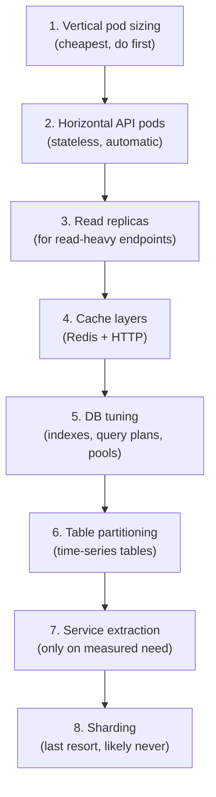

# 10 — Scalability & Performance

> **Status:** Approved · **Owner:** Architecture · **Last updated:** 2026-09-11

The brief: *"I may go for a scalable system with load balancer so design and app in
such a way that I can scale easily... but also need to process a lot of user
requests."*

This document specifies how, in order of when each lever is pulled.

---

## 1. Capacity model

### Assumptions (to be validated against real data in phase 1)

| Metric | Launch | Year 1 | Year 3 |
|---|---|---|---|
| Active buyer organisations | 200 | 2,000 | 10,000 |
| Named users | 600 | 8,000 | 40,000 |
| Products (SKUs) | 8,000 | 40,000 | 150,000 |
| Orders / day | 500 | 8,000 | 50,000 |
| Order lines / day | 6,000 | 120,000 | 800,000 |
| Peak RPS (API) | 30 | 400 | 2,500 |
| Peak RPS (search) | 15 | 200 | 1,200 |
| DB size | 5 GB | 80 GB | 600 GB |

### Read/write ratio

Pharma ordering is **read-dominated**: browsing and searching vastly outnumber
ordering.

```
Catalogue + search reads   ████████████████████████████████████  ~85%
Cart operations            ███                                     ~8%
Order placement            ██                                      ~5%
Admin / reports            █                                       ~2%
```

This ratio is why the first scaling lever is read replicas and caching, not sharding.

### Derived targets

| Component | Target |
|---|---|
| API pods | 3 at launch, 12 at year 1, 40 at year 3 |
| DB connections | `pods × pool_max` must stay under `max_connections` — see §5 |
| Redis | Single node → cluster at ~50k ops/s |
| OpenSearch | 1 node → 3 nodes at ~200k SKUs |

---

## 2. Scaling levers, in order



**Rule:** do not pull lever N+1 until lever N is measurably exhausted. Most systems
never need past lever 4. Jumping to service extraction to solve a slow query is how
teams end up with distributed systems that are still slow.

---

## 3. The stateless tier (lever 2)

Every property below exists so that the load balancer needs no intelligence:

| Property | Implementation |
|---|---|
| No local session | JWT + Redis-backed revocation |
| No local files | S3 with pre-signed uploads |
| No in-memory truth | Redis for cache, Postgres for data |
| No sticky routing | Any pod serves any request |
| Graceful shutdown | `app.enableShutdownHooks()`, drain ≤ 30 s on SIGTERM |
| Fast boot | < 5 s cold start; DB connections warmed before readiness |
| Idempotent startup | Migrations and seeds are safe to run concurrently |

### Autoscaling policy

```yaml
apiVersion: autoscaling/v2
kind: HorizontalPodAutoscaler
metadata:
  name: medichain-api
spec:
  scaleTargetRef: { kind: Deployment, name: medichain-api }
  minReplicas: 3
  maxReplicas: 40
  metrics:
    - type: Resource
      resource: { name: cpu, target: { type: Utilization, averageUtilization: 65 } }
    - type: Pods
      pods:
        metric: { name: http_requests_per_second }
        target: { type: AverageValue, averageValue: "150" }
  behavior:
    scaleUp:
      stabilizationWindowSeconds: 30      # react fast to a spike
      policies:
        - { type: Percent, value: 100, periodSeconds: 60 }
        - { type: Pods,   value: 6,   periodSeconds: 60 }
      selectPolicy: Max
    scaleDown:
      stabilizationWindowSeconds: 300     # shrink slowly, avoid flapping
      policies:
        - { type: Percent, value: 25, periodSeconds: 120 }
```

**Why CPU alone is insufficient:** a pod blocked on an external API can be at 20% CPU
while its queue grows. The RPS metric catches that. Conversely, a pod doing heavy
JSON serialisation saturates CPU before RPS. Both metrics together are more reliable
than either alone.

**Why `minReplicas: 3`:** fewer than 3 means a single pod restart during a deploy
degrades capacity noticeably, and a node failure removes a third of your capacity.

### Load balancer configuration

| Setting | Value | Reason |
|---|---|---|
| Algorithm | Least outstanding requests | Better than round-robin when request cost varies (a report vs a product read) |
| Health check | `GET /health/ready`, 10 s interval, 3 failures → out | Readiness must return **503** when Postgres or Redis is down |
| Liveness | `GET /health/live` | Process-only check; a failed liveness restarts the pod |
| Deregistration delay | 30 s | Matches the graceful-shutdown drain window |
| Idle timeout | 60 s | Above the app's 30 s request timeout |
| Sticky sessions | **Disabled** | The tier is stateless; affinity would defeat autoscaling |
| Cross-zone balancing | Enabled | Even distribution across AZs |
| TLS | Terminated at the LB | Modern ciphers, TLS 1.2+ |

**The health-check failure mode that causes real outages:** if `/health/ready`
returns 200 while the database is unreachable, the load balancer keeps routing
traffic to pods that can only return 500s. Readiness must check dependencies and
return 503.

---

## 4. Read replicas (lever 3)

```
                    ┌──────────────────────┐
   writes ─────────▶│  PostgreSQL PRIMARY  │
                    └──────────┬───────────┘
                               │ streaming replication
              ┌────────────────┼────────────────┐
              ▼                ▼                ▼
        ┌──────────┐    ┌──────────┐    ┌──────────┐
        │ Replica 1│    │ Replica 2│    │ Replica 3│
        │  (reads) │    │(reports) │    │  (DR)    │
        └──────────┘    └──────────┘    └──────────┘
```

### Routing policy

| Query class | Target | Consistency |
|---|---|---|
| Price computation | **Primary** | Strong — always |
| Stock availability / ATP | **Primary** | Strong — always |
| Credit availability | **Primary** | Strong — always |
| Order write | **Primary** | Strong — always |
| Catalogue browse | Replica OK | Eventual (sub-second) |
| Search | Replica OK | Eventual |
| Reports / dashboards | Replica (dedicated) | Eventual |
| Audit log reads | Replica OK | Eventual |

**Replication lag guard.** A read routed to a replica checks the lag and falls back
to the primary if lag exceeds a threshold:

```ts
async selectReadTarget(): Promise<DataSource> {
  const lagMs = await this.replicaMonitor.lagMs();
  return lagMs > 5_000 ? this.primary : this.replica;
}
```

Without this, a read-after-write immediately after a mutation can return stale data,
which users experience as "I saved it and it disappeared".

### Read-after-write consistency

For the specific case where a user must see their own write immediately
(e.g. "view my new order"), the client passes a hint:

```http
GET /api/v1/orders/8f3c...?consistency=strong
```

The repository then reads from the primary. This is opt-in per request because it
costs primary capacity; making it the default would defeat the purpose of replicas.

**Better still:** the mutation response already contains the created resource, so the
client does not need to re-read at all. TanStack Query seeds its cache from the
mutation response, which eliminates most read-after-write reads entirely.

---

## 5. Connection management

This is where most Node + Postgres deployments break at scale.

### The arithmetic that must be respected

```
max_connections (Postgres)        200
  − superuser reserved              3
  − replication slots               2
  − admin/monitoring                5
  = available for the application  190

Each API pod runs:  pool_max = 20
  → 190 / 20 = 9 pods maximum
```

**At 12 pods, `pool_max = 20` means 240 connections against a 200 limit.** Postgres
starts refusing connections, pods crash-loop, and the outage looks like a database
failure when it is a configuration failure.

### Solutions, in order

1. **Right-size the pool.** `pool_max = ceil(peak_concurrent_queries_per_pod × 1.2)`.
   For a mostly-I/O-bound API, 10–15 is usually enough — more connections do not mean
   more throughput once the database is saturated, only more contention.
2. **PgBouncer in transaction mode.** 12 pods × 15 = 180 client connections collapse
   to ~40 server connections. This is the standard solution and should be in place by
   phase 2.
3. **Statement timeout** as a safety net: `statement_timeout = 10s`. A runaway query
   otherwise holds a connection forever and starves the pool.
4. **Idle-in-transaction timeout**: `idle_in_transaction_session_timeout = 30s`.
   A leaked transaction is worse than a leaked connection — it holds locks.

```ts
// Prisma / pg pool configuration
{
  connectionLimit: Number(process.env.DATABASE_POOL_MAX ?? 15),
  idleTimeoutMillis: 30_000,
  connectionTimeoutMillis: 5_000,
  statement_timeout: 10_000,
  idle_in_transaction_session_timeout: 30_000,
  maxUses: 7_500,          // recycle connections, avoid memory creep
}
```

**Pool exhaustion is the single most common production incident in this stack.**
The readiness probe should fail if the pool is fully saturated for more than a few
seconds — better to remove a struggling pod from rotation than to have it queue
requests until they time out.

---

## 6. Caching strategy (lever 4)

### Layers

| Layer | What | TTL | Invalidation |
|---|---|---|---|
| CDN | Static assets, public images | 1 year (hashed) | Immutable filenames |
| CDN | Public catalogue pages | 5 min | Purge on catalogue publish |
| HTTP | `Cache-Control` on public GETs | 60 s | `s-maxage` + `stale-while-revalidate` |
| Redis | Permissions, config, feature flags | 30 s | Event-driven |
| Redis | Salt canonical/alias lookups | 1 h | Event-driven on salt write |
| Redis | Category tree | 15 min | Event-driven |
| Redis | Product detail (non-price fields) | 5 min | Event-driven on product write |
| Redis | Price lists | 5 min | Event-driven on price write |
| **Never cached** | **Price, stock, credit** | — | Always read from primary |

### Cache-aside with stampede protection

```ts
async get<T>(key: string, ttl: number, loader: () => Promise<T>): Promise<T> {
  const hit = await this.redis.get(key);
  if (hit) return JSON.parse(hit) as T;

  // Single-flight: only one caller loads; the rest wait for that result.
  return this.singleFlight.run(key, async () => {
    const value = await loader();
    await this.redis.set(key, JSON.stringify(value), 'EX', ttl);
    return value;
  });
}
```

**Without single-flight**, a cache expiry on a hot key means N concurrent requests all
miss and all hit the database simultaneously — a cache stampede. On a popular
catalogue key at 500 RPS, that is 500 identical queries arriving at once.

### Cache invalidation

Writes publish an event; subscribers drop the affected keys:

| Event | Invalidated keys |
|---|---|
| `product.updated` | `product:{id}`, `category:tree`, `search:*` (async reindex) |
| `price.updated` | `pricelist:{id}`, `product:{id}:price` |
| `salt.updated` | `salt:*` (all — salt changes affect many lookups) |
| `config.updated` | `config:{namespace}` |
| `flag.updated` | `flag:{key}` |

Cache invalidation failures are logged but **never fail the write**. A stale cache
for 5 minutes is acceptable; a failed order is not.

### What is deliberately not cached

**Price and stock are never cached** (ADR-004). They are the two values that must be
correct at the moment of commitment, and they are also the two values most tempting
to cache because they are read constantly. Caching them trades a small latency win
for a class of bug — honouring a stale price, promising unavailable stock — that is
both expensive and hard to detect.

Instead: optimise the query, add the right index, and read from the primary.

---

## 7. Database performance (lever 5)

### Query discipline

| Rule | Reason |
|---|---|
| No N+1 queries | Detect in CI with a query-count assertion on key endpoints |
| `EXPLAIN ANALYZE` before merging any new query on a large table | A missing index is invisible until production |
| Every list endpoint is paginated | An unbounded query is a latent outage |
| Keyset pagination for deep offsets | `OFFSET 100000` scans and discards 100k rows |
| No `SELECT *` in application code | Fetches unused columns, breaks covering indexes |
| Batch inserts (`createMany`) | 1,000 individual inserts ≈ 1,000 round trips |
| Avoid `COUNT(*)` on large tables in request paths | Use an approximate count or a materialised counter |

### The deep-pagination trap

```sql
-- SLOW: Postgres reads and discards 100,000 rows
SELECT * FROM "order" WHERE tenant_id = $1
ORDER BY placed_at DESC OFFSET 100000 LIMIT 20;

-- FAST: keyset — a single index seek
SELECT * FROM "order"
WHERE tenant_id = $1 AND (placed_at, id) < ($2, $3)
ORDER BY placed_at DESC, id DESC
LIMIT 20;
```

This is why the API supports cursor pagination, and why the default sort always
includes a unique tiebreaker.

### Materialised views for reporting

```sql
CREATE MATERIALIZED VIEW mv_daily_sales AS
SELECT
  tenant_id,
  date_trunc('day', o.placed_at) AS day,
  o.organisation_id,
  count(*)                       AS order_count,
  sum(o.grand_total)             AS sales_value,
  sum(o.taxable_total)           AS taxable_value
FROM "order" o
WHERE o.status NOT IN ('CANCELLED','REJECTED')
GROUP BY 1, 2, 3;

CREATE UNIQUE INDEX ON mv_daily_sales (tenant_id, day, organisation_id);

-- Refresh concurrently — does not block reads
REFRESH MATERIALIZED VIEW CONCURRENTLY mv_daily_sales;
```

Refreshed by a scheduled job (advisory-locked, so N replicas do not all refresh).
Dashboards read the view, so a heavy report never touches the order table.

**Trade-off:** the dashboard is up to N minutes stale. Acceptable for trend data,
unacceptable for "how much credit do I have left" — which is why that figure is read
live.

---

## 8. Partitioning (lever 6)

| Table | Trigger | Strategy |
|---|---|---|
| `audit_log` | Day one | Monthly range on `created_at` |
| `stock_ledger` | > 20M rows | Monthly range on `occurred_at` |
| `outbox_event` | > 50M rows | Daily range, drop after 7 days |
| `ai_usage` | > 10M rows | Monthly range |
| `order` | > 50M rows | Monthly range on `placed_at` |
| `notification` | > 50M rows | Monthly range |

**Why partitioning helps more than indexing here:** these tables grow without bound.
Past a certain size, indexes no longer fit in memory, and even an index scan becomes
I/O-bound. Partitioning keeps each index small enough to stay cached, and makes
retention an instant `DETACH PARTITION` instead of a mass `DELETE` that bloats the
table and holds locks.

**The requirement partitioning imposes:** every query must filter on the partition
key. A query without `created_at` in its `WHERE` scans every partition. This is why
every time-series table carries a `(tenant_id, …_at DESC)` index and the API
**requires** a date range on large list endpoints.

---

## 9. Async and background work

Anything not needed in the response is a job:

| Work | Sync/Async | Why |
|---|---|---|
| Order placement | **Sync** | The user must know it succeeded |
| Price/stock check | **Sync** | Required to place the order |
| Invoice PDF generation | Async | Slow, not needed immediately |
| Email / SMS / push | Async | External provider latency must not block |
| Search index update | Async | Eventual consistency is fine |
| Report generation | Async | Can take minutes |
| Export generation | Async | Large payloads |
| AI enrichment | Async | Slow, optional |
| Credit exposure reconciliation | Scheduled | Nightly |
| Expiry alerts | Scheduled | Daily |
| Nightly reconciliation | Scheduled | Daily |

### Job queue design

| Property | Implementation |
|---|---|
| Queue | BullMQ on Redis (phase 1–3), Kafka for streams (phase 4+) |
| Concurrency | Per-queue, tuned to the dependency's capacity |
| Retries | Exponential backoff, 5 attempts, then dead-letter |
| Idempotency | Every job is idempotent; retries are safe by construction |
| Timeouts | Every job has one; a hung job must not block the queue |
| Visibility | Queue depth, failure rate and dead-letter count in the admin portal |
| Locking | Scheduled jobs take an advisory lock |

**Backpressure:** if a queue depth exceeds a threshold, the API stops accepting new
work of that type and returns a clear "try again shortly" response rather than
queueing unboundedly. Unbounded queues convert a slowdown into an outage.

---

## 10. Frontend performance

### Website (Next.js)

| Technique | Effect |
|---|---|
| Server components by default | Less client JS shipped |
| Streaming SSR + Suspense | Faster perceived load |
| Route-level code splitting | Smaller initial bundle |
| `next/image` with a CDN | Optimised, lazy-loaded images |
| ISR for public catalogue pages | Static speed with periodic freshness |
| TanStack Query caching | Fewer API calls, instant back-navigation |
| Virtualised tables | 10,000-row grids without freezing |
| Prefetch on hover | Perceived instant navigation |
| Bundle budget in CI | Fails the build if the bundle grows past the limit |

### Mobile (React Native)

| Technique | Effect |
|---|---|
| FlashList for all long lists | 60 fps with thousands of items |
| `react-native-mmkv` cache | Instant cold-start from cache |
| TanStack Query persistence | Offline browse works |
| Hermes engine | Faster startup, lower memory |
| Image caching + resizing | Less bandwidth, no jank |
| Interaction manager for heavy work | Keeps the JS thread responsive |
| Bundle splitting via dynamic import | Faster initial load |
| Hermes bytecode precompilation | Smaller, faster bundles |

**Offline-first for the mobile cart.** The cart is persisted locally and synced when
connectivity returns. The server is authoritative — a client-side cart is a
convenience, never the truth.

---

## 11. Performance budgets

| Metric | Target | Alert threshold |
|---|---|---|
| API p50 (read) | < 50 ms | > 100 ms |
| API p95 (read) | < 200 ms | > 350 ms |
| API p99 (read) | < 500 ms | > 800 ms |
| API p95 (write) | < 800 ms | > 1.2 s |
| Order placement p95 | < 800 ms | > 1.5 s |
| Search p95 | < 150 ms | > 300 ms |
| DB query p95 | < 20 ms | > 50 ms |
| DB slow queries (> 1 s) | 0 per hour | > 5 per hour |
| Website LCP | < 2.5 s | > 3.5 s |
| Website INP | < 200 ms | > 300 ms |
| Mobile cold start | < 2 s | > 3 s |
| Error rate (5xx) | < 0.1% | > 0.5% |
| Cache hit ratio (catalogue) | > 85% | < 70% |

A budget breach sustained for two consecutive days raises a ticket. It does not
quietly become the new baseline — that is how performance debt accumulates invisibly.

---

## 12. Load testing

| Test | Profile | Pass criteria |
|---|---|---|
| Baseline | 100 RPS, 10 min | p95 < 200 ms, 0 errors |
| Peak | 3× expected peak, 30 min | p95 < 400 ms, < 0.1% errors |
| Spike | 0 → 10× in 60 s | Autoscale reacts, no errors |
| Soak | Expected peak, 8 h | No memory leak, no connection leak, stable latency |
| Stress | Ramp to failure | Graceful degradation, no data corruption |
| Concurrency | 200 simultaneous orders on 1 unit of stock | Exactly 1 succeeds — **never oversells** |
| Concurrency | 100 simultaneous payments on 1 invoice | Ledger balances exactly |
| Failover | Kill the primary | Recovery < 60 s, no data loss |
| Pod kill | Kill pods mid-traffic | Zero user-visible errors |

**The concurrency tests are correctness tests, not performance tests.** They are the
ones that catch the money bugs. They run on every PR, not only during load testing.

Tooling: k6 for API load, Playwright for browser-level, custom Node scripts for
concurrency correctness.

---

## 13. Observability for scale

| Signal | Purpose |
|---|---|
| RED metrics (Rate, Errors, Duration) per endpoint | The primary health signal |
| USE metrics (Utilisation, Saturation, Errors) per resource | Capacity planning |
| DB: connections, pool wait, slow queries, replication lag | The usual bottleneck |
| Redis: hit ratio, memory, evictions, ops/s | Cache effectiveness |
| Queue: depth, age of oldest job, failure rate | Backlog detection |
| Business metrics: orders/min, GMV/hour, failed payments | Detects a broken flow that is technically "up" |
| Traces with correlation ids | Root cause across the stack |

**The alert that matters most:** a business-metric alert, not an infrastructure one.
"Zero orders in the last 15 minutes during business hours" catches a broken order
path that returns HTTP 200 for every request. Infrastructure dashboards would show
everything green.

### Alerting tiers

| Tier | Response | Examples |
|---|---|---|
| P1 — Page | Immediate | Error rate > 5%, DB down, order placement failing, no orders in 15 min |
| P2 — Ticket | Same business day | p95 breach, queue backlog, replication lag > 30 s |
| P3 — Backlog | Weekly triage | Cache hit ratio drift, slow query growth |

---

## 14. Cost awareness

Scaling decisions have a cost dimension. Rough guidance:

| Lever | Relative cost | When it is worth it |
|---|---|---|
| Vertical pod sizing | Low | Almost always first |
| More API pods | Linear | When CPU-bound |
| Read replicas | Medium | When reads dominate (they do) |
| Redis cluster | Medium | When cache ops saturate |
| OpenSearch cluster | High | When relevance matters more than cost |
| Service extraction | **Very high** (ops + infra + complexity) | Only on measured, sustained need |
| Sharding | Highest | Almost never for this workload |

**The honest recommendation:** for this workload, a well-tuned modular monolith with
read replicas, Redis caching and 3–12 API pods will comfortably serve year-1 traffic
at a fraction of the cost and complexity of a microservice fleet. Spend the
engineering budget on correctness and features, not on distributed-systems
infrastructure you do not yet need.
