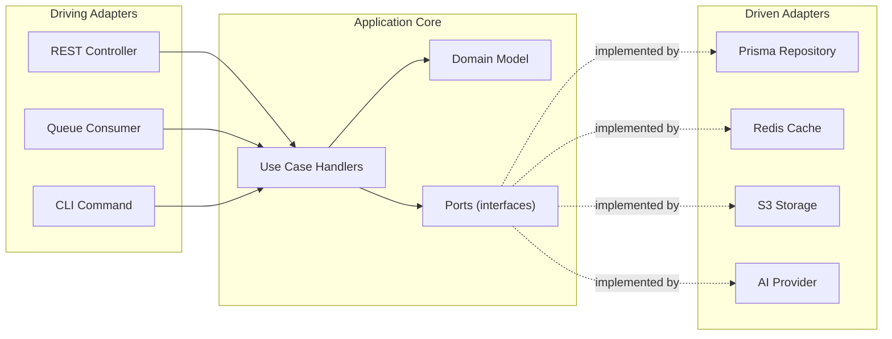
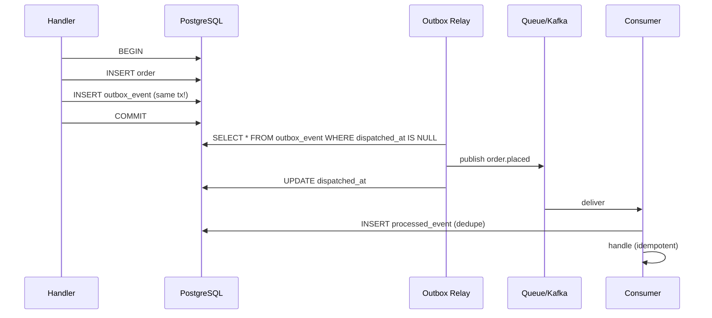

# 11 — Design Patterns & SOLID

> **Status:** Approved · **Owner:** Architecture · **Last updated:** 2026-09-11

Every pattern below is used **because it solves a specific problem in this codebase**,
not for decoration. Each entry states the problem, where the pattern lives, and a
code sketch.

A pattern applied where it is not needed is not "good design" — it is extra
indirection that the next developer has to read through.

---

# Part A — SOLID in practice

## A1. Single Responsibility Principle

> A class should have one reason to change.

**Violation:**

```ts
// 5 reasons to change: pricing rules, tax rules, persistence, PDF layout, email
class OrderService {
  async placeOrder(dto) { /* validate, price, tax, save, email, pdf */ }
}
```

**Applied:**

```ts
@Injectable()
export class PlaceOrderHandler {
  constructor(
    private readonly pricing: PricingService,        // price rules change here
    private readonly inventory: InventoryService,    // stock rules change here
    private readonly credit: CreditService,          // credit rules change here
    private readonly orders: OrderRepository,        // persistence changes here
    private readonly events: EventPublisher,         // side effects change here
  ) {}

  async execute(cmd: PlaceOrderCommand): Promise<Order> {
    return this.uow.run(async (tx) => {
      const priced = await this.pricing.priceOrder(cmd.lines, cmd.organisationId, tx);
      await this.inventory.reserve(priced.lines, tx);
      await this.credit.assertAvailable(cmd.organisationId, priced.total, tx);

      const order = Order.create({ ...cmd, lines: priced.lines });
      await this.orders.save(order, tx);
      await this.events.publish(order.pullEvents(), tx);

      return order;
    });
  }
}
```

The handler **orchestrates**. It contains no pricing rule, no tax rule and no SQL.
Each collaborator has exactly one reason to change.

**Where it shows up structurally:** one module per bounded context, one service per
business capability, one handler per use case. `PlaceOrderHandler` and
`CancelOrderHandler` are separate classes even though both touch orders — they change
for different reasons.

## A2. Open/Closed Principle

> Open for extension, closed for modification.

**The problem:** adding a payment provider, an AI provider or a shipping calculator
should not mean editing an `if/else` chain that already has eight branches.

**Violation:**

```ts
async charge(provider: string, amount: Money) {
  if (provider === 'razorpay') { /* ... */ }
  else if (provider === 'stripe') { /* ... */ }
  else if (provider === 'payu') { /* ... */ }   // grows forever
}
```

**Applied — Strategy + Registry:**

```ts
export interface PaymentGateway {
  readonly key: string;
  createIntent(amount: Money, ref: string): Promise<GatewayIntent>;
  verifyWebhookSignature(raw: Buffer, headers: Headers): boolean;
  refund(paymentRef: string, amount: Money): Promise<RefundResult>;
}

@Injectable()
export class PaymentGatewayRegistry {
  private readonly gateways = new Map<string, PaymentGateway>();

  constructor(gateways: PaymentGateway[]) {
    for (const g of gateways) this.gateways.set(g.key, g);
  }

  resolve(key: string): PaymentGateway {
    const gw = this.gateways.get(key);
    if (!gw) throw new ConfigurationError(`Unknown payment gateway: ${key}`);
    return gw;                       // never a silent fallback
  }
}

@Injectable()
export class RazorpayGateway implements PaymentGateway { readonly key = 'razorpay'; /* ... */ }
@Injectable()
export class StripeGateway   implements PaymentGateway { readonly key = 'stripe';   /* ... */ }
```

Adding a provider = **adding a class**. Nothing existing is modified.

**Same pattern, three more places:**

| Extension point | Strategy interface | Implementations |
|---|---|---|
| Payment providers | `PaymentGateway` | Razorpay, Stripe, PayU, Mock |
| AI providers | `AiProvider` | OpenAI, Anthropic, Azure, Bedrock, Ollama, Custom |
| Notification channels | `NotificationChannel` | Email, SMS, Push, WhatsApp, InApp |
| Search engines | `SearchPort` | Postgres, OpenSearch |
| Pricing rules | `PricingRule` | BasePrice, CustomerOverride, Slab, Scheme, Tax |

## A3. Liskov Substitution Principle

> Subtypes must be usable wherever the base type is expected, without surprises.

**The rule we enforce:** an implementation may not strengthen preconditions or weaken
postconditions.

```ts
export interface SearchPort {
  /**
   * @throws {SearchUnavailableError} when the backing engine is unreachable.
   * Callers MUST handle this and fall back.
   */
  search(query: SearchQuery): Promise<SearchResult>;
}

// VIOLATION: PostgresSearchAdapter silently returns [] when the DB is down.
// The caller cannot distinguish "no results" from "search is broken",
// so a real outage looks like an empty catalogue.
class BadAdapter implements SearchPort {
  async search(q) {
    try { return await this.run(q); }
    catch { return { items: [], total: 0 }; }     // ← violates the contract
  }
}

// CORRECT: throw, so the caller can degrade deliberately.
class PostgresSearchAdapter implements SearchPort {
  async search(q) {
    try { return await this.run(q); }
    catch (e) { throw new SearchUnavailableError('Search backend unavailable', { cause: e }); }
  }
}
```

The LSP violation here is subtle and expensive: it turns an outage into a silent
empty result set. Users see "no products found" instead of an error, and nobody
investigates.

## A4. Interface Segregation Principle

> No client should depend on methods it does not use.

**Violation:**

```ts
interface UserService {
  findById(id): Promise<User>;
  createUser(dto): Promise<User>;
  updateUser(dto): Promise<User>;
  deleteUser(id): Promise<void>;
  resetPassword(id): Promise<void>;
  exportAllUsers(): Promise<Buffer>;         // most callers need none of this
}
```

**Applied — segregated by capability:**

```ts
export interface UserReader {
  findById(id: string, ctx: TenantContext): Promise<User | null>;
  findByEmail(email: string): Promise<User | null>;
}

export interface UserWriter {
  create(dto: CreateUserDto, ctx: TenantContext): Promise<User>;
  update(id: string, dto: UpdateUserDto, ctx: TenantContext): Promise<User>;
  deactivate(id: string, ctx: TenantContext): Promise<void>;
}

export interface CredentialManager {
  setPassword(id: string, password: string): Promise<void>;
  verifyPassword(id: string, password: string): Promise<boolean>;
  forceLogout(id: string): Promise<void>;
}
```

`OrderService` depends on `UserReader` only. It cannot accidentally deactivate a user
or export the user table, because those methods are not in its interface.

**Where it matters most:** the `AiProvider` interface is deliberately minimal —
`chat`, `embed`, `vision`, `isAvailable`. A provider that cannot do vision simply
does not implement `VisionProvider`, rather than throwing `NotImplementedError` from
a method everyone can see.

## A5. Dependency Inversion Principle

> Depend on abstractions, not concretions.

**This is the pattern that makes service extraction possible later (ADR-000).**

```ts
// The port — owned by the consumer, expressed in domain terms
export interface StockPort {
  getAvailableToPromise(
    productId: string,
    warehouseId: string,
    ctx: TenantContext,
  ): Promise<Quantity>;

  reserve(
    lines: PricedLine[],
    reference: OrderRef,
    tx: TransactionContext,
  ): Promise<Reservation[]>;
}

export const STOCK_PORT = Symbol('StockPort');

// In-process implementation (phase 1–3)
@Injectable()
export class InProcessStockAdapter implements StockPort {
  constructor(private readonly inventory: InventoryService) {}
  getAvailableToPromise(...a) { return this.inventory.atp(...a); }
  reserve(...a)               { return this.inventory.reserve(...a); }
}

// HTTP implementation (phase 6, after extraction) — same interface
@Injectable()
export class HttpStockAdapter implements StockPort {
  constructor(private readonly http: HttpService) {}
  async getAvailableToPromise(...a) { return this.http.get('/internal/stock/atp', ...); }
  async reserve(...a)               { return this.http.post('/internal/stock/reserve', ...); }
}

// The consumer never knows which one it got
@Injectable()
export class PlaceOrderHandler {
  constructor(@Inject(STOCK_PORT) private readonly stock: StockPort) {}
}

// The swap is one line in the module
@Module({
  providers: [
    { provide: STOCK_PORT, useClass: InProcessStockAdapter },   // → HttpStockAdapter
  ],
})
export class OrdersModule {}
```

**Why this matters commercially:** when Inventory eventually needs its own service
and database, the change is a new adapter class and a module binding. No domain code
changes. That is the difference between a two-day change and a two-quarter rewrite.

---

# Part B — Architectural patterns

## B1. Ports & Adapters (Hexagonal Architecture)



**The dependency rule:** dependencies point **inward**. The domain knows nothing
about Prisma, Redis, HTTP or NestJS. This is what makes the domain testable in
milliseconds with no infrastructure.

**Structure per module:**

```
modules/orders/
├── domain/                    # pure — no framework imports, no I/O
│   ├── entities/order.entity.ts
│   ├── value-objects/money.vo.ts
│   ├── events/order-placed.event.ts
│   └── errors/order.errors.ts
├── application/
│   ├── commands/place-order.command.ts
│   ├── handlers/place-order.handler.ts
│   ├── queries/get-order.query.ts
│   └── ports/order.repository.port.ts
├── infrastructure/
│   ├── persistence/prisma-order.repository.ts
│   └── mappers/order.mapper.ts
├── api/
│   ├── orders.controller.ts
│   └── dto/
└── orders.module.ts
```

## B2. Repository

```ts
export interface OrderRepository {
  findById(id: string, ctx: TenantContext): Promise<Order | null>;
  findByOrderNo(no: string, ctx: TenantContext): Promise<Order | null>;
  save(order: Order, tx?: TransactionContext): Promise<void>;
  lockForUpdate(id: string, tx: TransactionContext): Promise<Order>;
  list(criteria: OrderCriteria, ctx: TenantContext): Promise<Page<Order>>;
}
```

**Rules that matter:**

- `findById` takes the `TenantContext` and applies it in the query — a foreign
  resource simply is not found (IDOR prevention, §3 of doc 09).
- `lockForUpdate` is a **separate, explicit** method. Acquiring a lock is a
  deliberate act, never an accidental side effect of a read.
- The repository returns **domain entities**, not database rows. Mapping happens in
  the repository, so the domain never sees a Prisma type.

## B3. Unit of Work

```ts
@Injectable()
export class UnitOfWork {
  constructor(private readonly prisma: PrismaService) {}

  async run<T>(fn: (tx: TransactionContext) => Promise<T>): Promise<T> {
    return this.prisma.$transaction(
      async (tx) => fn(new TransactionContext(tx)),
      {
        isolationLevel: 'ReadCommitted',
        timeout: 15_000,
        maxWait: 5_000,
      },
    );
  }
}
```

**Why `ReadCommitted` and not `Serializable`:** serializable isolation causes
retries under contention, and retries on money paths are exactly where double-posting
bugs come from. We get correctness from **explicit row locks** (`SELECT … FOR UPDATE`)
on the specific rows that need it, which is more predictable than optimistic
serialization failures at the transaction level.

The whole order placement runs in one `uow.run()`. If anything throws, everything
rolls back — including the outbox event, so no phantom event is published.

## B4. Domain Events + Transactional Outbox

```ts
// Raised by the aggregate, in memory
export class Order extends AggregateRoot {
  static create(props: CreateOrderProps): Order {
    const order = new Order({ ...props, status: OrderStatus.PLACED });
    order.addEvent(new OrderPlacedEvent(order.id, order.organisationId, order.grandTotal));
    return order;
  }
}

// Persisted in the SAME transaction as the aggregate
await this.orders.save(order, tx);
await this.outbox.append(order.pullEvents(), tx);   // atomic with the write
```



**Why the outbox and not a direct publish:** publishing inside the transaction means
a message can be sent and then the transaction rolls back — an event for an order
that does not exist. Publishing after the commit means a crash between commit and
publish loses the event forever. The outbox is the only approach that is atomic with
the state change.

**Consumers must be idempotent.** Delivery is at-least-once. Every consumer inserts
into `processed_event` (primary key on `consumer + event_id`) inside the same
transaction as its work — a duplicate delivery hits the primary key and is skipped.

## B5. Saga (Orchestration)

```ts
export interface SagaStep<T> {
  readonly name: string;
  execute(ctx: T, tx: TransactionContext): Promise<void>;
  compensate(ctx: T, tx: TransactionContext): Promise<void>;
}

export class OrderFulfilmentSaga {
  private readonly steps: SagaStep<OrderSagaContext>[] = [
    this.reserveStock,        // compensate: release reservation
    this.assertCredit,        // compensate: release credit hold
    this.approveOrder,        // compensate: cancel order
    this.generateInvoice,     // compensate: void invoice
    this.createShipment,      // compensate: cancel shipment
  ];

  async advance(saga: OrderSaga, tx: TransactionContext): Promise<void> {
    for (const step of this.steps.slice(saga.stepIndex)) {
      if (saga.completedSteps.includes(step.name)) continue;   // idempotent resume
      try {
        await step.execute(saga.context, tx);
        saga.markComplete(step.name);
        await this.sagas.save(saga, tx);
      } catch (err) {
        saga.fail(step.name, err);
        await this.sagas.save(saga, tx);
        throw err;                         // triggers compensation below
      }
    }
  }

  async compensate(saga: OrderSaga, tx: TransactionContext): Promise<void> {
    for (const step of [...this.steps].reverse()) {
      if (!saga.completedSteps.includes(step.name)) continue;
      try { await step.compensate(saga.context, tx); }
      catch (e) { this.log.error(`Compensation failed: ${step.name}`, e); }
    }
    saga.markCompensated();
    await this.sagas.save(saga, tx);
  }
}
```

**Why orchestration and not choreography:** an orchestrated saga has a single place
that knows the workflow, is queryable ("where is this order stuck?"), and can be
re-driven. Choreography spreads the workflow across N event handlers, and debugging
it means reconstructing the flow from logs.

**Every step is idempotent and resumable.** A saga that crashes mid-way resumes from
`stepIndex`, skipping completed steps.

## B6. CQRS-lite (separate read models, one write model)

We do **not** use full CQRS with separate write and read databases. We use the
useful half:

| Aspect | Write path | Read path |
|---|---|---|
| Model | Rich domain aggregates | Flat, denormalised read models |
| Store | PostgreSQL primary | Primary, replicas, materialised views |
| Consistency | Strong | Eventual |
| Purpose | Enforce invariants | Serve queries fast |

```ts
// Command — goes through the domain, enforces invariants
@CommandHandler(PlaceOrderCommand)
export class PlaceOrderHandler { /* ... */ }

// Query — bypasses the domain entirely, straight to a read model
@QueryHandler(GetOrderSummaryQuery)
export class GetOrderSummaryHandler {
  async execute(q: GetOrderSummaryQuery) {
    return this.db.orderSummary.findMany({ where: { tenantId: q.tenantId } });
  }
}
```

**Why not full CQRS:** two databases means eventual consistency on data the user just
wrote, plus projection infrastructure, plus reconciliation. For this workload, the
read models are the same PostgreSQL instance — we get the query-shape benefit without
the distributed-consistency cost.

## B7. Anti-Corruption Layer

Every external system gets an adapter that translates its model into ours. External
concepts never leak into the domain.

```ts
@Injectable()
export class RazorpayAdapter implements PaymentGateway {
  readonly key = 'razorpay';

  async createIntent(amount: Money, ref: string): Promise<GatewayIntent> {
    const res = await this.client.orders.create({
      amount: amount.toMinorUnits(),          // our Money → their integer paise
      currency: amount.currency,
      receipt: ref,
    });
    return new GatewayIntent({
      providerRef: res.id,                    // their naming → our domain naming
      clientSecret: res.client_secret,
      status: this.mapStatus(res.status),     // their enum → our enum
    });
  }

  private mapStatus(s: string): PaymentStatus {
    switch (s) {
      case 'created':  return PaymentStatus.PENDING;
      case 'authorized': return PaymentStatus.AUTHORIZED;
      case 'captured': return PaymentStatus.CAPTURED;
      case 'failed':   return PaymentStatus.FAILED;
      default:
        this.log.warn(`Unknown Razorpay status: ${s}`);
        return PaymentStatus.PENDING;         // fail safe, not fail open
    }
  }
}
```

**The rule:** if the word "Razorpay" appears anywhere outside
`infrastructure/payment-gateways/`, the abstraction has leaked.

## B8. Circuit Breaker

```ts
@Injectable()
export class ResilientHttpClient {
  private readonly breakers = new Map<string, CircuitBreaker>();

  private breakerFor(service: string): CircuitBreaker {
    if (!this.breakers.has(service)) {
      this.breakers.set(service, new CircuitBreaker(this.request.bind(this), {
        timeout: 5_000,
        errorThresholdPercentage: 50,
        resetTimeout: 30_000,
        volumeThreshold: 10,
      }));
    }
    return this.breakers.get(service)!;
  }

  async call<T>(service: string, fn: () => Promise<T>, fallback: () => T): Promise<T> {
    try {
      return await this.breakerFor(service).fire(fn);
    } catch {
      return fallback();                    // deterministic degradation
    }
  }
}
```

**Applied to:** every external provider — payment gateways, SMS, WhatsApp, email,
AI providers, GST/e-invoice API, transporter APIs.

**The fallback must be deterministic and safe.** For AI: return the non-AI result.
For SMS: queue for retry. For a payment gateway: **fail the request** — never
fabricate a payment result.

## B9. Bulkhead

Isolate resources so one slow dependency cannot exhaust everything.

```ts
// Separate connection pools / thread pools per dependency class
{
  pools: {
    primary:    { max: 15 },     // transactional work
    reports:    { max: 5 },      // heavy reads, separate replica
    ai:         { max: 3 },      // slow, optional
    external:   { max: 5 },      // gateway calls
  },
  queues: {
    notifications: { concurrency: 20 },   // high volume, independent
    invoices:      { concurrency: 5 },    // CPU-heavy PDF rendering
    indexing:      { concurrency: 2 },    // search index writes
    ai:            { concurrency: 3 },    // slow, rate-limited by provider
  },
}
```

Without bulkheads, a backlog of slow AI enrichment jobs starves the invoice queue,
which starves order confirmation. With them, a slow dependency degrades only itself.

## B10. Idempotency

```ts
@Injectable()
export class IdempotencyInterceptor implements NestInterceptor {
  async intercept(ctx: ExecutionContext, next: CallHandler) {
    const req = ctx.switchToHttp().getRequest();
    const key = req.headers['idempotency-key'];
    if (!key || !UNSAFE_METHODS.has(req.method)) return next.handle();

    const scope = `${req.method} ${req.route.path}`;
    const hash = sha256(JSON.stringify(req.body));

    // Atomic claim — a unique constraint, not a check-then-act
    const claimed = await this.store.claim(scope, key, hash);
    if (!claimed.acquired) {
      if (claimed.requestHash !== hash) throw new ConflictException('IDEMPOTENCY_KEY_REUSED');
      if (claimed.status === 'COMPLETED') {
        ctx.switchToHttp().getResponse().setHeader('Idempotency-Replayed', 'true');
        return of(claimed.responseBody);
      }
      throw new ConflictException('REQUEST_IN_PROGRESS');
    }

    const result = await next.handle().toPromise();
    await this.store.complete(scope, key, result);
    return of(result);
  }
}
```

**`claim` uses an `INSERT … ON CONFLICT DO NOTHING`** — the uniqueness of the
`(scope, idempotency_key)` index does the work atomically. A check-then-insert is a
race that lets two requests both pass.

---

# Part C — GoF patterns, with the problem each solves

## Creational

| Pattern | Problem it solves here | Where |
|---|---|---|
| **Factory** | Choosing an implementation at runtime | `PaymentGatewayRegistry`, `AiProviderRegistry`, `NotificationChannelResolver` |
| **Abstract Factory** | Producing a consistent family | `NotificationFactory` → `{ channel, template, formatter }` per channel |
| **Builder** | Constructing a complex object step by step | `OrderBuilder`, `SearchQueryBuilder`, `InvoiceBuilder` |
| **Singleton** | Exactly one instance | NestJS `Scope.DEFAULT` — the DI container guarantees it; **no hand-rolled singletons** |
| **Prototype** | Cloning a configured object | `ReorderService` clones a past order into a new cart |

```ts
// Factory — the registry, shown in A2
// Builder — assembling a search query without a 12-argument constructor
const result = await this.search.search(
  new SearchQueryBuilder()
    .forTenant(ctx.tenantId)
    .matching('paracetamol')
    .inCategory('analgesics')
    .availableOnly()
    .priceBetween(10, 500)
    .sortBy('relevance')
    .page(1, 24)
    .build(),
);
```

## Structural

| Pattern | Problem it solves here | Where |
|---|---|---|
| **Adapter** | Making a foreign interface fit ours | `RazorpayAdapter`, `OpenAiProvider`, `S3StorageAdapter`, `OpenSearchAdapter` |
| **Facade** | Simplifying a complex subsystem | `OrderFacade` exposing one call that coordinates pricing + stock + credit |
| **Decorator** | Adding behaviour without modifying | NestJS interceptors: `@Cacheable`, `@Audit`, `@Log`, `@Retry` |
| **Proxy** | Controlling access | Cache proxy, tenant-scoping proxy, lazy-loading proxy |
| **Composite** | Treating a tree uniformly | Category tree, pack hierarchy (unit → pack → case) |
| **Bridge** | Separating abstraction from implementation | Notification abstraction × channel implementation |

```ts
// Decorator — composable cross-cutting concerns, applied declaratively
@Audit({ action: 'order.cancel', entity: 'order' })
@Retry({ attempts: 3, backoff: 'exponential' })
@RateLimit({ scope: 'principal', max: 60, window: 60 })
@Post(':id/cancel')
async cancel(@Param('id') id: string, @Body() dto: CancelOrderDto) { /* ... */ }
```

```ts
// Composite — the category tree is a tree, and is treated as one
export abstract class CategoryNode {
  abstract getProductCount(): Promise<number>;
  abstract findProducts(filters: ProductFilters): Promise<Product[]>;
}
export class LeafCategory extends CategoryNode { /* ... */ }
export class ParentCategory extends CategoryNode {
  constructor(private children: CategoryNode[]) { super(); }
  async getProductCount() {
    return (await Promise.all(this.children.map((c) => c.getProductCount())))
      .reduce((a, b) => a + b, 0);
  }
}
```

## Behavioural

| Pattern | Problem it solves here | Where |
|---|---|---|
| **Strategy** | Interchangeable algorithms | Pricing rules, AI providers, payment gateways, shipping calculators, search adapters |
| **Observer** | Notifying many parties of a change | Domain events → notification, indexing, analytics, audit |
| **State** | Behaviour that changes with state | `OrderStateMachine`, `OnboardingStateMachine`, `PaymentStateMachine` |
| **Chain of Responsibility** | Sequential handlers, each may handle or pass | Middleware chain, approval chain, pricing rule chain, validation pipeline |
| **Command** | Encapsulating an action as an object | Every use case is a Command; enables queueing, retry, audit, undo |
| **Mediator** | Decoupling many-to-many collaborators | The command bus; saga orchestration |
| **Template Method** | Fixed skeleton, variable steps | `BaseImportJob` → `CatalogueImport`, `CustomerImport` |
| **Specification** | Composable business rules | Search filters, eligibility rules, scheme applicability |
| **Iterator** | Sequential access without exposing internals | Cursor pagination, export streaming |

### State — the order lifecycle

```ts
export type OrderStatus =
  | 'DRAFT' | 'PLACED' | 'PENDING_APPROVAL' | 'CONFIRMED' | 'CREDIT_HOLD'
  | 'PROCESSING' | 'PARTIALLY_DISPATCHED' | 'DISPATCHED' | 'DELIVERED'
  | 'DELIVERY_FAILED' | 'CANCELLED' | 'REJECTED' | 'RETURN_REQUESTED' | 'RETURNED';

const TRANSITIONS: Record<OrderStatus, OrderStatus[]> = {
  DRAFT:               ['PLACED', 'CANCELLED'],
  PLACED:              ['PENDING_APPROVAL', 'CONFIRMED', 'CANCELLED'],
  PENDING_APPROVAL:    ['CONFIRMED', 'REJECTED', 'CANCELLED'],
  CONFIRMED:           ['CREDIT_HOLD', 'PROCESSING', 'CANCELLED'],
  CREDIT_HOLD:         ['CONFIRMED', 'CANCELLED'],
  PROCESSING:          ['PARTIALLY_DISPATCHED', 'DISPATCHED', 'CANCELLED'],
  PARTIALLY_DISPATCHED:['DISPATCHED'],
  DISPATCHED:          ['DELIVERED', 'DELIVERY_FAILED'],
  DELIVERY_FAILED:     ['PROCESSING', 'CANCELLED'],
  DELIVERED:           ['RETURN_REQUESTED'],
  RETURN_REQUESTED:    ['RETURNED'],
  CANCELLED: [], REJECTED: [], RETURNED: [],
};

export class Order {
  transitionTo(next: OrderStatus, actor: Actor, reason?: string): void {
    if (!TRANSITIONS[this.status].includes(next)) {
      throw new InvalidOrderTransitionError(this.id, this.status, next);
    }
    this.addEvent(new OrderStatusChangedEvent(this.id, this.status, next, actor, reason));
    this.status = next;
    this.updatedAt = new Date();
  }
}
```

**Why a transition table and not `if` statements scattered across services:** the
legal transitions are stated **once**, are testable exhaustively, and an illegal
transition raises an error rather than silently corrupting the order. The table is
also directly renderable as documentation (see the state diagram in doc 04).

### Specification — composable search filters

```ts
export interface Specification<T> {
  toSql(alias: string): { clause: string; params: unknown[] };
  and(other: Specification<T>): Specification<T>;
  or(other: Specification<T>): Specification<T>;
}

const spec = new TenantSpec(ctx.tenantId)
  .and(new ActiveSpec())
  .and(new InStockSpec())
  .and(new CategorySpec(filters.categoryId))
  .and(new PriceRangeSpec(filters.minPrice, filters.maxPrice));

const { clause, params } = spec.toSql('p');
```

Adding a filter = adding a class. The query builder never grows an `if` chain, and
every filter is independently unit-testable.

### Template Method — bulk import

```ts
export abstract class BaseImportJob<T> {
  async run(file: Buffer, ctx: ImportContext): Promise<ImportReport> {
    const rows    = await this.parse(file);              // fixed
    const mapped  = rows.map((r) => this.mapRow(r));     // fixed
    const errors  = await this.validate(mapped);         // varies
    if (ctx.dryRun) return this.report(errors, mapped);  // fixed

    const inserted = await this.persist(mapped);         // varies
    await this.publishEvents(inserted);                  // fixed
    return this.report(errors, inserted);
  }
  protected abstract validate(rows: T[]): Promise<ValidationError[]>;
  protected abstract persist(rows: T[]): Promise<T[]>;
}

export class CatalogueImportJob extends BaseImportJob<ProductImportRow> { /* ... */ }
export class CustomerImportJob  extends BaseImportJob<CustomerImportRow> { /* ... */ }
```

The parse → map → validate → persist → publish skeleton is written once. Only the
varying steps are overridden.

---

# Part D — Anti-patterns we explicitly avoid

| Anti-pattern | Why it is banned here |
|---|---|
| **Anemic domain model** | Logic in services, data in entities, invariants enforced nowhere. Our aggregates enforce their own rules. |
| **Service locator** | Hides dependencies, breaks testability. We use constructor injection exclusively. |
| **God service** | A `CommonService` that everything depends on becomes a merge-conflict magnet and a change-risk concentrator. |
| **Shared mutable state** | Breaks the stateless tier. All shared state lives in Redis or Postgres. |
| **Primitive obsession** | `Money`, `Quantity`, `GstRate`, `CompositionKey` are value objects with validation in their constructors, not bare numbers and strings. |
| **Float for money** | Accumulates rounding errors into real losses. |
| **Check-then-act outside a transaction** | A TOCTOU race. The single most common money bug. |
| **Swallowing exceptions** | `catch (e) { log(e) }` then continuing to mutate state is how half-applied transactions happen. |
| **Silent fallback to a permissive implementation** | A missing config that falls back to a no-op signature verifier is a forged-payment vulnerability. **Fail closed.** |
| **Business logic in controllers** | Controllers validate and delegate. Nothing else. |
| **Business logic in the database** | Triggers only for derived-column maintenance, never for business rules. Business rules belong in testable code. |
| **Hand-rolled singletons** | The DI container owns lifetimes. |
| **Interfaces in DTO positions** | Makes the NestJS ValidationPipe a silent no-op. Use classes. |

---

# Part E — Value objects (where correctness actually lives)

```ts
export class Money {
  private constructor(
    private readonly amount: Decimal,
    readonly currency: string,
  ) {}

  static of(amount: string | number, currency = 'INR'): Money {
    return new Money(new Decimal(amount), currency);
  }

  add(other: Money): Money {
    this.assertSameCurrency(other);
    return new Money(this.amount.plus(other.amount), this.currency);
  }

  multiply(factor: Decimal.Value): Money {
    return new Money(this.amount.times(factor), this.currency);
  }

  /** Rounding happens ONLY here, and only at documented boundaries. */
  roundToCurrency(): Money {
    return new Money(this.amount.toDecimalPlaces(2, Decimal.ROUND_HALF_UP), this.currency);
  }

  /** Transport as a string — a JSON number would be an IEEE-754 double. */
  toJSON(): string { return this.amount.toFixed(4); }

  isNegative(): boolean { return this.amount.isNegative(); }

  private assertSameCurrency(o: Money): void {
    if (o.currency !== this.currency) throw new CurrencyMismatchError(this.currency, o.currency);
  }
}
```

```ts
export class CompositionKey {
  private constructor(readonly value: string) {}

  static from(parts: CompositionPart[]): CompositionKey {
    if (parts.length === 0) throw new EmptyCompositionError();
    return new CompositionKey(buildCompositionKey(parts));
  }

  equals(other: CompositionKey): boolean { return this.value === other.value; }
  hash(): string { return createHash('sha256').update(this.value).digest('hex'); }
  toString(): string { return this.value; }
}
```

**Why value objects instead of primitives:** every rule about the value is enforced
in **one** place. A `Money` cannot be added to a different currency, cannot be
negative where it should not be, and always serialises correctly. A bare `number`
can do all of those things and will, eventually, in production.

---

# Part F — Pattern → location index

| Pattern | Primary location |
|---|---|
| Ports & Adapters | `modules/*/application/ports`, `modules/*/infrastructure` |
| Repository | `modules/*/infrastructure/persistence` |
| Unit of Work | `common/database/unit-of-work.ts` |
| Domain Events | `modules/*/domain/events` |
| Transactional Outbox | `modules/platform/outbox` |
| Saga | `modules/orders/application/sagas` |
| CQRS-lite | `modules/*/application/commands` + `/queries` |
| Strategy | `infra/payment-gateways`, `infra/ai-providers`, `modules/pricing/domain/rules` |
| Factory / Registry | `*Registry` classes in each module |
| Adapter | `modules/*/infrastructure/*-adapter.ts` |
| Anti-Corruption Layer | Every `infrastructure/` adapter |
| Decorator | `common/interceptors` (`@Audit`, `@Cacheable`, `@Retry`) |
| Chain of Responsibility | `common/middleware`, `modules/onboarding/domain/approval-chain.ts` |
| State | `modules/*/domain/*.state-machine.ts` |
| Specification | `modules/catalog/domain/specifications`, `modules/search/domain/specifications` |
| Command / Mediator | `common/cqrs` command bus |
| Observer | Event subscribers in each module |
| Circuit Breaker | `infra/http/resilient-http.client.ts` |
| Bulkhead | Pool and queue configuration |
| Idempotency | `common/idempotency` |
| Template Method | `modules/*/application/import/base-import.job.ts` |
| Builder | `modules/search/domain/search-query.builder.ts` |
| Composite | `modules/catalog/domain/category-node.ts` |
| Value Objects | `modules/*/domain/value-objects` |
