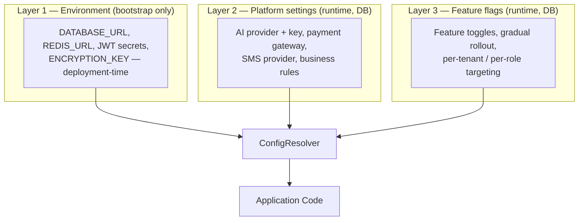

# 13 — Runtime Configuration & Feature Flags

> **Status:** Approved · **Owner:** Architecture · **Last updated:** 2026-09-11

> **The requirement:** *"keep it configurable so that an AI API key can also be
> provided at runtime. They can change provider. Do not need to change the
> application."*

This document specifies exactly how that works, end to end.

---

## 1. The three layers of configuration



| Layer | Stored in | Changed by | Requires restart? | Use for |
|---|---|---|---|---|
| **1. Environment** | Env vars / Secrets Manager | DevOps, via deployment | **Yes** | Infrastructure that cannot exist without the app: DB URL, encryption key |
| **2. Platform settings** | `platform_setting` table | Admin, via the UI | **No** | Provider keys, provider selection, business rules, thresholds |
| **3. Feature flags** | `feature_flag` table | Admin, via the UI | **No** | Toggling capability, gradual rollout |

**The rule that decides which layer:** *if changing the value must never require a
redeploy, it belongs in Layer 2 or 3.* Infrastructure credentials (database, Redis)
are the only things that legitimately belong in Layer 1 — the application cannot
start without them, so "runtime change" is meaningless for them.

---

## 2. Layer 1 — Environment, validated at boot

```ts
// backend/src/config/env.schema.ts
import { z } from 'zod';

export const envSchema = z.object({
  NODE_ENV: z.enum(['development', 'test', 'staging', 'production']),
  PORT: z.coerce.number().int().positive().default(3001),
  APP_ROLE: z.enum(['api', 'worker', 'scheduler']).default('api'),

  DATABASE_URL: z.string().url(),
  DATABASE_POOL_MAX: z.coerce.number().int().min(1).max(50).default(15),
  DATABASE_STATEMENT_TIMEOUT_MS: z.coerce.number().int().default(10_000),

  REDIS_URL: z.string().url(),

  JWT_ACCESS_SECRET: z.string().min(32),
  JWT_REFRESH_SECRET: z.string().min(32),
  ENCRYPTION_KEY: z.string().min(32),        // 32-byte base64 — protects Layer 2 secrets

  CORS_ORIGINS: z.string().transform((s) => s.split(',').map((o) => o.trim())),

  LOG_LEVEL: z.enum(['trace','debug','info','warn','error']).default('info'),
}).superRefine((env, ctx) => {
  // Fail the BOOT, not the first request, if a dangerous combination is configured.
  if (env.NODE_ENV === 'production') {
    if (env.CORS_ORIGINS.includes('*')) {
      ctx.addIssue({
        code: z.ZodIssueCode.custom,
        path: ['CORS_ORIGINS'],
        message: 'Wildcard CORS origin is not allowed in production with credentials.',
      });
    }
  }
});

export type AppEnv = z.infer<typeof envSchema>;
```

```ts
// backend/src/config/configuration.ts
export function validateEnv(raw: Record<string, unknown>): AppEnv {
  const result = envSchema.safeParse(raw);
  if (!result.success) {
    // A clear, actionable message — not a stack trace at 3 AM
    const details = result.error.issues
      .map((i) => `  • ${i.path.join('.')}: ${i.message}`)
      .join('\n');
    throw new Error(`Invalid environment configuration:\n${details}`);
  }
  return result.data;
}
```

**Why fail at boot rather than at first use:** a misconfigured service that starts
successfully and fails on the first request is far worse than one that refuses to
start. The orchestrator sees a crash-looping pod immediately; a runtime failure
appears as intermittent 500s in production.

---

## 3. Layer 2 — Platform settings (runtime, DB-backed)

### 3.1 Storage

```sql
CREATE TABLE platform_setting (
  id              uuid PRIMARY KEY DEFAULT uuid_generate_v7(),
  tenant_id       uuid REFERENCES tenant(id),      -- NULL = platform-wide
  namespace       text NOT NULL,                   -- 'ai' | 'payment' | 'sms' | 'business'
  key             text NOT NULL,
  value           jsonb,                           -- non-secret value
  value_encrypted bytea,                           -- AES-256-GCM for secrets
  is_secret       boolean NOT NULL DEFAULT false,
  description     text,
  updated_by      uuid REFERENCES app_user(id),
  created_at      timestamptz NOT NULL DEFAULT now(),
  updated_at      timestamptz NOT NULL DEFAULT now(),
  UNIQUE (tenant_id, namespace, key),
  CHECK ( (is_secret AND value_encrypted IS NOT NULL)
       OR (NOT is_secret AND value IS NOT NULL) )
);
```

A secret is stored **encrypted or not at all** — the `CHECK` constraint makes a
plaintext secret impossible at the database level, not just by convention.

### 3.2 Encryption service

```ts
// backend/src/common/utils/crypto.util.ts
import { createCipheriv, createDecipheriv, randomBytes } from 'node:crypto';

const ALGORITHM = 'aes-256-gcm';
const IV_LENGTH = 12;      // 96-bit IV, recommended for GCM
const TAG_LENGTH = 16;

export class EncryptionService {
  private readonly key: Buffer;

  constructor(base64Key: string) {
    this.key = Buffer.from(base64Key, 'base64');
    if (this.key.length !== 32) {
      throw new Error('ENCRYPTION_KEY must decode to exactly 32 bytes');
    }
  }

  /** Returns: keyVersion(1) || iv(12) || tag(16) || ciphertext */
  encrypt(plaintext: string, keyVersion = 1): Buffer {
    const iv = randomBytes(IV_LENGTH);
    const cipher = createCipheriv(ALGORITHM, this.key, iv);
    const ct = Buffer.concat([cipher.update(plaintext, 'utf8'), cipher.final()]);
    const tag = cipher.getAuthTag();
    return Buffer.concat([Buffer.from([keyVersion]), iv, tag, ct]);
  }

  decrypt(payload: Buffer): string {
    const iv  = payload.subarray(1, 1 + IV_LENGTH);
    const tag = payload.subarray(1 + IV_LENGTH, 1 + IV_LENGTH + TAG_LENGTH);
    const ct  = payload.subarray(1 + IV_LENGTH + TAG_LENGTH);
    const decipher = createDecipheriv(ALGORITHM, this.key, iv);
    decipher.setAuthTag(tag);
    return Buffer.concat([decipher.update(ct), decipher.final()]).toString('utf8');
  }
}
```

**GCM, not CBC.** GCM is authenticated encryption — a tampered ciphertext fails to
decrypt rather than silently producing garbage. For API keys, integrity matters as
much as confidentiality.

**Key versioning is built in** (the first byte), so `ENCRYPTION_KEY` can be rotated
without a migration window: a background job re-encrypts values with the new key.

### 3.3 The settings service

```ts
@Injectable()
export class PlatformSettingsService {
  private readonly cache = new Map<string, { value: unknown; expiresAt: number }>();
  private static readonly CACHE_TTL_MS = 30_000;

  constructor(
    private readonly prisma: PrismaService,
    private readonly encryption: EncryptionService,
    private readonly events: EventEmitter2,
  ) {
    // Any pod that changes a setting invalidates its own cache immediately,
    // and every other pod invalidates within the TTL below.
    this.events.on('config.updated', ({ namespace, key }) => {
      this.cache.delete(this.cacheKey(null, namespace, key));
    });
  }

  async get<T>(namespace: string, key: string, fallback: T): Promise<T> {
    const ck = this.cacheKey(null, namespace, key);
    const hit = this.cache.get(ck);
    if (hit && hit.expiresAt > Date.now()) return hit.value as T;

    const row = await this.prisma.platformSetting.findFirst({
      where: { tenantId: null, namespace, key },
    });

    let value: unknown = fallback;
    if (row) {
      value = row.isSecret
        ? JSON.parse(this.encryption.decrypt(row.valueEncrypted!))
        : row.value;
    }

    this.cache.set(ck, { value, expiresAt: Date.now() + PlatformSettingsService.CACHE_TTL_MS });
    return value as T;
  }

  async set(namespace: string, key: string, value: unknown, actorId: string, isSecret = false) {
    const data = isSecret
      ? { valueEncrypted: this.encryption.encrypt(JSON.stringify(value)), value: null, isSecret: true }
      : { value: value as any, valueEncrypted: null, isSecret: false };

    await this.prisma.platformSetting.upsert({
      where:  { tenantId_namespace_key: { tenantId: null, namespace, key } },
      create: { namespace, key, ...data, updatedBy: actorId },
      update: { ...data, updatedBy: actorId, updatedAt: new Date() },
    });

    this.cache.delete(this.cacheKey(null, namespace, key));

    // Notify every other pod. Fire-and-forget: the TTL is the safety net.
    this.events.emit('config.updated', { namespace, key, actorId });
  }

  private cacheKey(tenantId: string | null, ns: string, key: string) {
    return `${tenantId ?? 'global'}:${ns}:${key}`;
  }
}
```

**The 30-second TTL is the design decision that matters.** With a TTL, a change
propagates to every pod within 30 s **even if the invalidation event is lost**. The
event makes it near-instant; the TTL guarantees eventual correctness. Relying on the
event alone would mean one dropped message leaves a pod with a stale API key
indefinitely.

### 3.4 Secrets are write-only

```ts
@Get('settings/:namespace')
@RequireCapability('settings:read')
async listSettings(@Param('namespace') ns: string) {
  const rows = await this.settings.list(ns);
  return rows.map((r) => ({
    key: r.key,
    namespace: r.namespace,
    isSecret: r.isSecret,
    // A secret is NEVER returned. The UI shows a masked placeholder
    // plus the last-updated timestamp, so an admin can see it is set
    // without ever being able to read it back.
    value: r.isSecret ? '••••••••' : r.value,
    hasValue: r.isSecret ? r.valueEncrypted !== null : r.value !== null,
    updatedAt: r.updatedAt,
    updatedBy: r.updatedBy,
  }));
}
```

**Why write-only:** an API key that can be read through the admin UI can be read by
anyone who compromises an admin session. Write-only means a leaked admin session
lets an attacker *replace* a key (which is detectable and revocable) but not
*exfiltrate* one.

---

## 4. AI provider registry — the core requirement

### 4.1 The interface

```ts
// backend/src/infra/ai-providers/ai-provider.interface.ts
export type AiCapability = 'chat' | 'embedding' | 'vision' | 'ocr';

export interface AiProviderConfig {
  key: string;              // 'openai' | 'anthropic' | ...
  model: string;
  apiKey: string;
  baseUrl?: string;
  timeoutMs: number;
  maxRetries: number;
  options?: Record<string, unknown>;
}

export interface ChatRequest {
  messages: Array<{ role: 'system' | 'user' | 'assistant'; content: string }>;
  temperature?: number;
  maxTokens?: number;
  jsonMode?: boolean;
}

export interface ChatResponse {
  content: string;
  promptTokens: number;
  completionTokens: number;
  model: string;
  provider: string;
}

export interface AiProvider {
  readonly key: string;
  readonly capabilities: ReadonlySet<AiCapability>;
  chat(req: ChatRequest, cfg: AiProviderConfig): Promise<ChatResponse>;
  embed?(input: string[], cfg: AiProviderConfig): Promise<number[][]>;
  vision?(image: Buffer, prompt: string, cfg: AiProviderConfig): Promise<ChatResponse>;
  healthCheck(cfg: AiProviderConfig): Promise<boolean>;
}
```

Each provider implements only what it can actually do. `embed` and `vision` are
optional — a provider that cannot embed simply does not implement it, and the
registry rejects the binding rather than throwing at call time.

### 4.2 Implementations

```ts
@Injectable()
export class OpenAiProvider implements AiProvider {
  readonly key = 'openai';
  readonly capabilities = new Set<AiCapability>(['chat', 'embedding', 'vision']);

  constructor(private readonly http: ResilientHttpClient) {}

  async chat(req: ChatRequest, cfg: AiProviderConfig): Promise<ChatResponse> {
    const res = await this.http.call(
      `ai:${this.key}`,
      () => this.http.post(`${cfg.baseUrl ?? 'https://api.openai.com/v1'}/chat/completions`, {
        headers: { Authorization: `Bearer ${cfg.apiKey}` },
        body: {
          model: cfg.model,
          messages: req.messages,
          temperature: req.temperature ?? 0.2,
          max_tokens: req.maxTokens,
          ...(req.jsonMode ? { response_format: { type: 'json_object' } } : {}),
        },
        timeoutMs: cfg.timeoutMs,
      }),
      () => { throw new AiUnavailableError(this.key); },     // no fabricated response
    );

    return {
      content: res.choices[0].message.content,
      promptTokens: res.usage.prompt_tokens,
      completionTokens: res.usage.completion_tokens,
      model: res.model,
      provider: this.key,
    };
  }

  async embed(input: string[], cfg: AiProviderConfig): Promise<number[][]> { /* ... */ }
  async vision(image: Buffer, prompt: string, cfg: AiProviderConfig): Promise<ChatResponse> { /* ... */ }
  async healthCheck(cfg: AiProviderConfig): Promise<boolean> { /* lightweight models.list call */ }
}
```

Sibling implementations: `AnthropicProvider`, `AzureOpenAiProvider`, `BedrockProvider`,
`OllamaProvider` (local models), `CustomHttpProvider` (any OpenAI-compatible endpoint,
which covers Groq, Together, vLLM, LM Studio, OpenRouter and most gateways).

**`CustomHttpProvider` is the escape hatch.** Because it accepts a `baseUrl`, a new
OpenAI-compatible provider can be adopted by an admin through the UI with **zero code
changes**. That is what makes "they can change provider without changing the
application" literally true for the common case.

### 4.3 The registry

```ts
@Injectable()
export class AiProviderRegistry {
  private readonly providers = new Map<string, AiProvider>();
  private readonly cache = new Map<string, { cfg: AiProviderConfig; expiresAt: number }>();
  private static readonly TTL_MS = 30_000;

  constructor(
    providers: AiProvider[],
    private readonly settings: PlatformSettingsService,
    private readonly events: EventEmitter2,
  ) {
    for (const p of providers) this.providers.set(p.key, p);
    this.events.on('config.updated', ({ namespace }) => {
      if (namespace === 'ai') this.cache.clear();
    });
  }

  async resolve(capability: AiCapability, feature?: string): Promise<{ provider: AiProvider; cfg: AiProviderConfig }> {
    const enabled = await this.settings.get('ai', 'enabled', false);
    if (!enabled) throw new AiDisabledError();

    // Per-feature binding wins; otherwise the default provider is used.
    const providerKey = feature
      ? await this.settings.get('ai', `feature.${feature}.provider`,
          await this.settings.get('ai', 'defaultProvider', 'openai'))
      : await this.settings.get('ai', 'defaultProvider', 'openai');

    const cfg = await this.loadConfig(providerKey, feature);

    const provider = this.providers.get(providerKey);
    if (!provider) throw new ConfigurationError(`Unknown AI provider: ${providerKey}`);
    if (!provider.capabilities.has(capability)) {
      throw new ConfigurationError(
        `Provider '${providerKey}' does not support '${capability}'. ` +
        `Configure a different provider for this feature.`,
      );
    }
    if (!cfg.apiKey) throw new ConfigurationError(`AI provider '${providerKey}' has no API key configured.`);

    return { provider, cfg };
  }

  private async loadConfig(providerKey: string, feature?: string): Promise<AiProviderConfig> {
    const ck = `${providerKey}:${feature ?? 'default'}`;
    const hit = this.cache.get(ck);
    if (hit && hit.expiresAt > Date.now()) return hit.cfg;

    const cfg: AiProviderConfig = {
      key: providerKey,
      apiKey: await this.settings.get('ai', `provider.${providerKey}.apiKey`, ''),
      baseUrl: await this.settings.get('ai', `provider.${providerKey}.baseUrl`, undefined),
      model: feature
        ? await this.settings.get('ai', `feature.${feature}.model`,
            await this.settings.get('ai', `provider.${providerKey}.defaultModel`, ''))
        : await this.settings.get('ai', `provider.${providerKey}.defaultModel`, ''),
      timeoutMs: await this.settings.get('ai', 'timeoutMs', 30_000),
      maxRetries: await this.settings.get('ai', 'maxRetries', 2),
    };

    this.cache.set(ck, { cfg, expiresAt: Date.now() + AiProviderRegistry.TTL_MS });
    return cfg;
  }

  listProviders() {
    return [...this.providers.values()].map((p) => ({
      key: p.key,
      capabilities: [...p.capabilities],
    }));
  }
}
```

### 4.4 The AI service — metering, budget, degradation

```ts
@Injectable()
export class AiService {
  constructor(
    private readonly registry: AiProviderRegistry,
    private readonly usage: AiUsageRepository,
    private readonly settings: PlatformSettingsService,
  ) {}

  async chat(feature: string, req: ChatRequest, ctx: AiCallContext): Promise<ChatResponse> {
    const started = Date.now();

    // 1. Budget gate — exceeding it disables AI, it never breaks a core flow
    if (await this.budgetExceeded(ctx.tenantId)) {
      throw new AiBudgetExceededError();
    }

    // 2. Resolve provider (runtime-configurable)
    const { provider, cfg } = await this.registry.resolve('chat', feature);

    try {
      const res = await provider.chat(req, cfg);
      await this.usage.record({
        tenantId: ctx.tenantId,
        provider: provider.key,
        model: res.model,
        feature,
        userId: ctx.userId,
        promptTokens: res.promptTokens,
        completionTokens: res.completionTokens,
        costUsd: this.estimateCost(provider.key, res.model, res.promptTokens, res.completionTokens),
        latencyMs: Date.now() - started,
        success: true,
      });
      return res;
    } catch (err) {
      await this.usage.record({
        tenantId: ctx.tenantId, provider: provider.key, model: cfg.model, feature,
        userId: ctx.userId, promptTokens: 0, completionTokens: 0, costUsd: 0,
        latencyMs: Date.now() - started, success: false,
        errorMessage: err instanceof Error ? err.message : String(err),
      });
      throw err;
    }
  }
}
```

**Every AI feature declares a fallback:**

```ts
// The pattern every AI call site follows
async suggestReorder(orgId: string): Promise<ReorderSuggestion[]> {
  try {
    return await this.ai.suggestReorder(orgId);
  } catch (err) {
    if (err instanceof AiDisabledError ||
        err instanceof AiBudgetExceededError ||
        err instanceof AiUnavailableError) {
      this.log.warn({ err }, 'AI reorder suggestion unavailable, using deterministic fallback');
      return this.heuristicReorder(orgId);      // non-AI, always works
    }
    throw err;
  }
}
```

**There is no code path where an AI outage stops a customer from ordering medicine.**
This is a hard architectural requirement, not a nice-to-have.

---

## 5. Admin API for AI configuration

| Method | Path | Purpose |
|---|---|---|
| `GET` | `/admin/ai/providers` | List registered providers and their capabilities |
| `GET` | `/admin/ai/config` | Current config (secrets masked) |
| `PUT` | `/admin/ai/config` | Set default provider, model, timeouts, budget |
| `PUT` | `/admin/ai/providers/:key/key` | Set/rotate the API key (write-only) |
| `DELETE` | `/admin/ai/providers/:key/key` | Remove the key |
| `POST` | `/admin/ai/providers/:key/test` | Validate connectivity before saving |
| `PUT` | `/admin/ai/features/:feature` | Bind a feature to a provider + model |
| `GET` | `/admin/ai/usage` | Token and cost usage, by feature and period |
| `GET` | `/admin/ai/health` | Per-provider health |

### Changing the provider — the complete flow

```http
PUT /api/v1/admin/ai/config
Authorization: Bearer <admin-token>
Content-Type: application/json

{ "enabled": true, "defaultProvider": "anthropic", "timeoutMs": 30000, "monthlyBudgetUsd": 500 }
```

```http
PUT /api/v1/admin/ai/providers/anthropic/key
Content-Type: application/json

{ "apiKey": "sk-ant-..." }
```

**What happens, with no redeploy and no restart:**

```
1. PUT request → validated → capability check → key encrypted with AES-256-GCM
2. Row upserted into platform_setting
3. Cache invalidated in THIS pod immediately
4. `config.updated` event emitted
5. Every other pod drops its cache on the event, or within 30 s via TTL
6. The next AI request resolves 'anthropic' and uses the new key

Total elapsed: < 1 second (event path) / ≤ 30 seconds (worst case, TTL path)
```

### Testing before saving

```http
POST /api/v1/admin/ai/providers/anthropic/test

{ "apiKey": "sk-ant-...", "model": "claude-sonnet-4-20250514" }
```

```jsonc
{
  "ok": true,
  "provider": "anthropic",
  "model": "claude-sonnet-4-20250514",
  "latencyMs": 412,
  "capabilities": ["chat", "vision"],
  "testResponse": "OK",
  "estimatedCostPer1kTokens": "0.003000"
}
```

An admin validates a new key **before** committing it. Saving a broken key and
discovering it when a feature fails in production is exactly what this endpoint
prevents.

---

## 6. Layer 3 — Feature flags

```sql
CREATE TABLE feature_flag (
  id            uuid PRIMARY KEY DEFAULT uuid_generate_v7(),
  tenant_id     uuid REFERENCES tenant(id),
  key           text NOT NULL,
  description   text,
  is_enabled    boolean NOT NULL DEFAULT false,
  rollout_pct   smallint NOT NULL DEFAULT 100 CHECK (rollout_pct BETWEEN 0 AND 100),
  target_roles  text[] NOT NULL DEFAULT '{}',
  target_orgs   uuid[] NOT NULL DEFAULT '{}',
  metadata      jsonb NOT NULL DEFAULT '{}'::jsonb,
  updated_by    uuid REFERENCES app_user(id),
  updated_at    timestamptz NOT NULL DEFAULT now(),
  UNIQUE (tenant_id, key)
);
```

```ts
@Injectable()
export class FeatureFlagService {
  private cache = new Map<string, { enabled: boolean; expiresAt: number }>();

  async isEnabled(key: string, ctx: FlagContext): Promise<boolean> {
    // 1. Explicit per-tenant override wins
    const tenantOverride = await this.find(key, ctx.tenantId);
    if (tenantOverride) return this.evaluate(tenantOverride, ctx);

    // 2. Fall back to the platform-wide flag
    const global = await this.find(key, null);
    if (!global) return false;              // unknown flag ⇒ disabled (fail closed)

    return this.evaluate(global, ctx);
  }

  private evaluate(flag: FeatureFlag, ctx: FlagContext): boolean {
    if (!flag.isEnabled) return false;
    if (flag.targetOrgs.length && !flag.targetOrgs.includes(ctx.organisationId)) return false;
    if (flag.targetRoles.length && !ctx.roles.some((r) => flag.targetRoles.includes(r))) return false;
    if (flag.rolloutPct < 100) {
      // Deterministic bucketing — the SAME user always gets the same answer.
      // A random check would flip a user in and out on every request.
      const bucket = hashToBucket(`${flag.key}:${ctx.userId}`);
      return bucket < flag.rolloutPct;
    }
    return true;
  }
}
```

**Deterministic bucketing is the detail that is usually wrong.** A naive
`Math.random() < rolloutPct` gives a user a different experience on every request —
they see a feature, then it disappears, then reappears. Hashing the user id gives a
stable assignment.

**Unknown flag ⇒ disabled.** Failing closed means a typo in a flag name turns a
feature off rather than accidentally on.

### Flags and the client

Flags are delivered to clients so the UI can adapt:

```http
GET /api/v1/config/flags
```

```jsonc
{
  "flags": {
    "FF_MOBILE_APP_ENABLED": true,
    "FF_ONLINE_PAYMENTS_ENABLED": false,
    "FF_SALT_SMART_SUGGEST": true,
    "FF_MULTI_WAREHOUSE": false
  },
  "config": {
    "currency": "INR",
    "locale": "en-IN",
    "minOrderValue": "5000.0000",
    "supportPhone": "+91-...",
    "maxCartLines": 200
  }
}
```

**Flags are a UI convenience, never a security control.** The server enforces every
real rule regardless of what a client believes. A client that thinks
`FF_ONLINE_PAYMENTS_ENABLED` is true and tries to call the payment endpoint gets a
403 from the server.

---

## 7. Adding a brand-new provider (the honest answer)

The runtime system handles **configuration**. Adding a provider whose API is *not*
OpenAI-compatible requires a small amount of code — one class implementing
`AiProvider` — because the request/response translation is genuinely provider-specific.

| Scenario | Code change | Deploy needed |
|---|---|---|
| Rotate an existing provider's API key | None | **No** |
| Switch from OpenAI to Anthropic | None | **No** |
| Switch to a different OpenAI model | None | **No** |
| Add an OpenAI-compatible provider (Groq, Together, OpenRouter, vLLM, LM Studio) | None — use `CustomHttpProvider` + `baseUrl` | **No** |
| Bind a feature to a different provider/model | None | **No** |
| Change the AI budget or timeout | None | **No** |
| Disable AI entirely | None | **No** |
| Add a genuinely new API shape (e.g. a provider with bespoke signing) | **One new class** (~80 lines) | Yes (once) |

**This is the correct boundary.** Configuration should be runtime; a new protocol
adapter is code. The registry means the code change is additive — one file, one
registration, no modification to any existing provider, the registry, or any call
site. That is the Open/Closed Principle doing real work.

The provider list in the admin UI is populated from the registry, so a newly
deployed provider appears automatically with no UI change.

---

## 8. Configuration reference

### Namespace `ai`

| Key | Type | Secret | Default | Purpose |
|---|---|---|---|---|
| `enabled` | boolean | No | `false` | Master AI switch |
| `defaultProvider` | string | No | `openai` | Provider for unbound features |
| `timeoutMs` | number | No | `30000` | Per-request timeout |
| `maxRetries` | number | No | `2` | Retries before circuit opens |
| `monthlyBudgetUsd` | number | No | `200` | Spend cap |
| `provider.<key>.apiKey` | string | **Yes** | — | Provider credential |
| `provider.<key>.baseUrl` | string | No | — | Custom endpoint |
| `provider.<key>.defaultModel` | string | No | — | Default model |
| `feature.<feature>.provider` | string | No | — | Per-feature override |
| `feature.<feature>.model` | string | No | — | Per-feature model |

### Namespace `payment`

| Key | Secret | Purpose |
|---|---|---|
| `defaultProvider` | No | `razorpay` \| `stripe` \| `payu` \| `mock` |
| `provider.<key>.keyId` | No | Public key id |
| `provider.<key>.keySecret` | **Yes** | Secret key |
| `provider.<key>.webhookSecret` | **Yes** | Webhook signature secret |
| `retryMaxAttempts` | No | Payment retry policy |

### Namespace `notification`

| Key | Secret | Purpose |
|---|---|---|
| `email.provider` | No | `smtp` \| `ses` \| `sendgrid` |
| `email.apiKey` | **Yes** | Email credential |
| `sms.provider` | No | `msg91` \| `twilio` \| `console` |
| `sms.apiKey` | **Yes** | SMS credential |
| `whatsapp.provider` | No | `none` \| `cloud-api` |
| `whatsapp.token` | **Yes** | WhatsApp token |

### Namespace `business`

| Key | Type | Default | Purpose |
|---|---|---|---|
| `minOrderValue` | string | `"5000.0000"` | Minimum order value |
| `maxCartLines` | number | `200` | Cart line cap |
| `nearExpiryDays` | number | `180` | Near-expiry alert horizon |
| `creditCheckMode` | string | `"BLOCK"` | `BLOCK` \| `WARN` \| `APPROVAL` |
| `saltSearchFuzzyThreshold` | number | `0.6` | Trigram match threshold |
| `defaultCreditTerms` | string | `"NET30"` | Default payment terms |
| `allowBackorders` | boolean | `true` | Backorder handling |
| `invoicePrefix` | string | `"INV"` | Invoice numbering prefix |

**Why business rules live in configuration:** `minOrderValue`, `nearExpiryDays` and
`creditCheckMode` are commercial policies, not code. When the business decides to
change the minimum order value, that should be a five-second admin action, not a
sprint ticket, a code review and a deploy.

---

## 9. Testing configuration changes

```ts
describe('AI provider runtime switching', () => {
  it('uses the new provider within the cache TTL, without a restart', async () => {
    await settings.set('ai', 'defaultProvider', 'openai', adminId);
    const first = await registry.resolve('chat');
    expect(first.provider.key).toBe('openai');

    // Admin switches provider at runtime
    await settings.set('ai', 'defaultProvider', 'anthropic', adminId);
    await settings.set('ai', 'provider.anthropic.apiKey', 'sk-ant-test', adminId, true);

    // The emitting pod sees it immediately
    const second = await registry.resolve('chat');
    expect(second.provider.key).toBe('anthropic');
  });

  it('never returns a secret through the API', async () => {
    await settings.set('ai', 'provider.openai.apiKey', 'sk-secret', adminId, true);
    const listed = await controller.listSettings('ai');
    const row = listed.find((r) => r.key === 'provider.openai.apiKey');
    expect(row.value).toBe('••••••••');
    expect(JSON.stringify(listed)).not.toContain('sk-secret');
  });

  it('degrades gracefully when AI is disabled', async () => {
    await settings.set('ai', 'enabled', false, adminId);
    const result = await reorderService.suggestReorder(orgId);
    expect(result).toBeDefined();               // heuristic fallback, not an error
  });

  it('rejects a feature bound to a provider lacking the capability', async () => {
    await settings.set('ai', 'feature.prescription_ocr.provider', 'ollama', adminId);
    await expect(registry.resolve('vision', 'prescription_ocr'))
      .rejects.toThrow(ConfigurationError);
  });
});
```

---

## 10. Operational guidance

| Concern | Guidance |
|---|---|
| **Cold start** | Layer 2 values load lazily on first access and are then cached for 30 s. No startup dependency on the settings table. |
| **Settings table unavailable** | Falls back to the env default for every key. The app starts and serves; AI features report unavailable. |
| **Bad value written** | Validated on write against the key's declared type. An admin cannot set `timeoutMs` to `"abc"`. |
| **Rollback** | Every change is audited with actor and timestamp. A `platform_setting_history` row allows restoring a previous value. |
| **Audit** | Every settings change writes to `audit_log` with before/after values. Secrets are recorded as `[REDACTED]`. |
| **Per-tenant override** | `tenant_id` is nullable; a non-null row overrides the platform default for that tenant. Enables per-tenant AI budgets and providers. |
| **Emergency kill switch** | `ai.enabled = false` disables all AI instantly across the fleet. Same for each payment and notification provider. |

**The emergency kill switch is worth calling out.** When an AI provider starts
returning garbage, or a payment gateway starts failing, an admin can disable it in
one action across every pod within 30 seconds — without a deploy, and without
touching a core ordering flow.
