# 14 — Deployment, DevOps & Observability

> **Status:** Approved · **Owner:** Platform Engineering · **Last updated:** 2026-09-11

---

## 1. Environments

| Environment | Purpose | Data | Access | Topology |
|---|---|---|---|---|
| `local` | Development | Synthetic, seeded | Developer machine | docker-compose, all-in-one |
| `dev` | Shared integration | Synthetic | Team | 1 API pod, 1 worker, small managed PG/Redis |
| `staging` | Pre-production | Anonymised production copy | Team + QA | 2 API pods, 1 worker, read replica, 1-node OpenSearch |
| `prod` | Live | Real | Restricted, audited | 3–N API pods across ≥2 AZs, 2+ workers, PG primary + replica, Redis cluster, 3-node OpenSearch |

**Staging must be production-shaped.** A staging environment with different instance
sizes, a different Postgres version or no read replica does not predict production
behaviour — it predicts staging behaviour.

**Staging data is anonymised.** PII is scrubbed before the copy. A production data
copy in a lower environment is a compliance violation and a breach waiting to happen.

---

## 2. Build and release pipeline

```mermaid
graph LR
    A[Push / PR] --> B[Lint + Typecheck]
    B --> C[Unit + Integration Tests]
    C --> D[Money Concurrency Tests]
    D --> E[Tenant Isolation Tests]
    E --> F[Build]
    F --> G[Container Scan]
    G --> H[Push Image]
    H --> I[Deploy to Dev]
    I --> J[E2E Smoke]
    J --> K{Manual Approval}
    K -->|approved| L[Deploy to Staging]
    L --> M[E2E + Load Test]
    M --> N{Release Approval}
    N -->|approved| O[Migrate Prod DB]
    O --> P[Rolling Deploy Prod]
    P --> Q[Smoke Test]
    Q --> R{Healthy?}
    R -->|no| S[Automatic Rollback]
    R -->|yes| T[Done]
```



**The two blocking test stages** (`money concurrency`, `tenant isolation`) are not
optional. They are the automated gates that catch the two classes of bug that code
review reliably misses.

### Image build

```dockerfile
# infra/docker/backend.Dockerfile — multi-stage, distroless runtime
FROM node:22-alpine AS base
RUN corepack enable && corepack prepare pnpm@9 --activate
WORKDIR /app

FROM base AS deps
COPY pnpm-lock.yaml pnpm-workspace.yaml package.json ./
COPY backend/package.json backend/
COPY packages/shared-types/package.json packages/shared-types/
COPY packages/shared-utils/package.json packages/shared-utils/
RUN pnpm install --frozen-lockfile --prod=false

FROM deps AS build
COPY . .
RUN pnpm --filter @medichain/backend build
RUN pnpm --filter @medichain/backend deploy --prod /app/out

FROM gcr.io/distroless/nodejs22-debian12 AS runtime
WORKDIR /app
COPY --from=build /app/out ./
ENV NODE_ENV=production APP_ROLE=api PORT=3001
EXPOSE 3001
USER nonroot
CMD ["dist/main.js"]
```

**Why distroless:** no shell, no package manager, no `curl`. An attacker who achieves
RCE has almost nothing to pivot with. It also removes an entire class of CVE from the
image scan.

**Why `--frozen-lockfile`:** the build fails if the lockfile is out of sync with
`package.json`, instead of silently resolving different versions than the developer
tested.

### Release strategy

| Aspect | Approach |
|---|---|
| Deployment | Rolling update, `maxSurge: 1`, `maxUnavailable: 0` |
| Migration ordering | Migrations run **before** the new version starts, and must be backward compatible |
| Rollback | Redeploy the previous image tag; migrations are written to allow it |
| Feature gating | Risky changes ship behind a flag, enabled after verification |
| Mobile | EAS build → store submission; OTA updates for JS-only changes |
| Website/Admin | Immutable deploy + CDN purge |

**The backward-compatibility rule makes rollback possible.** If a migration drops a
column the old version needs, rollback is impossible. Two-release discipline for
drops and renames (see doc 06 §14) is what keeps rollback as a real option.

---

## 3. Configuration per environment

| Setting | dev | staging | prod |
|---|---|---|---|
| API pods | 1 | 2 | 3–40 (autoscaled) |
| DB instance | Small | Production-shaped | Multi-AZ, production-sized |
| Read replicas | 0 | 1 | 1–3 |
| Redis | Single | Single | Cluster |
| OpenSearch | Disabled (PG FTS) | 1 node | 3 nodes |
| Backups | None | Daily | Continuous WAL + daily |
| PITR | No | 7 days | 35 days |
| Log level | debug | info | info |
| AI enabled | Yes (cheap model) | Yes | Yes (budget-capped) |
| Rate limits | Relaxed | Production | Production |

---

## 4. Zero-downtime deploy mechanics

Four things must be true for a deploy to be invisible:

```ts
// 1. Graceful shutdown — without this, SIGTERM kills in-flight requests
const app = await NestFactory.create(AppModule);
app.enableShutdownHooks();

// 2. Readiness reflects real dependency health
//    Returns 503 if Postgres or Redis is unreachable, so the LB removes the pod.
@Get('health/ready')
async ready() {
  const db = await this.health.checkDatabase();
  const redis = await this.health.checkRedis();
  if (!db.ok || !redis.ok) {
    throw new ServiceUnavailableException({
      status: 'unavailable',
      checks: { database: db, redis },
    });
  }
  return { status: 'ok', checks: { database: db, redis } };
}

// 3. Liveness checks only the process — never a dependency.
//    A dependency failure must not cause a restart loop.
@Get('health/live')
live() { return { status: 'alive' }; }
```

```yaml
# 4. LB deregistration delay matches the shutdown drain window
deregistration_delay:
  timeout_seconds: 30
termination_grace_period_seconds: 40    # > deregistration delay
```

**The health-check mistake that causes outages:** `/health/ready` returning 200 while
the database is down. The load balancer keeps routing traffic to pods that can only
return 500s. Readiness **must** check dependencies.

**The mirror-image mistake:** putting dependency checks in `/health/live`. Then a
brief database blip restarts every pod, turning a 10-second degradation into a
5-minute outage.

---

## 5. Observability

### The three pillars

| Pillar | Tool | Purpose |
|---|---|---|
| **Metrics** | Prometheus + Grafana | Aggregate health, alerting, capacity |
| **Logs** | Pino → Loki / CloudWatch | Event detail, debugging |
| **Traces** | OpenTelemetry → Tempo/Jaeger | Request flow across the stack |

### Structured logging

```ts
// Every log line carries the same context
{
  "level": "info",
  "time": "2026-09-11T09:30:00.123Z",
  "msg": "Order placed",
  "service": "medichain-api",
  "version": "1.4.2",
  "env": "prod",
  "requestId": "01J8X2...",
  "correlationId": "01J8X2ABCDEF",
  "tenantId": "...",
  "userId": "...",
  "orderId": "...",
  "orderNo": "SO-2026-000412",
  "grandTotal": "4903.0000",
  "durationMs": 342
}
```

**Redaction is automatic and allow-list based.** Any key matching
`/password|token|secret|otp|card|cvv|authorization|apiKey/i` is dropped unless
explicitly opted in. Logging a secret requires a deliberate, reviewed act.

### Correlation ids

```
Client sends X-Correlation-Id (or the LB generates one)
  → middleware stores it in AsyncLocalStorage
  → every log line includes it
  → every DB query is tagged with it (application_name)
  → every outbound HTTP call forwards it
  → every error response returns it
```

A user reporting "order failed at 3:15 PM" becomes one query:
`{ correlationId: "..." }` returns every log line, trace span and DB query for that
request.

### Metrics

| Category | Metrics |
|---|---|
| **RED** (per endpoint) | Request rate, error rate, duration histogram (p50/p95/p99) |
| **USE** (per resource) | CPU, memory, connections, pool saturation, disk, network |
| **Database** | Active connections, pool wait time, slow queries, replication lag, cache hit ratio, deadlocks |
| **Redis** | Hit ratio, memory, evictions, ops/s, connected clients |
| **Queue** | Depth per queue, age of oldest job, failure rate, dead-letter count |
| **Business** | Orders/min, GMV/hour, failed payments, cart abandonment, active users |
| **Cache** | Hit ratio per cache key group |

**Business metrics are the most valuable and the most often skipped.** "Zero orders
placed in the last 15 minutes during business hours" catches a broken checkout that
returns HTTP 200 for every request. Infrastructure dashboards would show all green.

### Alerting

| Tier | Response | Conditions |
|---|---|---|
| **P1 — Page** | Immediate | Error rate > 5%; DB unreachable; order placement failing; **no orders in 15 min during business hours**; payment webhooks failing |
| **P2 — Ticket** | Same day | p95 latency breach; queue backlog > threshold; replication lag > 30 s; disk > 80%; money reconciliation mismatch |
| **P3 — Backlog** | Weekly triage | Cache hit ratio drift; slow query growth; deprecation warnings |

**Alert fatigue is a real failure mode.** Every alert must be actionable, must have a
runbook, and must have a known response. An alert nobody acts on trains the team to
ignore alerts.

---

## 6. Runbooks

Each of these must exist before phase 4. A runbook is a numbered list a tired
engineer can follow at 3 AM.

| Runbook | Trigger | Key steps |
|---|---|---|
| **Database failover** | Primary unreachable | Verify replica promotion; repoint the connection string; confirm writes resume; verify replication |
| **Connection pool exhaustion** | Pool wait > threshold | Check for leaked transactions; kill long-running queries; scale pods down; verify PgBouncer |
| **Redis loss** | Cache unreachable | Confirm fail-open behaviour; monitor DB load; restore from persistence |
| **Queue backlog** | Depth > threshold | Identify the stuck job type; check the dependency; scale workers; inspect dead letters |
| **Bad deploy rollback** | Error spike post-deploy | Redeploy the previous image; verify migrations are compatible; confirm recovery |
| **Payment webhook storm** | Webhook volume spike | Check idempotency dedupe is working; verify gateway status; confirm no double-credits |
| **Oversell detected** | Stock reconciliation mismatch | Freeze the affected product; identify affected orders; reconcile batches; notify |
| **Money reconciliation mismatch** | Nightly job alerts | Identify the entries; determine cause; post compensating entries; **never edit the ledger** |
| **Suspected breach** | Anomalous access | Revoke sessions; rotate secrets; preserve logs; follow the notification process |
| **AI provider outage** | Circuit breaker open | Confirm graceful degradation; check budget; switch provider via admin UI |

**Every runbook ends with a verification step.** "Confirm orders are flowing again"
— not just "restart the service". An unverified fix is a guess.

---

## 7. Disaster recovery

| Aspect | Target |
|---|---|
| RPO | ≤ 5 minutes (continuous WAL archiving) |
| RTO | ≤ 60 minutes |
| Backup retention | 35 days PITR; 7 years for financial records |
| Cross-region | Encrypted backups replicated to a second region |
| Restore drill | **Quarterly**, on a scratch instance, timed |
| Failover test | **Quarterly**, in staging |

**A backup that has never been restored is not a backup.** The quarterly drill is a
calendar commitment with a named owner. Restores are timed and the result recorded.

### Failure modes and responses

| Failure | Impact | Response |
|---|---|---|
| Single API pod dies | None | LB routes around it; autoscaler replaces it |
| Availability zone loss | Reduced capacity | Multi-AZ deployment continues; autoscaler compensates |
| Primary DB failure | Writes unavailable | Automatic failover to replica, < 60 s |
| Redis loss | Higher latency | Fail-open rate limiter; cache falls through to DB |
| OpenSearch loss | Search degraded | Fall back to Postgres FTS via `SearchPort` |
| Queue loss | Delayed async work | Jobs are in Postgres `background_job`; re-enqueued on recovery |
| Payment gateway down | Payments unavailable | Orders still placeable on credit; payment retried later |
| AI provider down | AI features unavailable | Deterministic fallbacks; core flows unaffected |
| Region loss | Full outage | Restore from cross-region backups (RTO ≤ 60 min) |

---

## 8. Cost management

| Lever | Approach |
|---|---|
| Right-sizing | Start small, scale on measured metrics, not guesses |
| Autoscaling | Scale down aggressively off-peak (stabilisation window 300 s) |
| Reserved capacity | Commit for baseline load once the pattern is known |
| Storage lifecycle | S3 → IA after 90 days → Glacier after 1 year |
| Log retention | 30 days hot, 1 year cold; not infinite |
| AI budget | Hard monthly cap; exceeding it degrades rather than overspends |
| Search cluster | Start with Postgres FTS; OpenSearch only when justified |
| Non-prod schedules | dev/staging shut down outside working hours |

**Cost is an architectural concern.** A design that requires a 12-node OpenSearch
cluster to serve 40,000 SKUs is a design problem, not a budget problem.

---

## 9. Local development experience

```bash
# One command to a working environment
pnpm bootstrap      # install + docker up + migrate + seed
pnpm dev            # turbo runs backend + website + admin concurrently
pnpm dev:mobile     # expo start
```

| Concern | Approach |
|---|---|
| Hot reload | NestJS watch mode; Next.js Fast Refresh; Metro fast refresh |
| Database | Docker Postgres with extensions pre-installed |
| Test isolation | Testcontainers spins a real Postgres per test suite |
| Seeded data | Realistic pharma catalogue, salts, organisations, orders |
| Mail/SMS | MailHog UI for email; console provider for SMS |
| API docs | Swagger at `http://localhost:3001/docs` |
| Type safety | Shared types mean a backend change breaks the client build immediately |

**Testcontainers over an in-memory database.** `pg-mem` and SQLite do not reproduce
Postgres behaviour — no `FOR UPDATE` semantics, no real locking, no `jsonb`, no
partial indexes, no `NUMERIC` precision. The money-path tests are precisely the tests
that need real Postgres behaviour, so a fake database would make the most important
tests meaningless.

---

## 10. Security operations

| Practice | Cadence |
|---|---|
| Dependency audit | Every PR (CI-blocking on high/critical) |
| Container scan | Every image build |
| Secret scan | Every commit + PR |
| SAST | Every PR |
| DAST | Nightly on staging |
| Penetration test | Before each major launch |
| Access review | Quarterly |
| Secret rotation | Quarterly, or immediately on suspicion |
| Patch management | Critical within 24 h, high within 7 days |

---

## 11. Documentation as code

| Artefact | Location | Kept current by |
|---|---|---|
| Architecture docs | `docs/` | PR review |
| OpenAPI spec | Generated | CI |
| Database schema | Migrations + ERD | Migrations |
| Runbooks | `docs/runbooks/` | Post-incident review |
| ADRs | `docs/03-architecture-decisions.md` | Any architectural change |
| Post-mortems | `docs/postmortems/` | Within 5 days of a P1 |

**Post-mortems are blameless.** The goal is a systemic fix, not an individual to
blame. A team that hides incidents has more incidents, discovered later and by
customers.

---

## 12. Definition of "production ready"

Before any service or major feature is considered live:

- [ ] Health endpoints correct (readiness checks dependencies, liveness does not)
- [ ] Graceful shutdown implemented and verified
- [ ] Structured logs with correlation ids
- [ ] Metrics for rate, errors and duration on every endpoint
- [ ] Alerts configured with runbooks
- [ ] Rate limits applied
- [ ] Idempotency on unsafe writes
- [ ] Authorisation at guard **and** query layer
- [ ] Audit logging on every state change
- [ ] Backups configured and a restore **verified**
- [ ] Load tested at 3× expected peak
- [ ] Rollback tested
- [ ] Runbook written
- [ ] No secrets in code, config or logs
- [ ] Dependency and container scans clean
