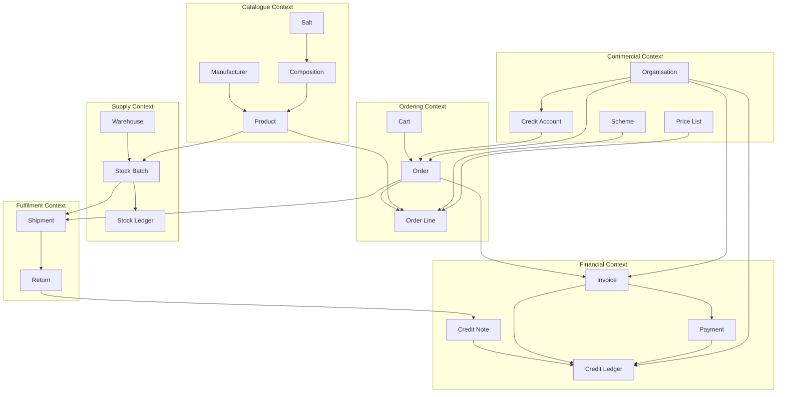

# 17 — Domain Model & Glossary

> **Status:** Approved · **Owner:** Product + Architecture · **Last updated:** 2026-09-11

The ubiquitous language of the platform. Everyone — developers, product, the pharma
domain expert, support — uses these words with these meanings. A term used
inconsistently is a bug in the making.

---

## 1. Ubiquitous language

### Actors

| Term | Definition |
|---|---|
| **Tenant** | The pharma company that owns this deployment. Today there is exactly one; the schema supports many. |
| **Organisation** | A buyer entity: a distributor, wholesaler, pharmacy or hospital. Belongs to a tenant. |
| **Distributor / Stockist** | A buyer that purchases in bulk from the pharma company and resells to retailers. Buys at PTS. |
| **Wholesaler** | A buyer operating between distributor and retailer. Typically smaller volumes. |
| **Retail Pharmacy** | A licensed shop selling to end consumers. Buys at PTR. |
| **Hospital / Institutional** | A buyer purchasing for inpatient or institutional use. Often tender-priced. |
| **Sales Rep** | An internal user who places orders on behalf of buyers and manages a region. |
| **Buyer Admin** | The organisation's own administrator: manages its users, addresses and views its ledger. |
| **Buyer User** | An individual who places orders within an organisation. |

### Product and composition

| Term | Definition |
|---|---|
| **Product** | A sellable SKU: a specific brand, in a specific pack, from a specific manufacturer. |
| **SKU** | Stock Keeping Unit — the internal unique identifier for a product. |
| **Brand Name** | The commercial name, e.g. `Cetzine-P`. |
| **Generic Name** | The composition written out, e.g. `Paracetamol + Cetirizine`. |
| **Salt** | A molecule / active pharmaceutical ingredient, e.g. `Paracetamol`. The unit of clinical meaning. |
| **Salt Alias** | Another name for the same salt: `Acetaminophen`, `PCM`, `Acetaminophenum`. |
| **Composition** | The ordered, strength-annotated list of salts in a product. |
| **Composition Key** | The canonical, sorted, normalised string derived from a composition. The basis of salt-combination search. |
| **Combination Drug** | A product containing two or more salts. |
| **Dosage Form** | Tablet, capsule, syrup, injection, cream, drops, inhaler. |
| **Strength** | The amount of active ingredient per unit, e.g. `500 mg`, `5 mg/5 ml`. |
| **Pack** | The sellable unit, e.g. `Strip of 10 tablets`. |
| **Pack Hierarchy** | Unit → Pack → Case, with conversion factors. Ordering 10 strips vs shipping 1 case of 10×10. |
| **Schedule** | The regulatory classification: OTC, H, H1, X, Narcotic. Determines prescription and record requirements. |
| **Prescription Drug** | A product whose schedule requires a valid prescription (H, H1, X, Narcotic). |
| **Substitute** | A different brand with the identical composition. Cheaper alternatives. |
| **HSN Code** | Harmonised System of Nomenclature code — the tax classification. |
| **Storage Condition** | Ambient, cool, cold chain (2–8 °C), frozen. |

### Pricing and commercial

| Term | Definition |
|---|---|
| **MRP** | Maximum Retail Price — the legally printed consumer price. |
| **PTS** | Price to Stockist — the distributor's buying price. |
| **PTR** | Price to Retailer — the pharmacy's buying price. |
| **Price List** | A named set of prices, assigned to a tier or organisation. |
| **Price Override** | A negotiated price for a specific organisation and product. |
| **Scheme** | A promotional offer: percentage off, flat off, free goods, combo, slab. |
| **Free Goods** | `Buy 10, get 1 free` — a quantity benefit rather than a price reduction. |
| **Slab Pricing** | Price that changes with quantity band. |
| **Price Explanation Trail** | The ordered record of which pricing rules fired and what each did. |
| **Credit Terms** | Payment window: Net 30, Net 45, advance, part-advance. |
| **Credit Limit** | The maximum outstanding balance permitted for an organisation. |
| **Exposure** | The current amount owed including invoiced, unbilled and on-hold orders. |
| **Available Credit** | `credit_limit − exposure`. |
| **Credit Hold** | An order parked because the limit would be exceeded. |
| **Ageing** | Outstanding balances bucketed by days overdue: 0–30, 31–60, 61–90, 90+. |

### Orders and fulfilment

| Term | Definition |
|---|---|
| **Indent** | The traditional paper order form. Used loosely to mean "an order". |
| **Cart** | The pre-order basket. Server-side, persistent. |
| **Quote / Proforma** | A priced, non-binding order preview with a validity window. |
| **Order** | A confirmed intent to purchase, with priced lines and a lifecycle. |
| **Order Line** | One product + quantity within an order. |
| **Backorder** | An order line that could not be fulfilled from available stock and is held. |
| **ATP** | Available To Promise — `qty_on_hand − qty_reserved`. What can actually be sold. |
| **Reservation** | Stock held for an order but not yet shipped. Has a TTL. |
| **FEFO** | First-Expiry-First-Out. The allocation rule: ship the batch expiring soonest. |
| **Batch / Lot** | A specific manufactured quantity with its own batch number and expiry date. |
| **GRN** | Goods Receipt Note — the record of stock received into a warehouse. |
| **Dispatch** | The act of sending goods. Creates a shipment and triggers an invoice. |
| **Shipment** | The physical consignment. One order may produce multiple shipments. |
| **ePOD** | Electronic Proof Of Delivery — signature or photo confirming receipt. |
| **E-way Bill** | The statutory document required to move goods above a value threshold. |
| **Partial Fulfilment** | Shipping part of an order, leaving the rest open or backordered. |

### Money and documents

| Term | Definition |
|---|---|
| **Invoice** | The tax document. Legally immutable once issued. |
| **Tax Invoice** | A GST-compliant invoice with CGST/SGST or IGST, HSN codes and a place of supply. |
| **Credit Note** | A document reducing what a customer owes. The **only** way to correct an invoice. |
| **Debit Note** | A document increasing what a customer owes. |
| **Place of Supply** | The state determining whether the tax is intra-state (CGST+SGST) or inter-state (IGST). |
| **Ledger** | The append-only record of every debit and credit against an organisation. |
| **Allocation** | Applying a payment to specific invoices. |
| **Unallocated Amount** | Payment received but not yet applied to an invoice. |
| **Reconciliation** | Matching our ledger against gateway settlements and bank statements. |
| **Dunning** | The escalating process of chasing overdue payments. |
| **IRN** | Invoice Reference Number — the identifier returned by the e-invoice system. |

### Platform

| Term | Definition |
|---|---|
| **Bounded Context** | A module with its own model, tables and public interface. |
| **Aggregate** | A cluster of objects treated as one unit for consistency. Has one root. |
| **Aggregate Root** | The only entry point into an aggregate. The consistency boundary. |
| **Domain Event** | A statement that something happened: `order.placed`. Past tense, immutable. |
| **Outbox** | A table holding events written in the same transaction as the state change. |
| **Saga** | A multi-step workflow with explicit compensations for failure. |
| **Compensation** | The undo action for a completed saga step. |
| **Idempotency Key** | A client-supplied key making a retried request safe to replay. |
| **Advisory Lock** | A Postgres lock ensuring a scheduled job runs once across replicas. |
| **Capability** | A fine-grained permission: `order:create`, `invoice:void`. |
| **ABAC** | Attribute-Based Access Control — scoping by tenant, warehouse, region. |
| **Tenant Context** | The resolved tenant + scope applied to every query. |
| **Projection** | A read model built from events. Rebuildable; never a source of truth. |
| **Feature Flag** | A runtime toggle for a capability, optionally targeted. |
| **Circuit Breaker** | A guard that stops calling a failing dependency. |
| **Bulkhead** | Resource isolation so one slow dependency cannot exhaust everything. |

### Consistency vocabulary

| Term | Meaning here |
|---|---|
| **Strong consistency** | Reads always reflect the latest committed write. Used for price, stock, credit. |
| **Eventual consistency** | Reads may lag briefly. Used for search, dashboards, projections. |
| **Read-your-writes** | A user immediately sees their own write. Guaranteed via the mutation response. |
| **At-least-once delivery** | A message may be delivered more than once. Consumers must be idempotent. |
| **Exactly-once** | **Not claimed.** Achieved in practice via at-least-once + idempotent consumers. |
| **TOCTOU** | Time-Of-Check-To-Time-Of-Use — a race where state changes between check and act. |
| **Lost update** | Two concurrent read-modify-writes where one silently overwrites the other. |

---

## 2. Domain model overview

---

## 3. Aggregate boundaries

Each aggregate is a consistency boundary: everything inside is updated in one
transaction, and everything outside is updated via events.

| Aggregate root | Contains | Invariants it protects |
|---|---|---|
| **Order** | Order lines, status history | Total = Σ(line totals); legal status transitions; credit check at placement |
| **StockBatch** | Quantities | `on_hand − reserved = available`; `reserved ≤ on_hand`; `on_hand ≥ 0` |
| **CreditAccount** | Exposure, limit | `exposure ≤ effective_limit`; exposure matches the ledger |
| **Invoice** | Invoice lines, tax summary | `grand_total = Σ(lines) + tax − discount + freight + round_off`; immutable once issued |
| **Payment** | Allocations | `Σ(allocations) ≤ amount` |
| **Product** | Composition | `composition_key` matches the composition rows |
| **OnboardingApplication** | Documents, review notes | Legal state transitions; approval creates org + user atomically |
| **Shipment** | Shipment lines | `Σ(shipped) ≤ Σ(ordered)` per line |

**The rule that follows from this table:** an operation touching two aggregates is
**not** a single transaction. It is a saga with compensations. Attempting to make it
atomic is how distributed-transaction complexity enters the system.

---

## 4. Key business rules

Numbered so they can be referenced in code comments, tests and tickets.

| # | Rule |
|---|---|
| BR-01 | An order cannot be placed by a `SUSPENDED` or `BLOCKED` organisation. |
| BR-02 | An organisation with an expired drug licence cannot place an order. |
| BR-03 | A schedule H/H1/X line requires a verified prescription before the order is confirmed. |
| BR-04 | Credit exposure may never exceed the effective credit limit. |
| BR-05 | Price is computed server-side only. Client-supplied prices are ignored. |
| BR-06 | Stock may never be oversold. Allocation is FEFO and transactional. |
| BR-07 | An issued tax invoice is immutable. Corrections are credit notes. |
| BR-08 | Invoice numbering is gapless within a tenant and fiscal year. |
| BR-09 | Every money movement produces an immutable ledger entry. |
| BR-10 | A balance is always derived from the ledger, never stored as mutable truth. |
| BR-11 | An order may only transition along the defined state machine. |
| BR-12 | Every state transition is recorded with actor, timestamp and reason. |
| BR-13 | A payment webhook is processed at most once per provider event id. |
| BR-14 | Every unsafe write accepts an idempotency key. |
| BR-15 | Stock on hand must equal the sum of its ledger entries at all times. |
| BR-16 | A return cannot exceed the quantity originally invoiced on that line. |
| BR-17 | Credit note tax must reverse the tax on the original invoice line. |
| BR-18 | An order cannot be modified after dispatch. |
| BR-19 | Every query is scoped to the caller's tenant. |
| BR-20 | A resource belonging to another tenant returns 404, never 403. |

---

## 5. Order status definitions

| Status | Meaning | Terminal? |
|---|---|---|
| `DRAFT` | Saved but not submitted | No |
| `PLACED` | Submitted by the buyer | No |
| `PENDING_APPROVAL` | Awaiting internal approval (threshold or credit policy) | No |
| `CONFIRMED` | Approved and accepted | No |
| `CREDIT_HOLD` | Parked because the credit limit would be exceeded | No |
| `PROCESSING` | Stock allocated, being picked | No |
| `PARTIALLY_DISPATCHED` | Some lines shipped | No |
| `DISPATCHED` | Fully shipped | No |
| `DELIVERED` | Confirmed received (ePOD) | No |
| `DELIVERY_FAILED` | Refused or undeliverable | No |
| `CANCELLED` | Cancelled before dispatch | **Yes** |
| `REJECTED` | Rejected in approval | **Yes** |
| `RETURN_REQUESTED` | A return has been raised | No |
| `RETURNED` | Return completed | **Yes** |

---

## 6. Acronyms

| Acronym | Expansion |
|---|---|
| **ABAC** | Attribute-Based Access Control |
| **ADR** | Architecture Decision Record |
| **API** | Application Programming Interface |
| **ATP** | Available To Promise |
| **CDN** | Content Delivery Network |
| **CGST** | Central Goods and Services Tax (intra-state) |
| **CQRS** | Command Query Responsibility Segregation |
| **CSV** | Comma-Separated Values |
| **CSPRNG** | Cryptographically Secure Pseudo-Random Number Generator |
| **DTO** | Data Transfer Object |
| **ePOD** | Electronic Proof of Delivery |
| **FEFO** | First-Expiry-First-Out |
| **FIFO** | First-In-First-Out |
| **GST** | Goods and Services Tax |
| **GSTIN** | GST Identification Number |
| **HSN** | Harmonised System of Nomenclature |
| **IGST** | Integrated GST (inter-state) |
| **INN** | International Nonproprietary Name |
| **IRN** | Invoice Reference Number (e-invoice) |
| **JWT** | JSON Web Token |
| **KYC** | Know Your Customer |
| **MRP** | Maximum Retail Price |
| **OTP** | One-Time Password |
| **PAN** | Permanent Account Number |
| **PDC** | Post-Dated Cheque |
| **PITR** | Point-In-Time Recovery |
| **PTR** | Price To Retailer |
| **PTS** | Price To Stockist |
| **RBAC** | Role-Based Access Control |
| **RED** | Rate, Errors, Duration (metrics) |
| **RMA** | Return Merchandise Authorisation |
| **RPO** | Recovery Point Objective |
| **RTO** | Recovery Time Objective |
| **RTV** | Return To Vendor |
| **SGST** | State Goods and Services Tax (intra-state) |
| **SKU** | Stock Keeping Unit |
| **SLO** | Service Level Objective |
| **SSE** | Server-Sent Events |
| **TOTP** | Time-based One-Time Password |
| **TOCTOU** | Time-Of-Check-To-Time-Of-Use |
| **USE** | Utilisation, Saturation, Errors (metrics) |
| **UTR** | Unique Transaction Reference |
| **UOM** | Unit of Measure |

---

## 7. Language rules

1. **Past tense for events** — `OrderPlaced`, never `PlaceOrder`. An event is a fact.
2. **Imperative for commands** — `PlaceOrder`, never `OrderPlacing`. A command is a request.
3. **`Order` not `PurchaseOrder`** — this is a sales-order system. `PurchaseOrder` is reserved for our own procurement from manufacturers.
4. **`Organisation` not `Customer`** — buyers are licensed businesses, not consumers. "Customer" is ambiguous in a B2B context.
5. **`Salt` not `Ingredient`** — the pharma industry says salt; matching industry language reduces translation errors.
6. **`Batch` not `Lot`** — interchangeable in the industry; we standardise on `batch` in code and schema, accepting `lot` in UI copy where it is more familiar.
7. **`Exposure` not `Outstanding`** — exposure is the operational figure (including unbilled and held orders); outstanding is the accounting figure. They differ, and conflating them causes credit bugs.
8. **`Composition` not `Formula`** — composition is the regulatory term.
9. **Money is always a decimal string in transport**, never a number.
10. **Never say "exactly-once"** — say "at-least-once with idempotent consumers". The former is a promise no broker keeps.

---

## 8. Reference data

Seeded in `backend/src/database/seeds/`:

| Dataset | Records | Source |
|---|---|---|
| Roles and capabilities | ~12 roles, ~90 capabilities | Code |
| Categories | ~40 (multi-level) | Industry standard |
| Dosage forms | ~15 | Code |
| Storage conditions | 4 | Code |
| Schedule classes | 5 | Statute |
| GST rates | ~8 applicable rates | Statute |
| Payment terms | ~6 | Business |
| Units of measure | ~20 | Code |
| Salt master | ~5,000 molecules | Curated |
| Salt aliases | ~15,000 | Curated |
| Manufacturers | ~500 | Business |
| Demo products | ~200 | Synthetic (dev only) |
| Feature flags | ~10 | Code |

**The salt master is the one dataset that must be curated, not generated.** It is
the foundation of the platform's most distinctive feature. Its quality directly
determines whether salt-combination search works, and bad salt data cannot be
compensated for by better search code.
